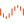
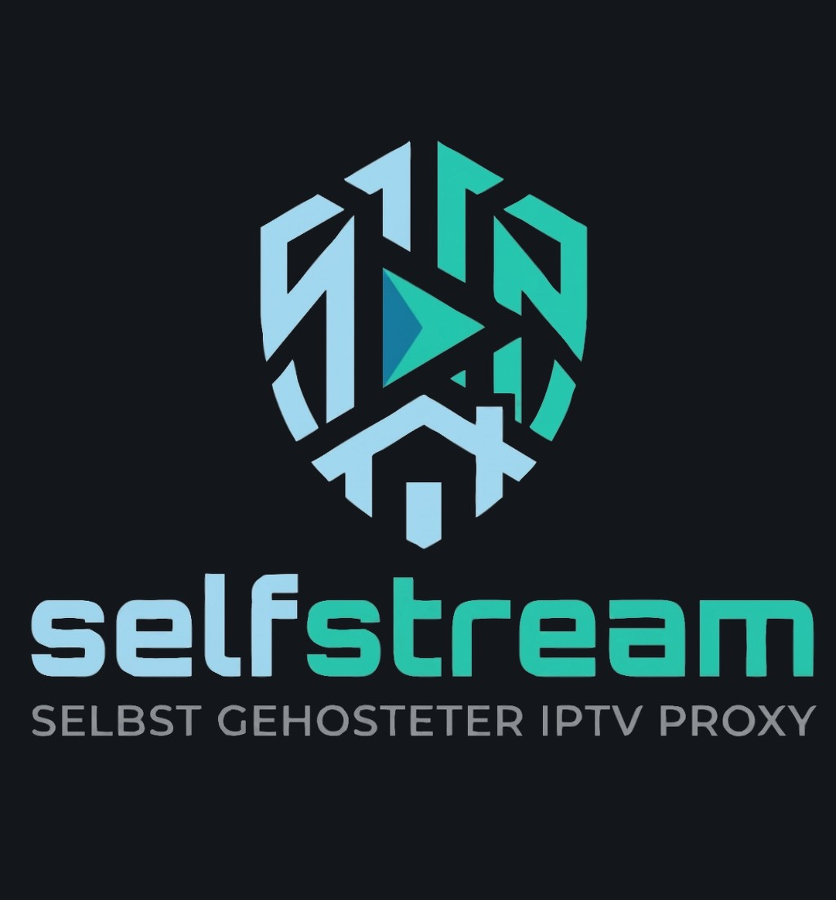
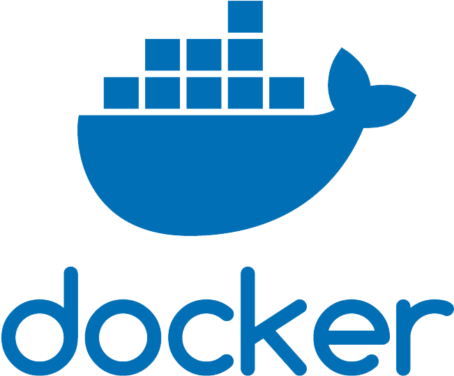
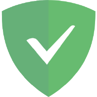
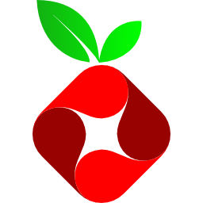

<p align="center">
  
</p>

<p align="center">
  <a href="#english">🇬🇧 English</a> &nbsp;|&nbsp; <a href="#deutsch">🇩🇪 Deutsch</a>
</p>

<p align="center">
  
  
  
  
</p>

---

# 🇬🇧 English

## What is SelfDashboard?

SelfDashboard is a clean, modular, self-hosted home dashboard with a powerful plugin system — running as a single Docker container. Manage multiple dashboards, customize every detail, and add widgets for your self-hosted services. Plugins can be developed by anyone and installed later.

## Features

Recent plugin and API changes are summarized in **[docs/CHANGELOG.md](docs/CHANGELOG.md)**.

| Feature | Description |
|---|---|
| 🧩 **Plugin System** | Add, remove and configure widgets for any service |
| 📋 **Multiple Dashboards** | Create unlimited dashboards, each with its own URL (`/dashboard/home`, `/dashboard/server`) |
| 🎨 **6 Color Themes** | Dark, Light, Nord, Catppuccin, Dracula, Solarized |
| 🖌️ **Custom Colors** | Override any color individually per dashboard |
| 🖼️ **Custom Logo** | Upload your own logo per dashboard |
| 🌍 **Multilingual** | German & English interface |
| 🖱️ **Drag & Drop** | Move and resize widgets freely |
| 📐 **Widget Controls** | Per-widget zoom, padding and height adjustments |
| 🔍 **Dashboard Zoom** | Scale the entire dashboard (70%–150%) |
| 📏 **Grid Spacing** | Adjust widget gap and outer padding |
| 🔗 **Navbar Options** | Show icon only, text only, or both — toggle dashboard tabs |
| 📱 **Responsive layout** | **Phone / tablet / desktop** grid based on dashboard width; optional per-widget overrides in **⚙️ → Layout: phone & tablet**; compact **navbar search** (full-width row) on narrow viewports |
| 🐳 **Single Container** | Next.js 15, no database, no Redis needed |
| 📋 **Central error log** | **Settings → Logs**: app, API, and plugin errors (filter, export, 3–30 day retention) — automatic for every registered plugin |
| ✉️ **Navbar mail (IMAP)** | Unread badge in the navbar — multiple accounts, Synology/MailPlus-friendly, encrypted passwords, webmail link on click |
| 🖥️ **Unraid Ready** | Community Apps template included |

---

## Available Plugins

Icons match the assets in the app under [`public/plugin-logos/`](public/plugin-logos/) (same as in the plugin store). Plugins without a dedicated file still use emoji in the table below.

| Plugin | Category | Description | Status |
|---|---|---|---|
| 🔖 Bookmarks | Utility | Quick links with groups, custom icons, drag & drop, responsive grid or row | ✅ Included |
| 📅 Calendar | Productivity | CalDAV two-way + ICS feeds; accounts in `/api/calendar`, data in `data/calendar/` | ✅ Included |
| 🕐 Clock & Date | Utility | Time, date, timezone and city name | ✅ Included |
| 🌤️ Weather | Utility | City or postal code — current conditions (Open-Meteo, no API key) | ✅ Included |
|  **Unraid** | System | CPU, RAM, Array & Pool per GraphQL API | ✅ Included |
|  **Emby** | Media | Active sessions — who is watching what | ✅ Included |
|  **Selfstream** | Media | Live IPTV streams from Selfstream admin — user, channel/program, duration (`POST /api/selfstream`) | ✅ Included |
|  **Docker** | System | Container list via Engine API (socket mount) | ✅ Included |
|  **Unraid Docker** | System | Container list via Unraid GraphQL API (no Docker socket on Unraid host) | ✅ Included |
|  **AdGuard Home** | Network | DNS stats & protection (via `/api/adguard`, Basic auth) | ✅ Included |
|  **Pi-hole** | Network | Pi-hole v6 style stats (queries, blocked %, lists); toggle blocking (`/api/pihole`) | ✅ Included |
|  **FRITZ!Box Internet** | Network | WAN throughput chart from TR-064 byte counters (`POST /api/fritzbox`) | ✅ Included |
| 🖼️ Iframe | Utility | Embed any URL (iframe) or as a link — dashboards, internal tools, maps | ✅ Included |
| 📝 Scratchpad | Utility | Short notes widget, editable in place | ✅ Included |
|  **CrowdSec** | Security | Alerts & bans from local `crowdsec.db` (optional volume); IP feed, lookup links, optional unban via Docker/`cscli` | ✅ Included (optional setup) |

## Quick Start

### Option 1 — Unraid Community Apps (recommended)

1. Open Community Apps → search for **SelfDashboard**
2. Install and set your port (default: `3000`)
3. Open `http://YOUR-IP:3000`
4. Click **+** to add plugins and start building
5. Done ✓

### Option 2 — Docker run

```bash
docker run -d \
  --name selfdashboard \
  --restart unless-stopped \
  -p 3000:3000 \
  -e TZ=Europe/Berlin \
  -v /mnt/user/appdata/selfdashboard:/app/data \
  -v /var/run/docker.sock:/var/run/docker.sock \
  ghcr.io/kabelsalatundklartext/selfdashboard:latest
```

*(Optional `-v /var/run/docker.sock:…` — Docker widget only; same host as the container. The **`-v …:/app/data`** mount stores **`dashboard.json`** on disk so all browsers share the same configuration.)*

### Option 3 — docker-compose

```bash
git clone https://github.com/kabelsalatundklartext/selfdashboard.git
cd selfdashboard
docker-compose up -d
```

## Docker widget & Unraid template

- **Shared configuration (`dashboard.json`):** when **`/app/data`** is mounted (Unraid: *Config Storage*), SelfDashboard saves **`dashboard.json`** on the server after changes (`PUT /api/dashboard-state`) and loads it on startup (`GET`). Every browser then sees the same dashboards and widgets; **`localStorage`** remains a fast local cache. **Back up** your host appdata folder. Optional **`SELFDASHBOARD_DATA_DIR`** changes the directory *inside* the container where the file is written (the official image sets **`/app/data`**).
- The **Unraid Community Apps** template (`unraid/selfdashboard.xml`) includes a **Docker Socket** mapping (host `/var/run/docker.sock` → container `/var/run/docker.sock`, read-only), equivalent to `-v /var/run/docker.sock:/var/run/docker.sock`. It is shown **by default** in the template (not hidden under “more settings”). Clear the path if you do not want the Docker widget.
- **CrowdSec Data (optional)** maps a host folder with `crowdsec.db` to `/crowdsec-data` (read-only). **Leave empty** if you do not use the CrowdSec widget — SelfDashboard does not require CrowdSec. See **CrowdSec widget (optional)** below.
- The **Custom plugins** path is a **bind-mount**: files on the Unraid disk only appear inside the container when that host folder is mapped to `/app/plugins/custom`. The **stock** image does **not** auto-register new TypeScript plugins from that folder — see **Building Your Own Plugin** and rebuild the image (or use a custom image that reads it).
- The Docker plugin uses **`/api/docker-containers`** on the **same machine** where SelfDashboard runs. It talks to the **local** Docker Engine via that socket only.
- **Permission denied (`EACCES`)** on the socket: the container user must be allowed to open the mounted socket (host `root:docker`). The Unraid template sets **`ExtraParams` `--group-add=281`** (common Unraid `docker` GID). If yours differs, run `stat -c '%g' /var/run/docker.sock` on the host and adjust. Newer SelfDashboard images run as **root** in the container so the socket usually works without tuning.
- **Start / stop / restart:** **`POST /api/docker-containers`** (two-step confirmation). Plugin settings: master **Buttons**, then **Start** / **Stop** / **Restart** individually. Anyone who can open the dashboard can trigger actions when the socket is mounted — turn the master off on shared setups.
- **CPU & RAM:** **`GET …&stats=1`** merges **`sdStats`** for running containers. Master **Docker-Stats**, then **CPU** and **RAM** separately; stats requests run only if at least one of CPU/RAM is enabled (while the stats master is on). In the widget, values can appear as **compact bars** (toggle **CPU/RAM als Balken**) or as one-line text; layout is **Name : runtime : stats : actions** on a single row, with the double-confirm panel on a second line when needed.
- **Stats alignment (Docker plugin ≥ 1.7.9):** RAM follows the same rule as **`docker stats`** / Docker Desktop (page cache subtracted: cgroup v1 `total_inactive_file`, v2 `inactive_file`), not raw `memory_stats.usage`. CPU % uses the standard Engine delta formula; very short `system_cpu_usage` sampling windows are ignored to reduce spikes. Stats requests prefer **`stream=false&one-shot=false`** so the daemon can prime **precpu_stats** (falls back to `stream=false` only if the daemon returns HTTP 400).

### Remote / “external” Docker

The current implementation **does not** list containers on **another** server. A Unix socket is **local to one host** and cannot reach Docker on a different machine over the network. Practical options: install SelfDashboard **on** that other host (and mount its socket), or use a separate **HTTP API** (e.g. Portainer) — that would be a different plugin/feature, not the socket-based widget.

---

## CrowdSec widget (optional)

**You do not need CrowdSec to run SelfDashboard.** This plugin is only for users who already run [CrowdSec](https://www.crowdsec.net/) on the **same server** and want a compact dashboard widget (overview, bans, countries, searchable IP feed).

| What | Details |
|---|---|
| **Purpose** | Read-only view of alerts/bans from CrowdSec’s local SQLite file `crowdsec.db` — no LAPI, no CrowdSec container API |
| **Required?** | **No** — skip all CrowdSec mounts if you do not use the widget |
| **Data source** | File `crowdsec.db` on a bind-mounted folder (default in widget: `/crowdsec-data/crowdsec.db`) |
| **Unraid template** | **CrowdSec Data (optional)** — map your CrowdSec appdata/data folder to `/crowdsec-data` (read-only). Leave **empty** if unused |
| **Unban (optional)** | Enable in plugin settings; requires **Docker Socket** mount and the CrowdSec container name (e.g. `crowdsec`) so SelfDashboard can run `cscli` via `docker exec` |
| **Time range** | Selectable in the widget (1 / 7 / 30 / 90 / 365 days); plugin settings set defaults |
| **GeoIP / flags** | Countries resolved from **GeoLite2** `.mmdb` on disk (same as CrowdSec threat-map setups). Auto-search in `/crowdsec-data` for `GeoLite2-City.mmdb` or `GeoLite2-Country.mmdb`. Install via CrowdSec (`cscli hub` / geoip collection) or mount the file next to `crowdsec.db`. Flag images use emoji + optional `flagcdn.com` |
| **Env (optional)** | `CROWDSEC_DATA_DIR`, `CROWDSEC_GEOIP_PATH` (direct path to `.mmdb`), `CROWDSEC_DB_PATH`, `CROWDSEC_CONTAINER` |

**Docker run example (optional CrowdSec mount):**

```bash
docker run -d \
  --name selfdashboard \
  --restart unless-stopped \
  -p 3000:3000 \
  -e TZ=Europe/Berlin \
  -v /mnt/user/appdata/selfdashboard:/app/data \
  -v /mnt/user/appdata/crowdsec/data:/crowdsec-data:ro \
  -v /var/run/docker.sock:/var/run/docker.sock \
  ghcr.io/kabelsalatundklartext/selfdashboard:latest
```

After install: add the **CrowdSec** widget from the store, confirm the DB path, pick a time range. Enable unban only if you understand the security impact (same as allowing Docker control from the dashboard).

---

## Dashboard Management

Each dashboard gets its own URL. Navigate between dashboards via the tab bar in the navbar or through **Settings → Dashboards**.

| Action | How |
|---|---|
| Create dashboard | Settings → Dashboards → New Dashboard |
| Switch dashboard | Click tab in navbar or Settings → Dashboards → Open |
| Hide tab from navbar | Settings → Dashboards → 👁️ toggle per dashboard |
| Delete dashboard | Settings → Dashboards → 🗑️ |
| Rename / change icon | Settings → Dashboards → ✏️ |

---

## Widget Controls

In **Edit Mode** (✏️ button), hover over any widget to see controls:

| Control | Function |
|---|---|
| ⠿ Drag handle | Move widget |
| 🔍 `− 100% +` | Zoom widget content |
| ↔ `− 8 +` | Inner padding |
| ↕ `− 4 +` | Widget height |
| ⚙️ | Plugin settings |
| ✕ | Remove widget |
| Resize grip (corner/edge) | Resize width and height freely |

---

## Responsive layout (phone, tablet & desktop)

The dashboard uses **three layout bands** based on the **dashboard grid width** (the track that holds the widgets — not only the outer browser window):

| Band | Approx. width | Behaviour |
|---|---|---|
| **Phone** | **&lt; 768 px** | Single **stacked column**; each widget uses **`layoutPhone`** height overrides when set, otherwise the desktop **`layout`** height. |
| **Tablet** | **768 – 1023 px** | **12-column** grid like desktop; optional **`layoutTablet`** overrides (`w`, `h`, `x`, `y`, `minH`) merge with **`layout`**. |
| **Desktop** | **≥ 1024 px** | Full **desktop** layout — what you usually edit when resizing widgets on a large screen. |

**How to tune it:** enter **Edit mode** (✏️), open a widget’s **⚙️** settings. Below the plugin-specific options, **“Layout: phone & tablet”** lets you set optional **phone** row height / min height and **tablet** position & size. **Leave fields empty** to keep using the desktop layout values for that band.

On **narrow viewports (about ≤ 1024 px)** the **navbar web search** moves to a **second row** at **full width** so it is not squeezed into the corner next to zoom and actions.

Plugins can optionally read the **`layoutMode`** prop (`'phone' \| 'tablet' \| 'desktop'`) for their own responsive UI — see **[docs/PLUGIN_DEV.md](docs/PLUGIN_DEV.md)**.

---

## Bookmarks Plugin

| Feature | Description |
|---|---|
| Groups | Create multiple groups, each collapsible |
| Hide groups | Toggle visibility per group with 👁️ |
| Custom icons | Emoji or upload PNG/JPG image |
| Drag & drop | Reorder apps within and across groups |
| Layout | **Grid** (responsive columns) or **horizontal row** (scroll) |
| Tile width | Min/max width in px; optional **fixed** column width (no stretch-to-fill in grid) |
| New tab | Per-app setting to open in new tab or same tab |

---

## Calendar plugin

| Feature | Description |
|---|---|
| CalDAV | Two-way sync (iCloud, Nextcloud, Fastmail, WEB.DE with app password, …) |
| ICS | Read-only subscription URLs (WEB.DE share link, Google, …) |
| Storage | `data/calendar/store.json` on the server; credentials encrypted (AES-256-GCM) |
| UI | Compact tile + full-screen month/agenda; account setup in the modal |
| Sync | Background sync every 5 min (env `CALENDAR_SYNC_INTERVAL_SECONDS`) |

Accounts are configured in the calendar modal (cog on the tile), not in the old widget JSON config.

---

## Navbar mail (IMAP)

Built-in feature (not a dashboard widget). Configure under **Settings → Email**; toggle the icon under **Settings → General → Navbar email**.

| Topic | Details |
|---|---|
| **Purpose** | Poll one or more IMAP accounts and show **total unread** as a badge on the mail icon in the navbar; click opens your **webmail URL** |
| **API** | `GET /api/mail/status` (read cache), `?refresh=1` (force sync), `PUT /api/mail/settings`, `POST /api/mail/test` |
| **Storage** | `data/mail/mail.json` (or `MAIL_DATA_DIR`); passwords encrypted with **AES-256-GCM** (same key as calendar — see env below) |
| **Accounts** | Multiple accounts; per account: host, port, SSL, user, password, mailbox folder, webmail URL |
| **Mailbox `*`** | All IMAP folders with unread mail, **trash excluded** (includes Sent, subfolders — can be a high number) |
| **Mailbox `@accounts`** | Synology MailPlus style: only `INBOX.AccountName` folders (closer to the MailPlus sidebar) |
| **Poll interval** | **1–900 seconds** for all accounts (save after changing) |
| **Logs** | Filter **Settings → Logs** by plugin **`mail`** (`mail/sync`, `mail/test`, …) |

**Synology example:** host `192.168.1.15`, port **993**, SSL on, webmail `http://192.168.1.15:5000/mail/#inbox` (webmail port **not** in the IMAP host field).

**After Docker restart:** re-enter the mailbox password and click **Save** — otherwise background sync cannot decrypt stored credentials (navbar may show a yellow dot).

---

## Selfstream plugin

| Topic | Details |
|---|---|
| **Purpose** | Show **active IPTV streams** from a [Selfstream](https://github.com/kabelsalatundklartext/selfstream) admin instance (who is watching which channel/program and for how long). |
| **API** | Browser → `POST /api/selfstream` (SelfDashboard server calls the Selfstream admin API; admin password is sent in the request body and used as the API token server-side). |
| **Settings** | Selfstream **base URL** (e.g. `http://host:8080`, without `/admin` suffix), **admin password**, refresh interval (seconds), optional display of client IP. |
| **Requirements** | Selfstream must be reachable from the SelfDashboard container (same host or LAN). |

---

## FRITZ!Box WAN throughput plugin

| Topic | Details |
|---|---|
| **Purpose** | Live **download / upload** throughput chart for the WAN, using FRITZ!Box **TR-064** total byte counters (no extra daemon on the router). |
| **API** | Browser → `POST /api/fritzbox` (SelfDashboard server calls your box). Optional `lite: true` for counter-only refresh between full polls. |
| **Auth** | TR-064 username + password; optional **HTTPS with self-signed** allowed. |
| **Refresh** | **0–300 s** full TR-064 poll: **`0`** = no interval (only when the dashboard loads). Use **Live counters** for lighter, frequent counter updates. |
| **Live counters** | **0** = samples only on the full refresh interval; **3–15 s** = extra counter polls for a smoother curve. |
| **History cache** | Last curve points are stored in **browser `localStorage`** (per **base URL + username**), up to **7 days**, so the widget is not empty after a reload while new samples arrive. |
| **Layout** | **Vertical** (chart above stat tiles) or **horizontal** (chart beside tiles — works best in a **wide** tile). |
| **Visibility** | Toggle title, legend, live values, chart, time-axis hint (“older / newer”), and each stat tile (averages & peaks) independently in plugin settings. |
| **Plot height** | **`0`** = built-in default height (**168 px**). **`1–220`** = exact height in **1 px** steps. |
| **Y-axis** | **`0` Mbit/s max** = scale from data; fixed max clips values at the top. |
| **Samples** | **16–120** history points kept for the chart. |
| **Sanity cap** | Optional **max measured rate (Mbit/s)** in settings: **exact** ceiling for both directions when &gt; 0 (e.g. **1000** on a 1 Gbit/s line). **0** = only TR-064 **Layer1** max bit rates from the box (when present) + **3%** headroom. |
| **Language** | Display strings: **auto** (match dashboard), **German**, or **English**. |

---

## Settings Overview

**General** — Language (DE/EN), Dashboard title, Navbar display style, Dashboard tab visibility

**Dashboards** — Create, edit, delete dashboards. Toggle tab visibility per dashboard. Set emoji or custom PNG icon.

**Design** — Grid spacing (widget gap + outer padding), Logo upload, Color theme, Custom color overrides per color

**Email** — IMAP accounts, navbar badge, poll interval, connection test

**Logs (Protokoll)** — Central error log for support and debugging: filter by level, source, plugin; download `.txt` / JSONL; retention 3 / 7 / 30 days. Every plugin registered via `registerPlugin` logs render failures and failed `/api/*` calls automatically. Mail uses the same log with plugin id **`mail`**. Details: **[docs/LOGGING.md](docs/LOGGING.md)**.

---

## Building Your Own Plugin

Anyone can create plugins for SelfDashboard. **Full walkthrough, examples, and types:** [docs/PLUGIN_DEV.md](docs/PLUGIN_DEV.md).

### What you ship vs. what SelfDashboard does automatically

| You (plugin author) | SelfDashboard (after `registerPlugin` + rebuild) |
|---|---|
| Folder `plugins/<id>/index.tsx` exporting **`meta`** and **`component`** (`Widget`, optional **`Settings`**) | **Plugin Store** listing; user can add/remove instances on dashboards |
| One-time **import + `registerPlugin(...)`** in `src/lib/pluginLoader.ts`, then **`next build` / new Docker image** | **Widget chrome** in edit mode: drag handle, per-widget zoom / padding / height, ⚙️ opens your `Settings` when exported, remove button |
| Optional **`src/app/api/...`** route if the browser must call a service **without CORS** (same pattern as Docker, FRITZ!Box, …) | **`Widget` props:** `instanceId`, `config`, `theme`, `editMode`, `layoutMode` — persist user settings via existing store / `dashboard.json` |
| Responsive UI yourself (CSS variables, `minWidth: 0`, optional `layoutMode`) | Initial tile size from **`meta.defaultLayout`** and phone stack hint **`stackedExtraH`** |
| Optional **`reportPluginCatch`** in `catch` blocks; server route with **`logPluginApiFailure`** | **Error log**: widget render errors + failed **`fetch('/api/…')`** under **Settings → Logs** (`meta.id` = plugin id) |

**Not automatic:** copying TypeScript into Unraid **Custom Plugins** (`/app/plugins/custom`) **does not** register plugins in the **stock** image — the loader is compiled at build time. Use a **custom image** or fork with `pluginLoader.ts` updated, then rebuild.

**Starter:** copy **`plugins/_template/`** → **`plugins/<id>/`**, register in **`pluginLoader.ts`**. See **[docs/PLUGIN_DEV.md](docs/PLUGIN_DEV.md)** and **[docs/LOGGING.md](docs/LOGGING.md)**.

### Builtin plugins, `pluginLoader.ts`, and Unraid

- **Shipped plugins** (Bookmarks, Calendar, Clock, Weather, Docker, Unraid, Unraid Docker, Emby, Selfstream, AdGuard Home, Pi-hole, FRITZ!Box, Iframe, Scratchpad, CrowdSec, …) are **compiled into the Docker image**. They are registered in **`src/lib/pluginLoader.ts`** together with the folder **`plugins/<id>/`**. This file is **not** bind-mounted on Unraid — changing it means **editing the Git repo and rebuilding** the image (or opening a PR upstream).
- The Unraid template option **“Custom Plugins Path”** maps a host folder to **`/app/plugins/custom`**. The **stock** SelfDashboard image **does not** automatically load arbitrary TypeScript plugins from that path at runtime. Treat the mount as **optional** (e.g. for your own assets or for **custom images** you build yourself that read that directory). To add a new plugin today, follow **PLUGIN_DEV.md** and **rebuild** the container image.

**Minimal example** (full types and steps in [docs/PLUGIN_DEV.md](docs/PLUGIN_DEV.md)):

`plugins/myplugin/index.tsx` — export `meta` and `component` as in PLUGIN_DEV.

`src/lib/pluginLoader.ts` — add import and one line inside `loadBuiltinPlugins()`:

```ts
import * as myPlugin from '../../plugins/myplugin'

// inside loadBuiltinPlugins():
registerPlugin(myPlugin.meta, myPlugin.component)
```

Then rebuild the Docker image (builtin plugins are compiled in, not loaded from a host folder at runtime).

---

## Environment Variables

| Variable | Default | Description |
|---|---|---|
| `TZ` | `Europe/Berlin` | Timezone |
| `NODE_ENV` | `production` | Node.js environment |
| `SELFDASHBOARD_DATA_DIR` | `/app/data` (in the official image) | Directory inside the container where **`dashboard.json`** is stored. Must match your **`/app/data`** bind-mount unless you intentionally use another path. |
| `SELFDASHBOARD_CALENDAR_KEY` | auto-generated file in data dir | **Stable secret** for encrypting calendar and **mail** passwords. Set explicitly in Docker so credentials survive container recreation. |
| `MAIL_DATA_DIR` | `<dataDir>/mail` | Directory for **`mail.json`** (optional override) |
| `CROWDSEC_DATA_DIR` | `/crowdsec-data` | Allowed root for DB paths (CrowdSec widget only; optional) |
| `CROWDSEC_GEOIP_PATH` | — | Full path to `GeoLite2-*.mmdb` if not in the data folder (optional) |
| `CROWDSEC_DB_PATH` | — | Default DB file if widget path is empty (optional) |
| `CROWDSEC_CONTAINER` | `crowdsec` | Docker container name for optional unban via `cscli` (optional) |

---

## Troubleshooting

| Problem | Solution |
|---|---|
| Dashboard not loading | Check logs: `docker logs selfdashboard` |
| Config lost after update | Image updates do not remove your appdata volume; **`dashboard.json`** and **`localStorage`** keep your layout. If a **new browser** shows an empty dashboard, check that **`/app/data`** is mounted and writable (see *Shared configuration* above). |
| Port already in use | Change host port: `-p 3001:3000` |
| Widgets invisible in edit mode | Try refreshing the page |
| Theme not applying | Hard refresh: Ctrl+Shift+R |
| CrowdSec widget: `crowdsec.db not found` | Set **CrowdSec Data (optional)** in the Unraid template (host folder with `crowdsec.db` → `/crowdsec-data:ro`), or remove the widget if you do not use CrowdSec |
| CrowdSec: no country flags / all `??` | Ensure **GeoLite2-City.mmdb** (or Country) is in the mounted CrowdSec data folder, or set `CROWDSEC_GEOIP_PATH` |
| CrowdSec: unban fails | Mount **Docker Socket**, check container name in plugin settings, enable unban there |
| Mail badge red/yellow, count 0 | **Settings → Email** → re-enter password → **Save**. Set fixed `SELFDASHBOARD_CALENDAR_KEY` in Docker. Check **Logs** filter `mail` |
| Mail: `ENOTFOUND host:5000` | IMAP host must be IP/hostname only (e.g. `192.168.1.15`), port **993** separate; webmail URL goes in **Webmail URL** field |
| Mail test OK, navbar empty | Enable **Navbar email** (General or Email tab); save account; badge needs unread &gt; 0 |

---

## Technology

- **Frontend:** Next.js 15, React 18, Tailwind CSS
- **State:** Zustand — persisted to **`localStorage`** (cache) and to **`dashboard.json`** on the server when **`/app/data`** (or **`SELFDASHBOARD_DATA_DIR`**) is available
- **Grid:** react-grid-layout
- **Container:** Node.js 20 Alpine
- **Plugin System:** Custom registry, zero external dependencies

---

## License

**MIT** — free to use, modify and share.

---

---

# 🇩🇪 Deutsch

## Was ist SelfDashboard?

SelfDashboard ist ein sauberes, modulares, selbst gehostetes Home-Dashboard mit einem leistungsstarken Plugin-System — als einzelner Docker-Container. Verwalte mehrere Dashboards, passe jedes Detail an und füge Widgets für deine selbst gehosteten Dienste hinzu. Plugins können von jedem entwickelt und nachträglich installiert werden.

## Features

Aktuelle Plugin- und API-Änderungen: **[docs/CHANGELOG.md](docs/CHANGELOG.md)**.

| Feature | Beschreibung |
|---|---|
| 🧩 **Plugin-System** | Widgets für beliebige Dienste hinzufügen, entfernen und konfigurieren |
| 📋 **Mehrere Dashboards** | Unbegrenzt viele Dashboards, jedes mit eigener URL (`/dashboard/home`, `/dashboard/server`) |
| 🎨 **6 Farbthemen** | Dark, Light, Nord, Catppuccin, Dracula, Solarized |
| 🖌️ **Eigene Farben** | Jede Farbe einzeln pro Dashboard anpassbar |
| 🖼️ **Eigenes Logo** | Logo pro Dashboard hochladen |
| 🌍 **Mehrsprachig** | Deutsch & Englisch |
| 🖱️ **Drag & Drop** | Widgets frei verschieben und skalieren |
| 📐 **Widget-Controls** | Zoom, Innenabstand und Höhe pro Widget einstellbar |
| 🔍 **Dashboard-Zoom** | Gesamtes Dashboard skalieren (70%–150%) |
| 📏 **Grid-Abstände** | Widget-Abstand und Außenrand einstellbar |
| 🔗 **Navbar-Optionen** | Nur Icon, nur Text oder beides — Dashboard-Tabs ein/ausblendbar |
| 📱 **Responsives Layout** | **Handy / Tablet / Desktop**-Raster je nach Dashboard-Breite; optionale Widget-Overrides unter **⚙️ → Layout: Handy & Tablet**; **Navbar-Suche** auf schmalen Viewports in **eigener voller Zeile** |
| 🐳 **Single Container** | Next.js 15, keine Datenbank, kein Redis nötig |
| 📋 **Zentrales Protokoll** | **Einstellungen → Protokoll**: App-, API- und Plugin-Fehler (Filter, Export, 3–30 Tage) — automatisch für jedes registrierte Plugin |
| ✉️ **Navbar E-Mail (IMAP)** | Ungelesen-Badge in der Navbar — mehrere Konten, Synology/MailPlus, verschlüsselte Passwörter, Webmail per Klick |
| 🖥️ **Unraid-ready** | Community Apps Template inklusive |

---

## Verfügbare Plugins

Die Icons entsprechen den Dateien in [`public/plugin-logos/`](public/plugin-logos/) (wie im Plugin-Store). Plugins ohne eigene Logo-Datei nutzen weiterhin ein Emoji in der Tabelle.

| Plugin | Kategorie | Beschreibung | Status |
|---|---|---|---|
| 🔖 Bookmarks | Utility | Schnelllinks mit Gruppen, Icons, Drag & Drop, Raster oder waagerechte Zeile | ✅ Enthalten |
| 📅 Kalender | Productivity | CalDAV Zwei-Wege + ICS-Feeds; Konten über `/api/calendar`, Daten unter `data/calendar/` | ✅ Enthalten |
| 🕐 Uhr & Datum | Utility | Uhrzeit, Datum, Zeitzone und Stadtname | ✅ Enthalten |
| 🌤️ Wetter | Utility | Stadt oder PLZ — aktuelle Werte (Open-Meteo, ohne API-Key) | ✅ Enthalten |
|  **Unraid** | System | CPU, RAM, Array & Pool per GraphQL API | ✅ Enthalten |
|  **Emby** | Media | Aktive Sessions — wer schaut gerade was | ✅ Enthalten |
|  **Selfstream** | Media | Aktive IPTV-Streams aus dem Selfstream-Admin — Nutzer, Sender/Sendung, Laufzeit (`POST /api/selfstream`) | ✅ Enthalten |
|  **Docker** | System | Container-Liste per Engine API (Socket-Mount) | ✅ Enthalten |
|  **Unraid Docker** | System | Container über Unraid GraphQL API (ohne Docker-Socket auf dem Unraid-Host) | ✅ Enthalten |
|  **AdGuard Home** | Netzwerk | DNS-Statistik & Schutz (über `/api/adguard`, Basic-Auth) | ✅ Enthalten |
|  **Pi-hole** | Netzwerk | Pi-hole-v6-Statistik (Anfragen, blockiert, Anteil, Listen); Blocking per Klick (`/api/pihole`) | ✅ Enthalten |
|  **Fritzbox Internet Verlauf** | Netzwerk | WAN-Durchsatz-Kurve per TR-064, Byte-Zähler (`POST /api/fritzbox`) | ✅ Enthalten |
| 🖼️ Iframe | Utility | Beliebige URL einbetten (iframe) oder als Link | ✅ Enthalten |
| 📝 Notizzettel | Utility | Kurzer Merkzettel, direkt im Widget bearbeitbar | ✅ Enthalten |
|  **CrowdSec** | Sicherheit | Alerts & Banns aus lokaler `crowdsec.db` (optionales Volume); IP-Feed, Lookup-Links, optional Entsperren per Docker/`cscli` | ✅ Enthalten (Setup optional) |

---

## Schnellstart

### Option 1 — Unraid Community Apps (empfohlen)

1. Community Apps öffnen → nach **SelfDashboard** suchen
2. Installieren, Port einstellen (Standard: `3000`)
3. `http://DEINE-IP:3000` öffnen
4. **+** klicken, Plugins hinzufügen, Dashboard aufbauen
5. Fertig ✓

### Option 2 — Docker run

```bash
docker run -d \
  --name selfdashboard \
  --restart unless-stopped \
  -p 3000:3000 \
  -e TZ=Europe/Berlin \
  -v /mnt/user/appdata/selfdashboard:/app/data \
  -v /var/run/docker.sock:/var/run/docker.sock \
  ghcr.io/kabelsalatundklartext/selfdashboard:latest
```

*(Optional `-v /var/run/docker.sock:…` — nur Docker-Widget; Socket vom **gleichen** Host wie der Container. Der **`-v …:/app/data`**-Mount speichert **`dashboard.json`** auf der Platte, damit alle Browser dieselbe Konfiguration nutzen.)*

### Option 3 — docker-compose

```bash
git clone https://github.com/kabelsalatundklartext/selfdashboard.git
cd selfdashboard
docker-compose up -d
```

## Docker-Widget & Unraid-Template

- **Gemeinsame Konfiguration (`dashboard.json`):** Ist **`/app/data`** gemappt (Unraid: *Config Storage*), schreibt SelfDashboard nach Änderungen **`dashboard.json`** auf den Server (`PUT /api/dashboard-state`) und lädt sie beim Start (`GET`). Alle Browser sehen dieselben Dashboards und Widgets; **`localStorage`** bleibt ein schneller lokaler Cache. **Backup** des Appdata-Ordners nicht vergessen. Optional setzt **`SELFDASHBOARD_DATA_DIR`** das Verzeichnis *im* Container für die Datei (offizielles Image: **`/app/data`**).
- Das **Community-Apps-Template** (`unraid/selfdashboard.xml`) enthält einen Eintrag **Docker Socket** (Host `/var/run/docker.sock` → Container `/var/run/docker.sock`, **read-only**), entspricht **` -v /var/run/docker.sock:/var/run/docker.sock`**. Der Eintrag ist **standardmäßig sichtbar** (nicht nur unter „mehr Einstellungen“). Pfad leer lassen / Mapping entfernen, wenn du das Docker-Widget nicht brauchst.
- **CrowdSec Data (optional)** mappt einen Host-Ordner mit `crowdsec.db` nach `/crowdsec-data` (**read-only**). **Leer lassen**, wenn du das CrowdSec-Widget nicht nutzt — SelfDashboard braucht CrowdSec **nicht**. Details: Abschnitt **CrowdSec-Widget (optional)**.
- **Custom Plugins:** der konfigurierte Pfad ist ein **Bind-Mount** — Dateien auf der Unraid-Platte sind im Container nur sichtbar, wenn dieser Host-Ordner nach **`/app/plugins/custom`** gemappt ist. Das **Standard-Image** lädt daraus **keine** neuen TypeScript-Plugins automatisch in den Store — siehe **Eigenes Plugin entwickeln** und Image neu bauen (oder eigenes Image, das den Ordner auswertet).
- Das Docker-Plugin ruft **`/api/docker-containers`** nur auf dem **gleichen Rechner** auf, auf dem SelfDashboard läuft, und spricht so die **lokale** Docker Engine über den Socket an.
- **`EACCES` / Zugriff verweigert** auf dem Socket: Der Container-Prozess braucht Rechte auf den gemounteten Socket (Host `root:docker`). Das Unraid-Template setzt **`ExtraParams` `--group-add=281`** (typische Unraid-`docker`-GID). Abweichend: auf dem Host `stat -c '%g' /var/run/docker.sock` ausführen und anpassen. Neuere SelfDashboard-Images laufen im Container als **root**, dann klappt der Socket meist ohne Feintuning.
- **Start / Stopp / Neustart:** **`POST /api/docker-containers`** (zweistufige Bestätigung). Plugin: Master **Buttons**, darunter **Start** / **Stopp** / **Neustart** einzeln. Wer das Dashboard öffnen kann, kann bei gemountetem Socket Aktionen auslösen — Master bei geteiltem Zugriff aus.
- **CPU & RAM:** **`GET …&stats=1`** liefert **`sdStats`** für laufende Container. Master **Docker-Stats**, darunter **CPU** und **RAM** einzeln; die Stats-Abfrage läuft nur, wenn mindestens eine der beiden Anzeigen an ist (und der Stats-Master an ist). Im Widget optional **Balken** (Schalter **CPU/RAM als Balken**) oder Text in **einer Zeile**: **Name : Laufzeit : Auslastung : Aktionen**; die zweite Bestätigungszeile erscheint nur bei Bedarf darunter.
- **Stats wie Unraid / `docker stats` (Docker-Plugin ≥ 1.7.9):** RAM entspricht der **Docker-CLI-Logik** (Datei-Cache wird abgezogen: cgroup v1 `total_inactive_file`, v2 `inactive_file`), nicht dem rohen `memory_stats.usage`. CPU-% nutzt die übliche Engine-Delta-Formel; bei **zu kurzem** `system_cpu_usage`-Messfenster wird kein CPU-Wert angezeigt (weniger Ausreißer). Abfrage bevorzugt **`stream=false&one-shot=false`**, damit **`precpu_stats`** zuverlässig gefüllt ist; bei HTTP **400** nur **`stream=false`** (ältere Daemons).

### Anderes / „externes“ Docker

Mit dem **aktuellen** Socket-Ansatz werden **keine** Container eines **anderen** Servers angezeigt. Ein Unix-Socket ist **lokal** und geht nicht übers Netz zu fremdem Docker. Praktisch: SelfDashboard **auf jenem Host** installieren (und dort den Socket mounten), oder später eine **HTTP-API** (z. B. Portainer) anbinden — das wäre ein anderes Feature als das Socket-Widget.

---

## CrowdSec-Widget (optional)

**SelfDashboard funktioniert ohne CrowdSec.** Das Plugin richtet sich an Nutzer, die [CrowdSec](https://www.crowdsec.net/) bereits auf **demselben Server** betreiben und Alerts/Banns im Dashboard sehen möchten (Übersicht, Banns, Länder, durchsuchbarer IP-Feed).

| Thema | Details |
|---|---|
| **Zweck** | Nur-Lesen-Ansicht auf die lokale SQLite-Datei `crowdsec.db` — **kein** LAPI, **keine** CrowdSec-Container-API |
| **Pflicht?** | **Nein** — alle CrowdSec-Mounts weglassen, wenn du das Widget nicht nutzt |
| **Datenquelle** | Datei `crowdsec.db` per Bind-Mount (Standard im Widget: `/crowdsec-data/crowdsec.db`) |
| **Unraid-Template** | **CrowdSec Data (optional)** — CrowdSec-Appdata/Data-Ordner nach `/crowdsec-data` (**read-only**). Feld **leer lassen**, wenn nicht genutzt |
| **Entsperren (optional)** | In den Plugin-Einstellungen aktivieren; zusätzlich **Docker Socket** und Container-Name (z. B. `crowdsec`) für `cscli` per `docker exec` |
| **Zeitraum** | Im Widget wählbar (1 / 7 / 30 / 90 / 365 Tage); Einstellungen liefern Standardwerte |
| **GeoIP / Flaggen** | Länder aus **GeoLite2** `.mmdb` auf der Platte (wie beim CrowdSec Threat-Map). Automatische Suche in `/crowdsec-data` nach `GeoLite2-City.mmdb` / `GeoLite2-Country.mmdb` (CrowdSec Hub/geoip). Flaggen: Emoji + optional `flagcdn.com` |
| **Env (optional)** | `CROWDSEC_DATA_DIR`, `CROWDSEC_GEOIP_PATH` (Pfad zur `.mmdb`), `CROWDSEC_DB_PATH`, `CROWDSEC_CONTAINER` |

**Docker-Beispiel (optionaler CrowdSec-Mount):**

```bash
docker run -d \
  --name selfdashboard \
  --restart unless-stopped \
  -p 3000:3000 \
  -e TZ=Europe/Berlin \
  -v /mnt/user/appdata/selfdashboard:/app/data \
  -v /mnt/user/appdata/crowdsec/data:/crowdsec-data:ro \
  -v /var/run/docker.sock:/var/run/docker.sock \
  ghcr.io/kabelsalatundklartext/selfdashboard:latest
```

Nach der Installation: **CrowdSec**-Widget im Store hinzufügen, DB-Pfad prüfen, Zeitraum wählen. Entsperren nur aktivieren, wenn dir bewusst ist, dass damit (wie beim Docker-Widget) Steuerung über den Socket möglich wird.

---

## Dashboard-Verwaltung

Jedes Dashboard hat eine eigene URL. Zwischen Dashboards wechseln per Tab in der Navbar oder über **Einstellungen → Dashboards**.

| Aktion | So geht's |
|---|---|
| Dashboard erstellen | Einstellungen → Dashboards → Neues Dashboard |
| Dashboard wechseln | Tab in Navbar klicken oder Einstellungen → Öffnen |
| Tab ausblenden | Einstellungen → Dashboards → 👁️ Toggle pro Dashboard |
| Dashboard löschen | Einstellungen → Dashboards → 🗑️ |
| Umbenennen / Icon ändern | Einstellungen → Dashboards → ✏️ |

---

## Widget-Controls

Im **Bearbeitungsmodus** (✏️ Button), über ein Widget hovern um Controls zu sehen:

| Control | Funktion |
|---|---|
| ⠿ Griff | Widget verschieben |
| 🔍 `− 100% +` | Widget-Inhalt zoomen |
| ↔ `− 8 +` | Innenabstand |
| ↕ `− 4 +` | Widget-Höhe |
| ⚙️ | Plugin-Einstellungen |
| ✕ | Widget entfernen |
| Resize-Griff (Ecke/Rand) | Breite und Höhe frei skalieren |

---

## Responsives Layout (Handy, Tablet & Desktop)

Das Dashboard schaltet anhand der **Raster-Breite** des Dashboards (der Bereich mit den Widgets — nicht nur die Browserfensterbreite) zwischen **drei Modi**:

| Modus | Ca. Breite | Verhalten |
|---|---|---|
| **Handy** | **&lt; 768 px** | **Eine Spalte**, Widgets untereinander; optional **`layoutPhone`** (`h`, `minH`) — sonst gilt das **Desktop-`layout`**. |
| **Tablet** | **768 – 1023 px** | **12-Spalten-Raster** wie Desktop; optional **`layoutTablet`** (`w`, `h`, `x`, `y`, `minH`) wird mit **`layout`** gemischt. |
| **Desktop** | **≥ 1024 px** | Normales **Desktop-Layout** — typischerweise das, was du am großen Bildschirm per Ziehen skalierst. |

**Anpassen:** **Bearbeiten** (✏️) aktivieren, beim Widget **⚙️** öffnen. Unten **„Layout: Handy & Tablet“**: optional **Höhe / Mindesthöhe** für die **gestapelte Handy-Ansicht** sowie **Tablet**-Position und -Größe. **Felder leer lassen** = für diesen Modus die Werte vom **Desktop-Layout** übernehmen.

Bei **schmalen Viewports (ca. ≤ 1024 px)** liegt die **Navbar-Websuche** in einer **zweiten Zeile in voller Breite**, damit sie nicht mit Zoom und Buttons um Platz kämpft.

Plugins können optional die Prop **`layoutMode`** (`'phone' \| 'tablet' \| 'desktop'`) nutzen — siehe **[docs/PLUGIN_DEV.md](docs/PLUGIN_DEV.md)**.

---

## Bookmarks Plugin

| Feature | Beschreibung |
|---|---|
| Gruppen | Mehrere Gruppen erstellen, einzeln ausblendbar |
| Gruppen ausblenden | Sichtbarkeit pro Gruppe mit 👁️ togglen |
| Eigene Icons | Emoji oder PNG/JPG hochladen |
| Drag & Drop | Apps innerhalb und zwischen Gruppen verschieben |
| Darstellung | **Raster** (responsive Spalten) oder **waagerechte Zeile** (scrollbar) |
| Kachelbreite | Min./Max. in Pixel; optional **feste** Spaltenbreite (Raster streckt nicht mit) |
| Neuer Tab | Pro App einstellbar ob neuer oder gleicher Tab |

---

## Kalender-Plugin

| Feature | Beschreibung |
|---|---|
| CalDAV | Zwei-Wege-Sync (iCloud, Nextcloud, WEB.DE mit App-Passwort, …) |
| ICS | Nur lesen — z. B. WEB.DE „Kalender-URL zum Einbinden“ |
| Speicher | `data/calendar/store.json` serverseitig; Zugangsdaten verschlüsselt |
| UI | Kachel + Vollbild (Monat/Agenda); Konten im Modal (Zahnrad) |
| Sync | Hintergrund-Sync alle 5 Min (`CALENDAR_SYNC_INTERVAL_SECONDS`) |

---

## Navbar E-Mail (IMAP)

Eingebaute Funktion (kein Dashboard-Widget). Konfiguration unter **Einstellungen → E-Mail**; Schalter für das Symbol unter **Einstellungen → Allgemein → Navbar E-Mail**.

| Thema | Details |
|---|---|
| **Zweck** | Ein oder mehrere IMAP-Konten abfragen, **Summe ungelesen** als Badge am Mail-Symbol; Klick öffnet die **Webmail-URL** |
| **API** | `GET /api/mail/status` (Cache), `?refresh=1` (Sync erzwingen), `PUT /api/mail/settings`, `POST /api/mail/test` |
| **Speicher** | `data/mail/mail.json` (oder `MAIL_DATA_DIR`); Passwörter **AES-256-GCM** (gleicher Schlüssel wie Kalender — siehe Env) |
| **Konten** | Mehrere Konten: Host, Port, SSL, Benutzer, Passwort, Ordner, Webmail-URL |
| **Ordner `*`** | Alle IMAP-Ordner mit Ungelesen, **ohne Papierkorb** (inkl. Gesendet, Unterordner — kann hoch sein) |
| **Ordner `@accounts`** | Wie MailPlus-Sidebar: nur `INBOX.Kontoname` |
| **Abfrage-Intervall** | **1–900 Sekunden** (nach Änderung **Speichern**) |
| **Protokoll** | **Einstellungen → Protokoll**, Filter **`mail`** |

**Synology-Beispiel:** Host `192.168.1.15`, Port **993**, SSL an, Webmail `http://192.168.1.15:5000/mail/#inbox` (Port **5000** nicht ins IMAP-Host-Feld).

**Nach Docker-Neustart:** Passwort erneut eintragen und **Speichern** — sonst kann der Hintergrund-Sync das Passwort nicht entschlüsseln (gelber Punkt in der Navbar).

---

## Selfstream-Plugin

| Thema | Details |
|---|---|
| **Zweck** | **Aktive IPTV-Streams** aus einer [Selfstream](https://github.com/kabelsalatundklartext/selfstream)-Admin-Instanz anzeigen (Nutzer, Sender/Sendung, Laufzeit). |
| **API** | Browser → `POST /api/selfstream` (SelfDashboard-Server ruft die Selfstream-Admin-API auf; Admin-Passwort im Request, serverseitig als API-Token). |
| **Einstellungen** | Selfstream-**Basis-URL** (z. B. `http://host:8080`, ohne `/admin`), **Admin-Passwort**, Aktualisierungsintervall (Sekunden), optional Client-IP anzeigen. |
| **Voraussetzung** | Selfstream muss vom SelfDashboard-Container aus erreichbar sein (gleicher Host oder LAN). |

---

## Fritzbox-Plugin (Internet-Verlauf)

| Thema | Details |
|---|---|
| **Zweck** | **Download- und Upload-Durchsatz** am WAN als Kurve aus den FRITZ!Box-**TR-064**-Gesamtbyte-Zählern (ohne Extra-Dienst auf der Box). |
| **API** | Browser → `POST /api/fritzbox` (SelfDashboard-Server spricht die Box an). Optional `lite: true` für nur Zähler zwischen vollen Abrufen. |
| **Anmeldung** | TR-064-Benutzer + Passwort; optional **HTTPS mit selbstsigniertem Zertifikat** erlauben. |
| **Aktualisieren** | **0–300 s** voller TR-064-Abruf: **`0`** = kein Intervall (nur beim Laden des Dashboards). Für laufende Messpunkte **Zähler-Takt** nutzen. |
| **Zähler-Takt** | **0** = Messpunkte nur beim Intervall „Aktualisieren“; **3–15 s** = zusätzliche Zähler-Abfragen für flüssigere Kurve. |
| **Verlauf-Cache** | Letzte Kurvenpunkte im **Browser-`localStorage`** (pro **Basis-URL + Benutzername**), bis **7 Tage**, damit nach einem Reload nicht sofort „zu wenige Messpunkte“ erscheint. |
| **Layout** | **Vertikal** (Grafik über Karten) oder **waagerecht** (Grafik neben Karten — bei **breitem** Widget am schönsten). |
| **Sichtbarkeit** | In den Plugin-Einstellungen: Überschrift, Legende, Live-Werte, Kurve, Zeitachsen-Hinweis und jede Statistik-Karte einzeln ein/aus. |
| **Plot-Höhe** | **`0`** = interne Standardhöhe (**168 px**). **`1–220`** = exakte Höhe in **1-Pixel-Schritten**. |
| **Y-Achse** | **`0` Mbit/s Maximum** = Skala aus den Daten; fester Wert schneidet oben ab. |
| **Messpunkte** | **16–120** Werte für den Verlauf. |
| **Ausreißer** | Optional **Max. Messrate (Mbit/s)**: bei **&gt; 0** **exakte** Kappung für beide Richtungen (z. B. **1000**). **0** = nur TR-064 **Layer1**-Maximalwerte (falls vorhanden) + **3 %** Puffer. |
| **Sprache** | Anzeige: **auto** (wie Dashboard), **Deutsch** oder **Englisch**. |

---

## Einstellungen-Übersicht

**Allgemein** — Sprache (DE/EN), Dashboard-Titel, Navbar-Darstellung, Dashboard-Tab-Sichtbarkeit

**Dashboards** — Dashboards erstellen, bearbeiten, löschen. Tab-Sichtbarkeit pro Dashboard. Emoji oder PNG-Icon setzen.

**Design** — Grid-Abstände (Widget-Gap + Außenrand), Logo hochladen, Farbthema, Farben einzeln anpassen

**E-Mail** — IMAP-Konten, Navbar-Badge, Abfrage-Intervall, Verbindung testen

**Protokoll** — Zentrales Fehlerprotokoll für Support und Fehlersuche: Filter nach Stufe, Quelle, Plugin; Download `.txt` / JSONL; Aufbewahrung 3 / 7 / 30 Tage. Jedes per `registerPlugin` eingebundene Plugin loggt Render-Fehler und fehlgeschlagene `/api/*`-Aufrufe automatisch. E-Mail nutzt dasselbe Protokoll mit Plugin-ID **`mail`**. Details: **[docs/LOGGING.md](docs/LOGGING.md)**.

---

## Eigenes Plugin entwickeln

Plugins für SelfDashboard kann jeder schreiben. **Ausführliche Anleitung, Beispiele und Typen:** [docs/PLUGIN_DEV.md](docs/PLUGIN_DEV.md).

### Was du lieferst vs. was die App automatisch macht

| Du (Plugin-Autor) | SelfDashboard (nach `registerPlugin` + neuem Build) |
|---|---|
| Ordner `plugins/<id>/index.tsx` mit Export **`meta`** und **`component`** (`Widget`, optional **`Settings`**) | **Plugin-Store**-Eintrag; Nutzer kann Instanzen auf Dashboards legen/entfernen |
| **Import + `registerPlugin(...)`** in `src/lib/pluginLoader.ts`, danach **`next build` / neues Docker-Image** | **Widget-Chrome** im Bearbeiten-Modus: Griff, Zoom / Innenabstand / Höhe, ⚙️ öffnet dein `Settings` (falls exportiert), Entfernen |
| Optional **`src/app/api/...`**, wenn der Browser einen Dienst **ohne CORS** ansprechen soll (wie Docker, Fritzbox, …) | **`Widget`-Props:** `instanceId`, `config`, `theme`, `editMode`, `layoutMode` — Konfiguration läuft über Store / `dashboard.json` |
| Responsives Layout selbst (CSS-Variablen, `minWidth: 0`, optional `layoutMode`) | Start-Layout aus **`meta.defaultLayout`** und Stapel-Hinweis **`stackedExtraH`** |
| Optional **`reportPluginCatch`** in `catch`; Server-Route mit **`logPluginApiFailure`** | **Protokoll**: Render-Fehler + fehlgeschlagene **`fetch('/api/…')`** unter **Einstellungen → Protokoll** (`meta.id` = Plugin-ID) |

**Nicht automatisch:** TypeScript-Dateien nur nach **`/app/plugins/custom`** legen **registriert** im **Standard-Image** **keine** neuen Plugins — der Loader wird beim **Build** eingebunden. Dafür **eigenes Image** / Fork mit angepasstem `pluginLoader.ts` bauen.

**Vorlage:** **`plugins/_template/`** nach **`plugins/<id>/`** kopieren, in **`pluginLoader.ts`** registrieren. Siehe **[docs/PLUGIN_DEV.md](docs/PLUGIN_DEV.md)** und **[docs/LOGGING.md](docs/LOGGING.md)**.

### Builtin-Plugins, `pluginLoader.ts` und Unraid

- **Mitgelieferte Plugins** (Bookmarks, Kalender, Uhr, Wetter, Docker, Unraid, Unraid Docker, Emby, Selfstream, AdGuard Home, Pi-hole, Fritzbox Internet Verlauf, Iframe, Notizzettel, CrowdSec, …) stecken **fest im Docker-Image**. Das **CrowdSec-Widget** ist **optional** — siehe Abschnitt **CrowdSec-Widget (optional)**; ohne Mount funktioniert SelfDashboard normal. Sie werden in **`src/lib/pluginLoader.ts`** registriert, der Code liegt unter **`plugins/<id>/`**. Diese Datei wird auf Unraid **nicht** per Volume „eingehängt“ — wer etwas hinzufügen will, braucht eine **eigene Image-Build** (oder einen PR ins Haupt-Repo).
- Im Unraid-Template gibt es **„Custom Plugins Path“** → **`/app/plugins/custom`**. Das **Standard-Image** lädt daraus **keine** beliebigen TypeScript-Plugins zur Laufzeit automatisch. Das Mapping ist **optional** (z. B. eigene Dateien oder ein **selbst gebautes** Image, das diesen Ordner auswertet). Neuen Plugin-Code so einbinden wie in **PLUGIN_DEV.md** beschrieben, dann **Image neu bauen**.

---

## Umgebungsvariablen

| Variable | Standard | Beschreibung |
|---|---|---|
| `TZ` | `Europe/Berlin` | Zeitzone |
| `NODE_ENV` | `production` | Node.js Umgebung |
| `SELFDASHBOARD_DATA_DIR` | `/app/data` (im offiziellen Image) | Verzeichnis **im** Container für **`dashboard.json`**. Muss zum **`/app/data`-Bind-Mount** passen, außer du nutzt bewusst einen anderen Pfad. |
| `SELFDASHBOARD_CALENDAR_KEY` | Datei im Data-Ordner | **Fester Schlüssel** für Kalender- und **E-Mail**-Passwörter. In Docker setzen, damit Zugangsdaten Container-Neustarts überleben. |
| `MAIL_DATA_DIR` | `<dataDir>/mail` | Verzeichnis für **`mail.json`** (optional) |
| `CROWDSEC_DATA_DIR` | `/crowdsec-data` | Erlaubtes Wurzelverzeichnis für DB-Pfade (nur CrowdSec-Widget; optional) |
| `CROWDSEC_GEOIP_PATH` | — | Voller Pfad zu `GeoLite2-*.mmdb`, falls nicht im Data-Ordner (optional) |
| `CROWDSEC_DB_PATH` | — | Standard-DB-Datei, wenn im Widget kein Pfad gesetzt ist (optional) |
| `CROWDSEC_CONTAINER` | `crowdsec` | Docker-Container-Name für optionales Entsperren per `cscli` (optional) |

---

## Troubleshooting

| Problem | Lösung |
|---|---|
| Dashboard lädt nicht | Logs prüfen: `docker logs selfdashboard` |
| CrowdSec-Widget: `crowdsec.db nicht gefunden` | **CrowdSec Data (optional)** im Template setzen (Host-Ordner mit `crowdsec.db` → `/crowdsec-data:ro`) oder Mount weglassen und Widget entfernen, wenn du CrowdSec nicht nutzt |
| CrowdSec: keine Länder / nur `??` | **GeoLite2-City.mmdb** (oder Country) im gemounteten CrowdSec-Ordner ablegen oder `CROWDSEC_GEOIP_PATH` setzen |
| CrowdSec: Entsperren schlägt fehl | **Docker Socket** mounten, Container-Name in den Plugin-Einstellungen prüfen, Entsperren dort aktivieren |
| Konfiguration nach Update weg | Image-Updates löschen das Appdata-Volume nicht; **`dashboard.json`** und **`localStorage`** behalten dein Layout. Zeigt ein **neuer Browser** ein leeres Dashboard, prüfe ob **`/app/data`** gemappt und beschreibbar ist (Abschnitt *Gemeinsame Konfiguration* oben). |
| Port bereits belegt | Host-Port ändern: `-p 3001:3000` |
| Widgets im Bearbeitungsmodus unsichtbar | Seite neu laden |
| Theme wird nicht übernommen | Browser-Cache leeren: Strg+Shift+R |
| E-Mail: roter/gelber Punkt, 0 Mails | **Einstellungen → E-Mail** → Passwort neu → **Speichern**. Feste `SELFDASHBOARD_CALENDAR_KEY` im Container. **Protokoll** Filter `mail` |
| E-Mail: `ENOTFOUND host:5000` | IMAP-Host nur IP/Name (z. B. `192.168.1.15`), Port **993** extra; Webmail-URL ins Feld **Webmail-URL** |
| Test OK, Navbar leer | **Navbar E-Mail** einschalten; Konto speichern; Badge nur bei Ungelesen &gt; 0 |

---

## Technologie

- **Frontend:** Next.js 15, React 18, Tailwind CSS
- **State:** Zustand — im **`localStorage`** (Cache) und in **`dashboard.json`** auf dem Server, sobald **`/app/data`** bzw. **`SELFDASHBOARD_DATA_DIR`** verfügbar ist
- **Grid:** react-grid-layout
- **Container:** Node.js 20 Alpine
- **Plugin-System:** Eigene Registry, keine externen Abhängigkeiten

---

## Lizenz

**MIT** — kostenlos nutzbar, veränderbar und weiterzugeben.

