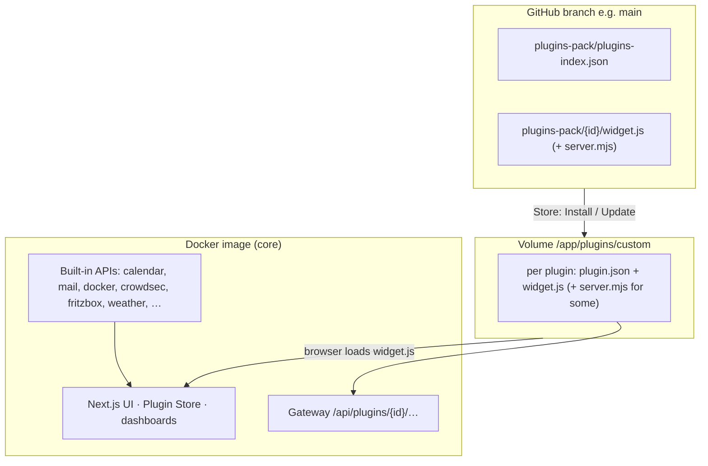
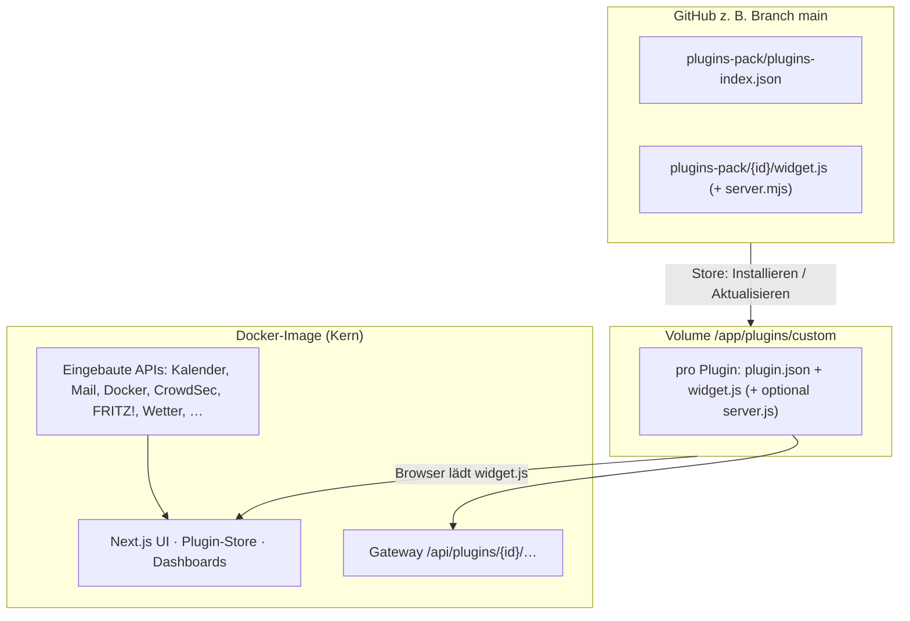

<p align="center">
  
</p>

<p align="center">
  <a href="#english">🇬🇧 English</a> &nbsp;|&nbsp; <a href="#deutsch">🇩🇪 Deutsch</a>
</p>

<p align="center">
  
  
  
  
</p>

---

<a id="overview"></a>

## SelfDashboard at a glance

<p align="center">
  <a href="docs/screenshot-dashboard.png">
    
  </a>
</p>

<p align="center"><sub>A real homelab layout — every widget is a plugin, freely arrangeable and configurable.</sub></p>

**SelfDashboard** is your personal control center for homelab and self-hosting: **one Docker container**, **one browser tab** — instead of a dozen open admin UIs.

| Visible in the screenshot | What you get |
|---|---|
| 📅 **Calendar** | Events (CalDAV/ICS), month view right on the dashboard |
| 🕐 **Clock & weather** | Local time; weather with **day blocks** (0–6 … 18–24) + **7-day** forecast (from tomorrow) |
| 🔖 **Bookmark grid** | Quick access to Unraid, DSM, Emby, Nextcloud, Vaultwarden, … |
| 🛡️ **CrowdSec** | Alerts and active bans at a glance |
| 🌐 **Network / AdGuard** | Protection status, DNS stats (tiles fill the widget) |
| ⚡ **FRITZ! energy** | Smart-outlet power: now, today, 7 days, month (TR-064) |
| 🖥️ **Unraid (2×)** | CPU, RAM, array/pool, and disks per server (**Unraid 7.2+** GraphQL) |
| 📺 **Kiosk / wall tablet** | Public **view-only** URL `/kiosk` — full-screen widgets for guests/tablets (optional password) |
| 📺 **Emby / SelfStream** | Active streams — separate widgets or **Selfstream-Emby** combined list |
| 💚 **Uptime Kuma** | Status-page monitors (up / down / pending) in a compact list |
| ✉️ **Navbar mail** | Unread IMAP badge (install **E-Mail** plugin from the store) — click opens webmail |

Everything supports **drag & drop**, **multiple dashboards** (e.g. `/dashboard/home`, `/dashboard/server`), **6 themes**, **EN/DE** — widgets come from the **volume-only plugin system** (install via **Plugin Store** or ZIP, update without rebuilding the image). See **[How SelfDashboard is built](#how-selfdashboard-is-built)**.

---

<a id="english"></a>

# 🇬🇧 English

## What is SelfDashboard?

> **See the [overview](#overview) above** for a full screenshot walkthrough.

SelfDashboard is a clean, modular, self-hosted home dashboard with a powerful plugin system — running as a single Docker container. Manage multiple dashboards, customize every detail, and add widgets for your self-hosted services.

**Plugins are not bundled in the image.** You install them from the **Plugin Store (GitHub)** or **ZIP** into a mounted folder (`/app/plugins/custom`). The Docker image only ships the **core app** (UI, store, shared APIs). Details: **[docs/PLUGINS.md](docs/PLUGINS.md)** · **[docs/PLUGIN_DEV.md](docs/PLUGIN_DEV.md)**.

## How SelfDashboard is built



| Layer | Location | Purpose |
|--------|----------|---------|
| **Core app** | Docker image `ghcr.io/…/selfdashboard` (`:latest`) | Dashboard UI, settings, logging, plugin store, most `/api/*` routes |
| **Installed plugins** | Host → `/app/plugins/custom/<id>/` | Widgets the browser runs (`widget.js`); survives image updates |
| **Plugin catalog** | GitHub `plugins-pack/` on branch `main` (configurable) | `plugins-index.json` + files the store downloads on install/update |
| **Plugin source (dev)** | `plugins-pack/<id>/` (`index.tsx`, `widget.js`, optional `server.ts`) | Store ships UI + bundled `server.mjs`; image builtins remain fallback |
| **App data** | Host → `/app/data` | `dashboard.json`, calendar DB, central log |

### App update vs plugin update

| You change… | New Docker image? | What to do |
|-------------|-------------------|------------|
| A **plugin** (`widget.js` and/or `server.mjs` on GitHub) | **No** | Plugin Store → **Update** (or **Update all**) → **Ctrl+F5** |
| **SelfDashboard core** (UI, APIs, store, loader) | **Yes** | `docker pull` + restart container; keep `/app/data` and `/app/plugins/custom` mounts |

## What's new (recent)

### Core app (Docker image)

- **Public kiosk mode** — **`/kiosk`** view-only URL for wall tablets (no admin login); optional password & session duration. Configure under **Settings → Users → Kiosk**. Edit widgets via normal login on **`/dashboard/<id>`**.
- **Two-factor auth (TOTP)** — **Settings → Users** — Authenticator apps supported at login.
- **Multi-user settings** — password change, 2FA, and kiosk config moved to **Settings → Users** (admin: user management + plugin whitelist).
- **Design backgrounds** — **Settings → Design**: **navbar** wallpaper (JPG/PNG/WebP + overlay) and **dashboard** background (**off / 1 image / 2 images** left+right), saved globally in `dashboard.json`.
- **Weather API proxy** — **`GET /api/plugins/weather/resolve`**; Open-Meteo via container HTTPS.
- **Settings modal** — fixed width, taller viewport; **Logs** tab scrolls inside the list.

### Plugins (volume / store — no image rebuild)

- **Uptime Kuma** — status-page overview (compact list, 2 columns from 6 monitors). Store ships `server.mjs` — API updates via plugin update.
- **Selfstream-Emby** — Selfstream + Emby/Jellyfin sessions in one mixed list with source icons per row.
- **Store-shipped APIs** — All backend plugins (AdGuard, Calendar, CrowdSec, Docker, Fritzbox, Fritz-Energy, Mail, Pi-hole, Selfstream, Uptime Kuma, Weather) ship `server.mjs` in `plugins-pack/` (no image rebuild for API fixes).
- **Weather 1.5.x** — current conditions; **four day blocks** (0–6, 6–12, 12–18, 18–24); **7-day** from **tomorrow**. Uses `/api/plugins/weather/…`.
- **Unraid 1.5.x** — GraphQL for **Unraid 7.2+** (not 7.3-only); array + pool disks, configurable suffix labels.
- **CrowdSec** — alert count respects time range (`daysBack`).
- **Volume-only model** — widgets live in `/app/plugins/custom`; **Plugin Store** from GitHub `plugins-pack/` (branch **`main`**); **Update all** + **Ctrl+F5** after plugin bumps.
- **Email plugin** — navbar IMAP badge + settings tab from the store.
- **Central log** — **Settings → Logs** (app, API, plugins).

Full API/plugin notes: **[docs/CHANGELOG.md](docs/CHANGELOG.md)**.

## Documentation

| Topic | Document |
|--------|----------|
| Install & update plugins | [docs/PLUGINS.md](docs/PLUGINS.md) |
| Write & publish plugins | [docs/PLUGIN_DEV.md](docs/PLUGIN_DEV.md) |
| Plugin architecture | [docs/PLUGIN_ARCHITECTURE.md](docs/PLUGIN_ARCHITECTURE.md) |
| Builtin servers in git / CI | [docs/PLUGINS_IN_REPO.md](docs/PLUGINS_IN_REPO.md) |
| Docker image build | [docs/DOCKER_BUILD.md](docs/DOCKER_BUILD.md) |
| Per-plugin setup (EN/DE) | [docs/plugins/README.md](docs/plugins/README.md) |
| Recent API/plugin changes | [docs/CHANGELOG.md](docs/CHANGELOG.md) |
| Error log | [docs/LOGGING.md](docs/LOGGING.md) |
| Unraid forum (update posts) | [docs/UNRAID_FORUM.md](docs/UNRAID_FORUM.md) |

## Features

Recent plugin and API changes are summarized in **[docs/CHANGELOG.md](docs/CHANGELOG.md)**.

| Feature | Description |
|---|---|
| 🧩 **Plugin System** | Volume-only widgets — install from GitHub store or ZIP; no widgets baked into the image |
| 🔄 **Plugin updates** | Store compares versions; badge + **Update all** — **no** image rebuild; **Ctrl+F5** after update |
| 📋 **Multiple Dashboards** | Create unlimited dashboards, each with its own URL (`/dashboard/home`, `/dashboard/server`) |
| 🎨 **6 Color Themes** | Dark, Light, Nord, Catppuccin, Dracula, Solarized |
| 🖌️ **Custom Colors** | Override any color individually per dashboard |
| 🖼️ **Custom Logo** | Upload your own logo per dashboard |
| 🖼️ **Background images** | **Design**: navbar wallpaper + dashboard (**1** or **2** JPG/PNG images) with readability overlay |
| 🌍 **Multilingual** | German & English interface |
| 🖱️ **Drag & Drop** | Move and resize widgets freely |
| 📐 **Widget Controls** | Per-widget zoom, padding and height adjustments |
| 🔍 **Dashboard Zoom** | Scale the entire dashboard (60%–150%) |
| 📏 **Grid Spacing** | Adjust widget gap and outer padding |
| 🔗 **Navbar Options** | Show icon only, text only, or both — toggle dashboard tabs |
| 📱 **Responsive layout** | **Phone / tablet / desktop** grid based on dashboard width; optional per-widget overrides in **⚙️ → Layout: phone & tablet**; compact **navbar search** (full-width row) on narrow viewports |
| 🐳 **Single Container** | Next.js 15, no external database (embedded SQLite for auth), no Redis needed |
| 📋 **Central error log** | **Settings → Logs**: app, API, and plugin errors (filter, export, 3–30 day retention) — automatic for every registered plugin |
| ✉️ **Navbar mail (IMAP)** | Unread badge in the navbar — multiple accounts, Synology/MailPlus-friendly, encrypted passwords, webmail link on click |
| 🔐 **Login & multi-user** | SQLite auth, admin/user roles, plugin whitelist, optional TOTP 2FA |
| 📺 **Kiosk mode** | Public **`/kiosk`** URL — view-only full-screen dashboard for wall tablets; optional password (admin configures under **Settings → Users → Kiosk**) |
| 🖥️ **Unraid Ready** | Community Apps template included |

---

## Plugins

Widgets are **not** bundled in the image — install them from the **Plugin Store** or upload a ZIP. Each plugin has its own **README (EN/DE)** under `plugins-pack/<id>/`.

Install & folders: **[docs/PLUGINS.md](docs/PLUGINS.md)** · Develop plugins: **[docs/PLUGIN_DEV.md](docs/PLUGIN_DEV.md)**

Plugins marked **(Beta)** are new integrations that have not yet been tested against every server version — feedback (with the service version) is welcome.

| Plugin | Category | Description | README |
|--------|----------|-------------|--------|
| [AdGuard Home](plugins-pack/adguard/README.md) | Network | DNS stats, protection toggle | EN/DE |
| [Bookmarks](plugins-pack/bookmarks/README.md) | Utility | Quick links with groups | EN/DE |
| [Calendar](plugins-pack/calendar/README.md) | Productivity | CalDAV + ICS | EN/DE |
| [Clock](plugins-pack/clock/README.md) | Utility | Time, date, timezone | EN/DE |
| [CrowdSec](plugins-pack/crowdsec/README.md) | Security | Alerts, bans, world map (optional) | EN/DE |
| [Docker](plugins-pack/docker/README.md) | System | Containers via socket | EN/DE |
| [Emby](plugins-pack/emby/README.md) | Media | Active sessions | EN/DE |
| [FRITZ! WAN](plugins-pack/fritzbox/README.md) | Network | Throughput chart | EN/DE |
| [FRITZ! Energy](plugins-pack/fritz-energy/README.md) | Network | Smart plug kWh | EN/DE |
| [Home Assistant](plugins-pack/home-assistant/README.md) | Utility | Selected entities **(Beta)** | EN/DE |
| [Iframe](plugins-pack/iframe/README.md) | Utility | Embed URLs | EN/DE |
| [Jellyfin](plugins-pack/jellyfin/README.md) | Media | Active sessions | EN/DE |
| [Email](plugins-pack/mail/README.md) | Productivity | Navbar IMAP badge | EN/DE |
| [Nginx Proxy Manager](plugins-pack/npm/README.md) | Network | Proxy hosts overview **(Beta)** | EN/DE |
| [OpenMediaVault](plugins-pack/openmediavault/README.md) | Storage | System info via RPC **(Beta)** | EN/DE |
| [OPNsense](plugins-pack/opnsense/README.md) | Network | Version, gateways **(Beta)** | EN/DE |
| [Pi-hole](plugins-pack/pihole/README.md) | Network | Pi-hole v6 stats | EN/DE |
| [Plex](plugins-pack/plex/README.md) | Media | Active sessions **(Beta)** | EN/DE |
| [Proxmox VE](plugins-pack/proxmox/README.md) | System | Nodes, VMs/LXC **(Beta)** | EN/DE |
| [Scratchpad](plugins-pack/scratchpad/README.md) | Utility | Short notes | EN/DE |
| [Selfstream](plugins-pack/selfstream/README.md) | Media | Live IPTV | EN/DE |
| [Selfstream · Emby · Jellyfin](plugins-pack/selfstream-emby/README.md) | Media | Combined stream list | EN/DE |
| [Speedtest Tracker](plugins-pack/speedtest-tracker/README.md) | Network | Latest down/up/ping **(Beta)** | EN/DE |
| [TrueNAS](plugins-pack/truenas/README.md) | Storage | System + pool status **(Beta)** | EN/DE |
| [UniFi Controller](plugins-pack/unifi/README.md) | Network | WLAN/LAN/WAN status **(Beta)** | EN/DE |
| [Unraid](plugins-pack/unraid/README.md) | System | Unraid **7.2+** GraphQL overview | EN/DE |
| [Unraid Docker](plugins-pack/unraid-docker/README.md) | System | Containers via Unraid API | EN/DE |
| [Uptime Kuma](plugins-pack/uptime-kuma/README.md) | Network | Status-page monitors | EN/DE |
| [Weather](plugins-pack/weather/README.md) | Utility | Open-Meteo (proxy), day blocks + 7-day | EN/DE |

## Quick Start

**Required:** map **`/app/data`** and **`/app/plugins/custom`**. Without the plugins folder, the store can install files but they will not persist.

**Image tags:** Unraid template uses **`ghcr.io/kabelsalatundklartext/selfdashboard:latest`**. Plugin catalog defaults to GitHub branch **`main`** (`SELFDASHBOARD_PLUGINS_GITHUB_REF`); the **`:beta`** image loads its catalog from the **`beta`** branch.

**Non-root container (PUID/PGID):** the app runs non-root, by default as **PUID/PGID 99/100** (Unraid `nobody:users`). On start, the entrypoint remaps to your PUID/PGID and chowns `/app/data` + `/app/plugins/custom` automatically (opt-out: `SELFDASHBOARD_SKIP_CHOWN=1`). **CrowdSec tip:** set PUID/PGID to the **same values as your CrowdSec container** — then SelfDashboard owns and reads `crowdsec.db` directly, surviving nightly backups that restart CrowdSec (no chmod needed).

### Option 1 — Unraid Community Apps (recommended)

1. Open Community Apps → search for **SelfDashboard**
2. Install — set **Config Storage**, **Plugins Storage**, port (default `3000`)
3. Open `http://YOUR-IP:3000`
4. **Plugin Store → From GitHub** — install widgets you need (Calendar, Bookmarks, …)
5. Click **+** to place widgets on the dashboard → **Ctrl+F5** if a widget stays blank
6. Done ✓

### Option 2 — Docker run

```bash
docker run -d \
  --name selfdashboard \
  --restart unless-stopped \
  -p 3000:3000 \
  -e TZ=Europe/Berlin \
  -v /mnt/user/appdata/selfdashboard:/app/data \
  -v /mnt/user/appdata/selfdashboard/plugins:/app/plugins/custom \
  -v /var/run/docker.sock:/var/run/docker.sock \
  ghcr.io/kabelsalatundklartext/selfdashboard:latest
```

*(**`/app/data`** → `dashboard.json`, calendar, logs. **`/app/plugins/custom`** → installed plugins. **Store → From GitHub** or ZIP, then **Ctrl+F5**. Docker socket optional — **Docker** plugin only. CrowdSec mount optional — **CrowdSec** plugin only.)*

### Option 3 — docker-compose

```bash
git clone https://github.com/kabelsalatundklartext/selfdashboard.git
cd selfdashboard
docker-compose up -d
```

## Docker & Unraid template

| Mount / setting | Content |
|-----------------|--------|
| **`/app/data`** | Per-user dashboards (`users/`), auth DB (`auth/`), calendar, central log — **back up** regularly |
| **`/app/plugins/custom`** | Installed plugins (`<id>/plugin.json`, `widget.js`, optional `server.mjs`) — **back up** with appdata |
| **GitHub env vars** | Pre-set in `:latest` image: repo `kabelsalatundklartext/selfdashboard`, ref `main`, path `plugins-pack` |
| **Docker Socket** (optional) | Local host only — **[Docker plugin](docs/plugins/docker/README.md)** |
| **CrowdSec Data** (optional) | `crowdsec.db` read-only — **[CrowdSec plugin](docs/plugins/crowdsec/README.md)** |

Unraid: **`unraid/selfdashboard.xml`** on branch **`main`** — **Config Storage**, **Plugins Storage** (both required for a normal setup).

After a **plugin** update: Store → **Update** → **Ctrl+F5**. After an **app** update: pull new image, restart — layouts and installed plugins stay on the volumes.

## Login & multi-user

SelfDashboard requires login. On first start (no users yet) you are redirected to **`/setup`** to create the admin account. Existing `dashboard.json` in appdata is migrated to that admin automatically (backup: `dashboard.json.pre-auth-migrated`).

| Topic | Details |
|-------|---------|
| **Roles** | **admin** — full access, plugin store, user management · **user** — only whitelisted plugins |
| **User data** | `/app/data/users/<id>/dashboard.json` per user |
| **Auth data** | `/app/data/auth/auth.db` (users, sessions, plugin whitelist) |
| **Admin UI** | **Settings → Users** — create/delete users, reset passwords, plugin checkmarks, **kiosk config** |
| **Self-service** | **Settings → Users** — change password, enable **2FA (TOTP)** |
| **2FA** | Optional authenticator at login — setup under **Settings → Users** |
| **Forgot password (no email)** | Env reset: `SELFDASHBOARD_AUTH_RESET_PASSWORD` → restart (see below) |
| **Backup** | Back up all of **`/app/data`** (at least `auth/` + `users/`) |
| **Dev only** | `SELFDASHBOARD_AUTH_DISABLED=1` disables auth (never in production) |

Details & test checklist: **[docs/AUTH-ROADMAP.md](docs/AUTH-ROADMAP.md)** · **[docs/UNRAID_AUTH_CHECKLIST.md](docs/UNRAID_AUTH_CHECKLIST.md)**

### Admin locked out (forgot password)

There is **no email reset** (would need SMTP — not typical for homelab). **Simplest: env reset on Unraid:**

1. **Env password reset (recommended on Unraid)** — edit container, add variable:
   - `SELFDASHBOARD_AUTH_RESET_PASSWORD` = your new password (min. 8 chars)
   - optional: `SELFDASHBOARD_AUTH_RESET_USER=admin` (default: first admin)
   - or one field: `SELFDASHBOARD_AUTH_RESET=admin:NewPassword`
   - **Restart container** → sign in → **clear the variable(s)** → restart again

2. **Direct CLI** (shell access):
   ```bash
   docker exec selfdashboard node /app/scripts/auth-reset-password.mjs --username admin --password 'NewSecurePass'
   ```

3. **Second admin** — reset password under **Settings → Users**.

---

## Dashboard Management

Each dashboard gets its own URL. Navigate between dashboards via the tab bar in the navbar or through **Settings → Dashboards**.

| Action | How |
|---|---|
| Create dashboard | Settings → Dashboards → New Dashboard |
| Switch dashboard | Click tab in navbar or Settings → Dashboards → Open |
| Hide tab from navbar | Settings → Dashboards → 👁️ toggle per dashboard |
| Delete dashboard | Settings → Dashboards → 🗑️ |
| Rename / change icon | Settings → Dashboards → ✏️ |

---

## Widget Controls

In **Edit Mode** (✏️ button), hover over any widget to see controls:

| Control | Function |
|---|---|
| ⠿ Drag handle | Move widget |
| 🔍 `− 100% +` | Zoom widget content |
| ↔ `− 8 +` | Inner padding |
| ↕ `− 4 +` | Widget height |
| ⚙️ | Plugin settings |
| ✕ | Remove widget |
| Resize grip (corner/edge) | Resize width and height freely |

---

## Responsive layout (phone, tablet & desktop)

The dashboard uses **three layout bands** based on the **dashboard grid width** (the track that holds the widgets — not only the outer browser window):

| Band | Approx. width | Behaviour |
|---|---|---|
| **Phone** | **&lt; 768 px** | Single **stacked column**; each widget uses **`layoutPhone`** height overrides when set, otherwise the desktop **`layout`** height. |
| **Tablet** | **768 – 1023 px** | **12-column** grid like desktop; optional **`layoutTablet`** overrides (`w`, `h`, `x`, `y`, `minH`) merge with **`layout`**. |
| **Desktop** | **≥ 1024 px** | Full **desktop** layout — what you usually edit when resizing widgets on a large screen. |

**How to tune it:** enter **Edit mode** (✏️), open a widget’s **⚙️** settings. Below the plugin-specific options, **“Layout: phone & tablet”** lets you set optional **phone** row height / min height and **tablet** position & size. **Leave fields empty** to keep using the desktop layout values for that band.

On **narrow viewports (about ≤ 1024 px)** the **navbar web search** moves to a **second row** at **full width** so it is not squeezed into the corner next to zoom and actions.

Plugins can optionally read the **`layoutMode`** prop (`'phone' \| 'tablet' \| 'desktop'`) for their own responsive UI — see **[docs/PLUGIN_DEV.md](docs/PLUGIN_DEV.md)**.

---

## Kiosk mode (wall tablet)

Public **view-only** display for a wall-mounted tablet or guest browser — separate from the normal logged-in dashboard.

| Topic | Details |
|---|---|
| **Display URL** | **`http://YOUR-IP:3000/kiosk`** — no admin login, full-screen widgets, no navbar |
| **Configure (admin)** | **Settings → Users → Kiosk / wall tablet** — enable, pick dashboard, optional password, session duration (2 h … unlimited) |
| **Edit widgets** | Log in as admin → **`/dashboard/<id>`** (e.g. `/dashboard/kiosk`) → edit mode — same as any dashboard |
| **Do not confuse** | **`/kiosk`** = display only · **`/dashboard/kiosk`** = edit with login |
| **Plugins** | Only widgets on the chosen kiosk dashboard are loaded (works in any browser, no SelfDashboard account needed when passwordless) |
| **HTTP / LAN** | Cookies work on HTTP by default; set `SELFDASHBOARD_SECURE_COOKIES=1` only behind HTTPS |

Ideal for a kitchen display, wall tablet, or shared screen on your LAN.

---

## Settings Overview

**General** — Language (DE/EN), dashboard title, navbar web search, navbar mail badge, navbar display style, dashboard tab visibility

**Users** — Change password, **2FA (TOTP)**, **kiosk / wall tablet** (admin). Admins also manage users and plugin whitelist here.

**Dashboards** — Create, edit, delete dashboards. Toggle tab visibility per dashboard. Set emoji or custom PNG icon.

**Design** — Navbar display style; grid spacing; **navbar background** (JPG/PNG + overlay); **dashboard background** (off / 1 image / 2 images side by side + overlay); logo upload; color theme; custom color overrides

**Email** — IMAP accounts, navbar badge, poll interval, connection test

**Logs (Protokoll)** — Central error log for support and debugging: filter by level, source, plugin; download `.txt` / JSONL; retention 3 / 7 / 30 days. Every plugin registered via `registerPlugin` logs render failures and failed `/api/*` calls automatically. Mail uses the same log with plugin id **`mail`**. Details: **[docs/LOGGING.md](docs/LOGGING.md)**.

## Environment Variables

| Variable | Default | Description |
|---|---|---|
| `TZ` | `Europe/Berlin` | Timezone |
| `NODE_ENV` | `production` | Node.js environment |
| `SELFDASHBOARD_DATA_DIR` | `/app/data` (in the official image) | Directory inside the container where **`dashboard.json`** is stored. Must match your **`/app/data`** bind-mount unless you intentionally use another path. |
| `SELFDASHBOARD_SECRET_KEY` | auto-generated file in data dir | **Central secret key** for encrypting **all** stored credentials: calendar, mail **and widget passwords/tokens** (AdGuard, Pi-hole, FRITZ!, Speedtest, …). **Strongly recommended:** set a fixed value in Docker so credentials survive image updates and volume moves. Once set, never change it — sealed secrets become unreadable. (Legacy alias `SELFDASHBOARD_CALENDAR_KEY` still works as a fallback.) |
| `MAIL_DATA_DIR` | `<plugins/custom>/mail` | Directory for **`mail.json`** (optional override) |
| `SELFDASHBOARD_PLUGINS_CUSTOM` | `<app>/plugins/custom` | Installed plugins (Unraid: map host folder here) |
| `SELFDASHBOARD_PLUGINS_GITHUB_REPO` | `kabelsalatundklartext/selfdashboard` in `:latest` image | GitHub repo for store (`owner/repo`) |
| `SELFDASHBOARD_PLUGINS_GITHUB_REF` | `main` | Branch/tag for `plugins-pack/` |
| `SELFDASHBOARD_PLUGINS_GITHUB_PATH` | `plugins-pack` | Path in repo to plugin files |
| `CROWDSEC_DATA_DIR` | `/crowdsec-data` | Allowed root for DB paths (CrowdSec widget only; optional) |
| `CROWDSEC_GEOIP_PATH` | — | Full path to `GeoLite2-*.mmdb` if not in the data folder (optional) |
| `CROWDSEC_DB_PATH` | — | Default DB file if widget path is empty (optional) |
| `CROWDSEC_CONTAINER` | `crowdsec` | Docker container name for optional unban via `cscli` (optional) |
| `SELFDASHBOARD_SECURE_COOKIES` | off | Set `1` to mark session/kiosk cookies **Secure** (HTTPS only). Default: **off** (HTTP on LAN works). |
| `SELFDASHBOARD_INSECURE_COOKIES` | — | Set `1` to force non-Secure cookies (same as default on HTTP). |
| `SELFDASHBOARD_AUTH_RESET_PASSWORD` | — | One-shot admin password reset on container start (see **Login & multi-user**) |

---

## Troubleshooting

| Problem | Solution |
|---|---|
| Dashboard not loading | Check logs: `docker logs selfdashboard` |
| **500 error after update** (`SQLITE_READONLY` in logs) | The container runs **non-root** (PUID/PGID, default 99/100). The entrypoint fixes volume ownership automatically on start; if you set `SELFDASHBOARD_SKIP_CHOWN=1`, run `chown -R <PUID>:<PGID>` on your appdata folder yourself. |
| **CrowdSec: `unable to open database file`** (often after nightly backups) | Set the container's **PUID/PGID to the same values as your CrowdSec container** (Unraid default 99/100). Then SelfDashboard reads `crowdsec.db` as the owner — permanently, no chmod. |
| Config lost after update | Image updates do not remove your appdata volume; your layout lives in **`/app/data/users/<userId>/dashboard.json`** (plus a `localStorage` cache). If a **new browser** shows an empty dashboard, check **`/app/data`** is mounted and writable (see **Docker & Unraid template**). |
| Plugin store empty / “GitHub not configured” | Set `SELFDASHBOARD_PLUGINS_GITHUB_*` or use the official `:latest` image defaults |
| Widget stuck on “Loading plugin…” | Wait a few seconds; **Plugin Store → Reload plugins**; check files under `/app/plugins/custom/<id>/widget.js` |
| Update installed, UI unchanged | **Ctrl+F5** (hard reload) — browser caches `widget.js` |
| Plugin not found after install | Confirm **Plugins Storage** mount; folder must contain `plugin.json` + `widget.js` (not `index.tsx`) |
| Port already in use | Change host port: `-p 3001:3000` |
| Widgets invisible in edit mode | Try refreshing the page |
| Theme not applying | Hard refresh: Ctrl+Shift+R |
| CrowdSec widget: `crowdsec.db not found` | Set **CrowdSec Data (optional)** in the Unraid template (host folder with `crowdsec.db` → `/crowdsec-data:ro`), or remove the widget if you do not use CrowdSec |
| CrowdSec: no country flags / all `??` | Ensure **GeoLite2-City.mmdb** (or Country) is in the mounted CrowdSec data folder, or set `CROWDSEC_GEOIP_PATH` |
| CrowdSec: unban fails | Mount **Docker Socket**, check container name in plugin settings, enable unban there |
| Mail badge red/yellow, count 0 | **Settings → Email** → re-enter password → **Save**. Set fixed `SELFDASHBOARD_CALENDAR_KEY` in Docker. Check **Logs** filter `mail` |
| Mail: `ENOTFOUND host:5000` | IMAP host must be IP/hostname only (e.g. `192.168.1.15`), port **993** separate; webmail URL goes in **Webmail URL** field |
| Mail test OK, navbar empty | Enable **Navbar email** (General or Email tab); save account; badge needs unread &gt; 0 |
| Mail badge shows mail that is gone in MailPlus | IMAP may still list deleted/read messages until the server cleans up. Use **Show unread** in email settings to see subjects. After update, SelfDashboard ignores `\Deleted` and `\Seen` ghosts. In MailPlus: empty trash / expunge if needed, then **Refresh all accounts**. |
| MailPlus shows 1 unread, preview listed 2 (old FRITZ mail) | Synology IMAP can keep ancient `UNSEEN` UIDs. Use **Settings → Email → Unread age filter** (default 30 days; `0` = off). Preview shows how many were ignored as too old or duplicate `Message-ID`. |
| Weather: **HTTP 404** on plugin API | **New app image** required — route is in the core app (`/api/plugins/weather/…`), not a volume-only plugin |
| Weather: no data / API error | Container must reach `api.open-meteo.com` and `geocoding-api.open-meteo.com` (HTTPS outbound). Test: `http://HOST:PORT/api/plugins/weather/resolve?name=Berlin&language=de` → JSON |
| Weather plugin old UI (hourly strip only) | Plugin Store → **Weather** → **Update** → **Ctrl+F5** (target **1.3.x**) |
| Unraid: **`Failed to fetch`** | Browser calls Unraid **directly** (`https://NAS/graphql`). Not a 7.3-only issue — check **API key**, URL, HTTPS cert, and **CORS / allowed origins** for your dashboard URL (e.g. `http://192.168.x.x:3010`) on **each** NAS |
| Unraid works on one NAS, not another | Compare API enabled, key permissions, and CORS on the failing box (**7.2.3** and **7.3** both supported if GraphQL API is active) |
| Background image not visible | **Design** → mode not **Off**; image uploaded; after change **Ctrl+F5**; very large images are capped (~4–5 MB in config) |
| Kiosk shows login instead of widgets | Use **`/kiosk`**, not **`/dashboard/…`**. Enable kiosk under **Settings → Users → Kiosk** |
| Kiosk: “Plugin not found” | Open **`/kiosk`** once as admin (updates plugin list), then retry guest browser; **Ctrl+F5** |
| Home dashboard broken after visiting `/kiosk` | Update to latest image (kiosk cookie no longer overrides admin session); **Ctrl+F5** |

---

## Technology

- **Frontend:** Next.js 15, React 18, Tailwind CSS
- **State:** Zustand — persisted to **`localStorage`** (cache) and to **`dashboard.json`** on the server when **`/app/data`** (or **`SELFDASHBOARD_DATA_DIR`**) is available
- **Grid:** react-grid-layout
- **Container:** Node.js 22 Alpine (multi-stage build, Next.js standalone)
- **Plugins:** Volume-only — dynamic `widget.js` load + `pluginRegistry`; catalog from GitHub `plugins-pack/`
- **Develop:** `npm run dev` in repo root; publish plugins with `npm run publish:plugin-pack`

---

## License

**MIT** — free to use, modify and share.

---

---

<a id="deutsch"></a>

# 🇩🇪 Deutsch

<a id="overview-de"></a>

## SelfDashboard im Überblick

<p align="center">
  <a href="docs/screenshot-dashboard.png">
    
  </a>
</p>

<p align="center"><sub>Ein reales Homelab-Layout — alle Widgets sind Plugins, frei anordbar und konfigurierbar.</sub></p>

**SelfDashboard** ist dein persönliches Kontrollzentrum für Homelab und Self-Hosting: **ein Docker-Container**, **ein Browser-Tab** — statt zwölf geöffneter Admin-Oberflächen.

| Im Screenshot sichtbar | Was es dir bringt |
|---|---|
| 📅 **Kalender** | Termine (CalDAV/ICS), Monatsansicht direkt auf dem Dashboard |
| 🕐 **Uhr & Wetter** | Lokale Zeit; Wetter mit **Tagesabschnitten** (0–6 … 18–24) + **7-Tage**-Vorschau (ab morgen) |
| 🔖 **Lesezeichen-Grid** | Schnellzugriff auf Unraid, DSM, Emby, Nextcloud, Vaultwarden, … |
| 🛡️ **CrowdSec** | Alerts und aktive Bans auf einen Blick |
| 🌐 **Netzwerk / AdGuard** | Schutz-Status, DNS-Statistik (Kacheln füllen das Widget) |
| ⚡ **FRITZ! Energie** | Steckdose: aktuell, heute, 7 Tage, Monat (TR-064) |
| 🖥️ **Unraid (2×)** | CPU, RAM, Array/Pool und Festplatten pro Server (**Unraid 7.2+** GraphQL) |
| 📺 **Kiosk / Wand-Tablet** | Öffentliche **Nur-Ansicht** unter `/kiosk` — Vollbild für Gäste/Tablet (optional Passwort) |
| 📺 **Emby / SelfStream** | Aktive Streams — einzeln oder kombiniert als **Selfstream-Emby** |
| 💚 **Uptime Kuma** | Status-Page-Monitore (OK / Down / Pending) in kompakter Liste |
| ✉️ **Navbar E-Mail** | IMAP-Badge (Plugin **E-Mail** aus dem Store installieren) — Klick öffnet Webmail |

Alles ist **Drag & Drop**, **mehrere Dashboards** (z. B. `/dashboard/home`, `/dashboard/server`), **6 Themes**, **DE/EN** — Widgets kommen aus dem **Volume-only Plugin-System** (Store oder ZIP, Updates ohne Image-Rebuild). Siehe **[Aufbau von SelfDashboard](#aufbau-von-selfdashboard)**.

## Was ist SelfDashboard?

SelfDashboard ist ein sauberes, modulares, selbst gehostetes Home-Dashboard mit einem leistungsstarken Plugin-System — als einzelner Docker-Container. Verwalte mehrere Dashboards, passe jedes Detail an und füge Widgets für deine selbst gehosteten Dienste hinzu.

**Plugins stecken nicht im Image.** Installation über **Plugin-Store (GitHub)** oder **ZIP** nach `/app/plugins/custom`. Das Image enthält nur die **Kern-App** (UI, Store, gemeinsame APIs). Details: **[docs/PLUGINS.md](docs/PLUGINS.md)** · **[docs/PLUGIN_DEV.md](docs/PLUGIN_DEV.md)**.

## Aufbau von SelfDashboard



| Schicht | Ort | Zweck |
|--------|-----|--------|
| **Kern-App** | Image `ghcr.io/…/selfdashboard` (`:latest`) | UI, Einstellungen, Protokoll, Plugin-Store, die meisten `/api/*`-Routen |
| **Installierte Plugins** | Host → `/app/plugins/custom/<id>/` | Widgets im Browser (`widget.js`); überlebt Image-Updates |
| **Plugin-Katalog** | GitHub `plugins-pack/` auf Branch `main` (konfigurierbar) | `plugins-index.json` + Dateien für Install/Update |
| **Plugin-Quellcode (Dev)** | `plugins-pack/<id>/` (`index.tsx`, `widget.js`, optional `server.ts`) | Store liefert UI + gebündeltes `server.mjs`; Image-Builtins als Fallback |
| **App-Daten** | Host → `/app/data` | `dashboard.json`, Kalender-DB, zentrales Protokoll |

### App-Update vs Plugin-Update

| Du änderst… | Neues Docker-Image? | Vorgehen |
|-------------|---------------------|----------|
| Ein **Plugin** (`widget.js` und/oder `server.mjs` auf GitHub) | **Nein** | Plugin-Store → **Aktualisieren** (oder **Alle aktualisieren**) → **Strg+F5** |
| **SelfDashboard-Kern** (UI, APIs, Store, Loader) | **Ja** | `docker pull` + Container neu starten; Mounts `/app/data` und `/app/plugins/custom` behalten |

## Neu (aktuelle Erweiterungen)

### Kern-App (Docker-Image)

- **Öffentlicher Kiosk-Modus** — URL **`/kiosk`** (Nur-Ansicht, kein Admin-Login); optional Passwort & Sitzungsdauer. Konfiguration: **Einstellungen → Benutzer → Kiosk**. Widgets bearbeiten per Login unter **`/dashboard/<id>`**.
- **Zwei-Faktor-Auth (TOTP)** — **Einstellungen → Benutzer** — Authenticator-Apps beim Login.
- **Einstellungen Benutzer-Tab** — Passwort, 2FA, Kiosk; Admin: Benutzerverwaltung & Plugin-Freigaben.
- **Hintergrundbilder im Design** — **Einstellungen → Design**: **Navbar**-Wallpaper (JPG/PNG/WebP + Overlay) und **Dashboard**-Hintergrund (**Aus / 1 Bild / 2 Bilder** links+rechts), global in `dashboard.json`.
- **Wetter-API-Proxy** — **`GET /api/plugins/weather/resolve`**; Open-Meteo über HTTPS im Container.
- **Einstellungs-Dialog** — feste Breite, höheres Fenster; Tab **Protokoll** scrollt in der Liste.

### Plugins (Volume / Store — kein Image-Rebuild)

- **Uptime Kuma** — Status-Page-Übersicht (kompakte Liste, 2 Spalten ab 6 Monitoren). Store liefert `server.mjs` — API-Updates per Plugin-Update.
- **Selfstream-Emby** — Selfstream- und Emby/Jellyfin-Sessions in einer gemischten Liste mit Quellen-Icon pro Zeile.
- **APIs im Store** — Alle Backend-Plugins (AdGuard, Kalender, CrowdSec, Docker, Fritzbox, Fritz-Energy, Mail, Pi-hole, Selfstream, Uptime Kuma, Wetter) liefern `server.mjs` in `plugins-pack/` (kein Image-Rebuild für API-Fixes).
- **Wetter 1.5.x** — aktuelles Wetter; **vier Tagesabschnitte** (0–6, 6–12, 12–18, 18–24); **7-Tage** ab **morgen**. Nutzt `/api/plugins/weather/…`.
- **Unraid 1.5.x** — GraphQL für **Unraid 7.2+** (nicht nur 7.3); Array + Pool, konfigurierbare Zusatz-Labels.
- **CrowdSec** — Alert-Zähler beachtet Zeitraum (`daysBack`).
- **Nur Plugins vom Volume** — Widgets unter `/app/plugins/custom`; **Plugin-Store** von GitHub `plugins-pack/` (Branch **`main`**); **Alle aktualisieren** + **Strg+F5** nach Plugin-Updates.
- **E-Mail-Plugin** — Navbar-IMAP-Badge + Einstellungs-Tab aus dem Store.
- **Zentrales Protokoll** — **Einstellungen → Protokoll** (App, API, Plugins).

API-/Plugin-Details: **[docs/CHANGELOG.md](docs/CHANGELOG.md)**.

## Dokumentation

| Thema | Datei |
|--------|--------|
| Installation & Plugin-Updates | [docs/PLUGINS.md](docs/PLUGINS.md) |
| Plugins entwickeln & veröffentlichen | [docs/PLUGIN_DEV.md](docs/PLUGIN_DEV.md) |
| Plugin-Architektur | [docs/PLUGIN_ARCHITECTURE.md](docs/PLUGIN_ARCHITECTURE.md) |
| Builtin-Server im Git / CI | [docs/PLUGINS_IN_REPO.md](docs/PLUGINS_IN_REPO.md) |
| Docker-Image bauen | [docs/DOCKER_BUILD.md](docs/DOCKER_BUILD.md) |
| Pro-Plugin-Anleitung (DE/EN) | [docs/plugins/README.md](docs/plugins/README.md) |
| Aktuelle API-/Plugin-Änderungen | [docs/CHANGELOG.md](docs/CHANGELOG.md) |
| Fehlerprotokoll | [docs/LOGGING.md](docs/LOGGING.md) |
| Unraid-Forum (Update-Posts) | [docs/UNRAID_FORUM.md](docs/UNRAID_FORUM.md) |

## Features

Aktuelle Plugin- und API-Änderungen: **[docs/CHANGELOG.md](docs/CHANGELOG.md)**.

| Feature | Beschreibung |
|---|---|
| 🧩 **Plugin-System** | Nur Volume-Plugins — Store (GitHub) oder ZIP; keine Widgets im Image |
| 🔄 **Plugin-Updates** | Versionsvergleich im Store; Badge + **Alle aktualisieren** — **kein** Image-Rebuild; danach **Strg+F5** |
| 📋 **Mehrere Dashboards** | Unbegrenzt viele Dashboards, jedes mit eigener URL (`/dashboard/home`, `/dashboard/server`) |
| 🎨 **6 Farbthemen** | Dark, Light, Nord, Catppuccin, Dracula, Solarized |
| 🖌️ **Eigene Farben** | Jede Farbe einzeln pro Dashboard anpassbar |
| 🖼️ **Eigenes Logo** | Logo pro Dashboard hochladen |
| 🖼️ **Hintergrundbilder** | **Design**: Navbar-Wallpaper + Dashboard (**1** oder **2** JPG/PNG) mit Lesbarkeits-Overlay |
| 🌍 **Mehrsprachig** | Deutsch & Englisch |
| 🖱️ **Drag & Drop** | Widgets frei verschieben und skalieren |
| 📐 **Widget-Controls** | Zoom, Innenabstand und Höhe pro Widget einstellbar |
| 🔍 **Dashboard-Zoom** | Gesamtes Dashboard skalieren (60%–150%) |
| 📏 **Grid-Abstände** | Widget-Abstand und Außenrand einstellbar |
| 🔗 **Navbar-Optionen** | Nur Icon, nur Text oder beides — Dashboard-Tabs ein/ausblendbar |
| 📱 **Responsives Layout** | **Handy / Tablet / Desktop**-Raster je nach Dashboard-Breite; optionale Widget-Overrides unter **⚙️ → Layout: Handy & Tablet**; **Navbar-Suche** auf schmalen Viewports in **eigener voller Zeile** |
| 🐳 **Single Container** | Next.js 15, keine externe Datenbank (eingebettetes SQLite für Auth), kein Redis nötig |
| 📋 **Zentrales Protokoll** | **Einstellungen → Protokoll**: App-, API- und Plugin-Fehler (Filter, Export, 3–30 Tage) — automatisch für jedes registrierte Plugin |
| ✉️ **Navbar E-Mail (IMAP)** | Ungelesen-Badge in der Navbar — mehrere Konten, Synology/MailPlus, verschlüsselte Passwörter, Webmail per Klick |
| 🔐 **Login & Mehrbenutzer** | SQLite-Auth, Admin/User-Rollen, Plugin-Whitelist, optional TOTP-2FA |
| 📺 **Kiosk-Modus** | Öffentliche URL **`/kiosk`** — Nur-Ansicht/Vollbild fürs Wand-Tablet; optional Passwort (**Einstellungen → Benutzer → Kiosk**) |
| 🖥️ **Unraid-ready** | Community Apps Template inklusive |

---

## Plugins

Widgets kommen **nicht** im Image mit — Installation über **Plugin-Store** oder ZIP. Pro Plugin eine eigene **README (DE/EN)** unter `plugins-pack/<id>/`.

Installation & Ordner: **[docs/PLUGINS.md](docs/PLUGINS.md)** · Entwicklung: **[docs/PLUGIN_DEV.md](docs/PLUGIN_DEV.md)**

Mit **(Beta)** markierte Plugins sind neue Integrationen, die noch nicht gegen jede Server-Version getestet sind — Feedback (mit Versionsangabe) ist willkommen.

| Plugin | Kategorie | Kurzbeschreibung | README |
|--------|-----------|------------------|--------|
| [AdGuard Home](plugins-pack/adguard/README.md) | Netzwerk | DNS-Statistik, Schutz umschalten | DE/EN |
| [Bookmarks](plugins-pack/bookmarks/README.md) | Utility | Schnelllinks mit Gruppen | DE/EN |
| [Kalender](plugins-pack/calendar/README.md) | Productivity | CalDAV + ICS | DE/EN |
| [Uhr](plugins-pack/clock/README.md) | Utility | Zeit, Datum, Zeitzone | DE/EN |
| [CrowdSec](plugins-pack/crowdsec/README.md) | Sicherheit | Alerts, Banns, Weltkarte (optional) | DE/EN |
| [Docker](plugins-pack/docker/README.md) | System | Container per Socket | DE/EN |
| [Emby](plugins-pack/emby/README.md) | Media | Aktive Sessions | DE/EN |
| [FRITZ! Internet](plugins-pack/fritzbox/README.md) | Netzwerk | WAN-Durchsatz-Kurve | DE/EN |
| [FRITZ! Energie](plugins-pack/fritz-energy/README.md) | Netzwerk | Steckdose kWh/W | DE/EN |
| [Home Assistant](plugins-pack/home-assistant/README.md) | Utility | Ausgewählte Entitäten **(Beta)** | DE/EN |
| [Iframe](plugins-pack/iframe/README.md) | Utility | Webseite einbetten | DE/EN |
| [Jellyfin](plugins-pack/jellyfin/README.md) | Media | Aktive Sessions | DE/EN |
| [E-Mail](plugins-pack/mail/README.md) | Productivity | Navbar IMAP-Badge | DE/EN |
| [Nginx Proxy Manager](plugins-pack/npm/README.md) | Netzwerk | Proxy-Hosts-Übersicht **(Beta)** | DE/EN |
| [OpenMediaVault](plugins-pack/openmediavault/README.md) | Storage | Systeminfo per RPC **(Beta)** | DE/EN |
| [OPNsense](plugins-pack/opnsense/README.md) | Netzwerk | Version, Gateways **(Beta)** | DE/EN |
| [Pi-hole](plugins-pack/pihole/README.md) | Netzwerk | DNS-Statistik v6 | DE/EN |
| [Plex](plugins-pack/plex/README.md) | Media | Aktive Sessions **(Beta)** | DE/EN |
| [Proxmox VE](plugins-pack/proxmox/README.md) | System | Nodes, VMs/LXC **(Beta)** | DE/EN |
| [Notizzettel](plugins-pack/scratchpad/README.md) | Utility | Kurznotizen | DE/EN |
| [Selfstream](plugins-pack/selfstream/README.md) | Media | IPTV-Streams live | DE/EN |
| [Selfstream · Emby · Jellyfin](plugins-pack/selfstream-emby/README.md) | Media | Kombinierte Stream-Liste | DE/EN |
| [Speedtest Tracker](plugins-pack/speedtest-tracker/README.md) | Netzwerk | Letzter Down/Up/Ping **(Beta)** | DE/EN |
| [TrueNAS](plugins-pack/truenas/README.md) | Storage | System + Pool-Status **(Beta)** | DE/EN |
| [UniFi Controller](plugins-pack/unifi/README.md) | Netzwerk | WLAN/LAN/WAN-Status **(Beta)** | DE/EN |
| [Unraid](plugins-pack/unraid/README.md) | System | Unraid **7.2+** GraphQL-Übersicht | DE/EN |
| [Unraid Docker](plugins-pack/unraid-docker/README.md) | System | Container per Unraid-API | DE/EN |
| [Uptime Kuma](plugins-pack/uptime-kuma/README.md) | Netzwerk | Status-Page-Monitore | DE/EN |
| [Wetter](plugins-pack/weather/README.md) | Utility | Open-Meteo (Proxy), Tagesabschnitte + 7 Tage | DE/EN |

---

## Schnellstart

**Pflicht:** **`/app/data`** und **`/app/plugins/custom`** mounten. Ohne Plugin-Ordner gehen Store-Installationen beim Neustart verloren.

**Image-Tags:** Unraid-Template nutzt **`ghcr.io/kabelsalatundklartext/selfdashboard:latest`**. Plugin-Katalog standardmäßig GitHub-Branch **`main`** (`SELFDASHBOARD_PLUGINS_GITHUB_REF`); das **`:beta`**-Image lädt seinen Katalog vom **`beta`**-Branch.

**Non-root-Container (PUID/PGID):** Die App läuft non-root, standardmäßig als **PUID/PGID 99/100** (Unraid `nobody:users`). Der Entrypoint mappt beim Start auf deine PUID/PGID und chownt `/app/data` + `/app/plugins/custom` automatisch (Opt-out: `SELFDASHBOARD_SKIP_CHOWN=1`). **CrowdSec-Tipp:** PUID/PGID auf **dieselben Werte wie dein CrowdSec-Container** setzen — dann besitzt und liest SelfDashboard die `crowdsec.db` direkt, auch nach nächtlichen Backups, die CrowdSec neu starten (kein chmod nötig).

### Option 1 — Unraid Community Apps (empfohlen)

1. Community Apps → **SelfDashboard** suchen
2. Installieren — **Config Storage**, **Plugins Storage**, Port (Standard `3000`)
3. `http://DEINE-IP:3000` öffnen
4. **Plugin-Store → Von GitHub** — benötigte Widgets installieren (Kalender, Lesezeichen, …)
5. **+** — Widgets aufs Dashboard legen → **Strg+F5**, falls ein Widget leer bleibt
6. Fertig ✓

### Option 2 — Docker run

```bash
docker run -d \
  --name selfdashboard \
  --restart unless-stopped \
  -p 3000:3000 \
  -e TZ=Europe/Berlin \
  -v /mnt/user/appdata/selfdashboard:/app/data \
  -v /mnt/user/appdata/selfdashboard/plugins:/app/plugins/custom \
  -v /var/run/docker.sock:/var/run/docker.sock \
  ghcr.io/kabelsalatundklartext/selfdashboard:latest
```

*(**`/app/data`** → `dashboard.json`, Kalender, Protokoll. **`/app/plugins/custom`** → installierte Plugins. **Store → Von GitHub** oder ZIP, dann **Strg+F5**. Docker-Socket optional — **Docker**-Plugin. CrowdSec-Mount optional — **CrowdSec**-Plugin.)*

### Option 3 — docker-compose

```bash
git clone https://github.com/kabelsalatundklartext/selfdashboard.git
cd selfdashboard
docker-compose up -d
```

## Docker & Unraid-Template

| Mount / Einstellung | Inhalt |
|---------------------|--------|
| **`/app/data`** | Pro-User-Dashboards (`users/`), Auth-DB (`auth/`), Kalender, Protokoll — **Backup** |
| **`/app/plugins/custom`** | Installierte Plugins (`<id>/plugin.json`, `widget.js`, optional `server.mjs`) — **mit Appdata sichern** |
| **GitHub-Env** | Im `:latest`-Image voreingestellt: Repo `kabelsalatundklartext/selfdashboard`, Ref `main`, Pfad `plugins-pack` |
| **Docker Socket** (optional) | Nur lokaler Host — **[Docker-Plugin](docs/plugins/docker/README.md)** |
| **CrowdSec Data** (optional) | `crowdsec.db` read-only — **[CrowdSec-Plugin](docs/plugins/crowdsec/README.md)** |

Unraid: **`unraid/selfdashboard.xml`** auf Branch **`main`** — **Config Storage** und **Plugins Storage** (für den Normalbetrieb beide nötig).

Nach **Plugin**-Update: Store → **Aktualisieren** → **Strg+F5**. Nach **App**-Update: neues Image pullen, neu starten — Layout und installierte Plugins bleiben auf den Volumes.

## Login & Mehrbenutzer

Ein Login ist nötig. Beim ersten Start (noch kein Benutzer) → **`/setup`** (Admin anlegen). Bestehendes `dashboard.json` im Appdata wird diesem Admin zugeordnet (Backup: `dashboard.json.pre-auth-migrated`).

| Thema | Details |
|-------|---------|
| **Rollen** | **admin** — alles, Plugin-Store, Benutzerverwaltung · **user** — nur freigegebene Plugins |
| **User-Daten** | `/app/data/users/<id>/dashboard.json` pro Benutzer |
| **Auth-Daten** | `/app/data/auth/auth.db` (Benutzer, Sessions, Plugin-Whitelist) |
| **Admin-UI** | **Einstellungen → Benutzer** — anlegen/löschen, Passwort zurücksetzen, Plugin-Häkchen, **Kiosk-Konfiguration** |
| **Selbst** | **Einstellungen → Benutzer** — Passwort ändern, **2FA (TOTP)** |
| **2FA** | Optional Authenticator beim Login — einrichten unter **Einstellungen → Benutzer** |
| **Passwort vergessen (ohne E-Mail)** | Env-Reset: `SELFDASHBOARD_AUTH_RESET_PASSWORD` → Restart (siehe unten) |
| **Backup** | Gesamtes **`/app/data`** sichern (mindestens `auth/` + `users/`) |
| **Nur Dev** | `SELFDASHBOARD_AUTH_DISABLED=1` schaltet Auth aus (nicht in Production) |

Details & Test-Checkliste: **[docs/AUTH-ROADMAP.md](docs/AUTH-ROADMAP.md)** · **[docs/UNRAID_AUTH_CHECKLIST.md](docs/UNRAID_AUTH_CHECKLIST.md)**

### Admin ausgesperrt (Passwort vergessen)

**Kein E-Mail-Reset** (bräuchte SMTP — im Homelab unüblich). **Am einfachsten auf Unraid: Env-Reset**

1. **Passwort per Env (empfohlen)** — Container bearbeiten, Variable setzen:
   - `SELFDASHBOARD_AUTH_RESET_PASSWORD` = neues Passwort (min. 8 Zeichen)
   - optional: `SELFDASHBOARD_AUTH_RESET_USER=admin` (Standard: erster Admin)
   - oder kombiniert: `SELFDASHBOARD_AUTH_RESET=admin:NeuesPasswort`
   - **Container neu starten** → einloggen → Variable **leeren** → erneut starten

2. **CLI** (Shell):
   ```bash
   docker exec selfdashboard node /app/scripts/auth-reset-password.mjs --username admin --password 'NeuesPasswort'
   ```

3. **Zweiter Admin** — **Einstellungen → Benutzer** → Passwort zurücksetzen.

---

## Dashboard-Verwaltung

Jedes Dashboard hat eine eigene URL. Zwischen Dashboards wechseln per Tab in der Navbar oder über **Einstellungen → Dashboards**.

| Aktion | So geht's |
|---|---|
| Dashboard erstellen | Einstellungen → Dashboards → Neues Dashboard |
| Dashboard wechseln | Tab in Navbar klicken oder Einstellungen → Öffnen |
| Tab ausblenden | Einstellungen → Dashboards → 👁️ Toggle pro Dashboard |
| Dashboard löschen | Einstellungen → Dashboards → 🗑️ |
| Umbenennen / Icon ändern | Einstellungen → Dashboards → ✏️ |

---

## Widget-Controls

Im **Bearbeitungsmodus** (✏️ Button), über ein Widget hovern um Controls zu sehen:

| Control | Funktion |
|---|---|
| ⠿ Griff | Widget verschieben |
| 🔍 `− 100% +` | Widget-Inhalt zoomen |
| ↔ `− 8 +` | Innenabstand |
| ↕ `− 4 +` | Widget-Höhe |
| ⚙️ | Plugin-Einstellungen |
| ✕ | Widget entfernen |
| Resize-Griff (Ecke/Rand) | Breite und Höhe frei skalieren |

---

## Responsives Layout (Handy, Tablet & Desktop)

Das Dashboard schaltet anhand der **Raster-Breite** des Dashboards (der Bereich mit den Widgets — nicht nur die Browserfensterbreite) zwischen **drei Modi**:

| Modus | Ca. Breite | Verhalten |
|---|---|---|
| **Handy** | **&lt; 768 px** | **Eine Spalte**, Widgets untereinander; optional **`layoutPhone`** (`h`, `minH`) — sonst gilt das **Desktop-`layout`**. |
| **Tablet** | **768 – 1023 px** | **12-Spalten-Raster** wie Desktop; optional **`layoutTablet`** (`w`, `h`, `x`, `y`, `minH`) wird mit **`layout`** gemischt. |
| **Desktop** | **≥ 1024 px** | Normales **Desktop-Layout** — typischerweise das, was du am großen Bildschirm per Ziehen skalierst. |

**Anpassen:** **Bearbeiten** (✏️) aktivieren, beim Widget **⚙️** öffnen. Unten **„Layout: Handy & Tablet“**: optional **Höhe / Mindesthöhe** für die **gestapelte Handy-Ansicht** sowie **Tablet**-Position und -Größe. **Felder leer lassen** = für diesen Modus die Werte vom **Desktop-Layout** übernehmen.

Bei **schmalen Viewports (ca. ≤ 1024 px)** liegt die **Navbar-Websuche** in einer **zweiten Zeile in voller Breite**, damit sie nicht mit Zoom und Buttons um Platz kämpft.

Plugins können optional die Prop **`layoutMode`** (`'phone' \| 'tablet' \| 'desktop'`) nutzen — siehe **[docs/PLUGIN_DEV.md](docs/PLUGIN_DEV.md)**.

---

## Kiosk-Modus (Wand-Tablet)

Öffentliche **Nur-Ansicht** für Wand-Tablet oder Gast-Browser — getrennt vom normalen Dashboard mit Login.

| Thema | Details |
|---|---|
| **Anzeige-URL** | **`http://DEINE-IP:3000/kiosk`** — kein Admin-Login, Vollbild, keine Navbar |
| **Konfiguration (Admin)** | **Einstellungen → Benutzer → Kiosk / Wand-Tablet** — aktivieren, Dashboard wählen, optional Passwort, Sitzungsdauer (2 Std. … unbegrenzt) |
| **Widgets bearbeiten** | Als Admin einloggen → **`/dashboard/<id>`** (z. B. `/dashboard/kiosk`) → Bearbeitungsmodus |
| **Nicht verwechseln** | **`/kiosk`** = nur Anzeigen · **`/dashboard/kiosk`** = Bearbeiten mit Login |
| **Plugins** | Nur Widgets vom gewählten Kiosk-Dashboard (funktioniert in jedem Browser) |
| **HTTP / LAN** | Cookies standardmäßig auch per HTTP; `SELFDASHBOARD_SECURE_COOKIES=1` nur hinter HTTPS |

Für Küchendisplay, Wand-Tablet oder gemeinsamen Bildschirm im LAN.

---

## Einstellungen-Übersicht

**Allgemein** — Sprache (DE/EN), Dashboard-Titel, Navbar-Websuche, Navbar E-Mail, Navbar-Darstellung, Dashboard-Tab-Sichtbarkeit

**Benutzer** — Passwort ändern, **2FA (TOTP)**, **Kiosk / Wand-Tablet** (Admin). Admins verwalten hier zusätzlich Benutzer und Plugin-Freigaben.

**Dashboards** — Dashboards erstellen, bearbeiten, löschen. Tab-Sichtbarkeit pro Dashboard. Emoji oder PNG-Icon setzen.

**Design** — Navbar-Darstellung; Grid-Abstände; **Navbar-Hintergrund** (JPG/PNG + Overlay); **Dashboard-Hintergrund** (Aus / 1 Bild / 2 Bilder nebeneinander + Overlay); Logo; Farbthema; Farben einzeln anpassen

**E-Mail** — IMAP-Konten, Navbar-Badge, Abfrage-Intervall, Verbindung testen

**Protokoll** — Zentrales Fehlerprotokoll für Support und Fehlersuche: Filter nach Stufe, Quelle, Plugin; Download `.txt` / JSONL; Aufbewahrung 3 / 7 / 30 Tage. Jedes per `registerPlugin` eingebundene Plugin loggt Render-Fehler und fehlgeschlagene `/api/*`-Aufrufe automatisch. E-Mail nutzt dasselbe Protokoll mit Plugin-ID **`mail`**. Details: **[docs/LOGGING.md](docs/LOGGING.md)**.

## Umgebungsvariablen

| Variable | Standard | Beschreibung |
|---|---|---|
| `TZ` | `Europe/Berlin` | Zeitzone |
| `NODE_ENV` | `production` | Node.js Umgebung |
| `SELFDASHBOARD_DATA_DIR` | `/app/data` (im offiziellen Image) | Verzeichnis **im** Container für **`dashboard.json`**. Muss zum **`/app/data`-Bind-Mount** passen, außer du nutzt bewusst einen anderen Pfad. |
| `SELFDASHBOARD_SECRET_KEY` | Datei im Data-Ordner | **Zentraler Schlüssel** für **alle** gespeicherten Zugangsdaten: Kalender, E-Mail **und Widget-Passwörter/-Tokens** (AdGuard, Pi-hole, FRITZ!, Speedtest, …). **Dringend empfohlen:** festen Wert in Docker setzen, damit Zugangsdaten Image-Updates und Volume-Umzüge überleben. Einmal gesetzt, nie mehr ändern — sonst sind verschlüsselte Werte unlesbar. (Alter Name `SELFDASHBOARD_CALENDAR_KEY` funktioniert weiter als Fallback.) |
| `MAIL_DATA_DIR` | `<plugins/custom>/mail` | Verzeichnis für **`mail.json`** (optional) |
| `SELFDASHBOARD_PLUGINS_CUSTOM` | `<app>/plugins/custom` | Installierte Plugins (Unraid: Host-Ordner hierher mappen) |
| `SELFDASHBOARD_PLUGINS_GITHUB_REPO` | `kabelsalatundklartext/selfdashboard` im `:latest`-Image | GitHub-Repo für Store (`owner/repo`) |
| `SELFDASHBOARD_PLUGINS_GITHUB_REF` | `main` | Branch/Tag für `plugins-pack/` |
| `SELFDASHBOARD_PLUGINS_GITHUB_PATH` | `plugins-pack` | Pfad im Repo zu den Plugin-Dateien |
| `CROWDSEC_DATA_DIR` | `/crowdsec-data` | Erlaubtes Wurzelverzeichnis für DB-Pfade (nur CrowdSec-Widget; optional) |
| `CROWDSEC_GEOIP_PATH` | — | Voller Pfad zu `GeoLite2-*.mmdb`, falls nicht im Data-Ordner (optional) |
| `CROWDSEC_DB_PATH` | — | Standard-DB-Datei, wenn im Widget kein Pfad gesetzt ist (optional) |
| `CROWDSEC_CONTAINER` | `crowdsec` | Docker-Container-Name für optionales Entsperren per `cscli` (optional) |
| `SELFDASHBOARD_SECURE_COOKIES` | aus | `1` = Session/Kiosk-Cookies nur per **HTTPS**. Standard: **aus** (HTTP im LAN). |
| `SELFDASHBOARD_INSECURE_COOKIES` | — | `1` = explizit unsichere Cookies (wie Standard bei HTTP). |
| `SELFDASHBOARD_AUTH_RESET_PASSWORD` | — | Einmal-Passwort-Reset beim Container-Start (siehe **Login & Mehrbenutzer**) |

---

## Troubleshooting

| Problem | Lösung |
|---|---|
| Dashboard lädt nicht | Logs prüfen: `docker logs selfdashboard` |
| **500-Fehler nach Update** (`SQLITE_READONLY` im Log) | Der Container läuft **non-root** (PUID/PGID, Standard 99/100). Der Entrypoint korrigiert die Volume-Rechte beim Start automatisch; bei `SELFDASHBOARD_SKIP_CHOWN=1` selbst `chown -R <PUID>:<PGID>` auf den Appdata-Ordner ausführen. |
| **CrowdSec: `unable to open database file`** (oft nach nächtlichem Backup) | **PUID/PGID des Containers auf dieselben Werte wie dein CrowdSec-Container** setzen (Unraid-Standard 99/100). Dann liest SelfDashboard die `crowdsec.db` als Eigentümer — dauerhaft, ohne chmod. |
| CrowdSec-Widget: `crowdsec.db nicht gefunden` | **CrowdSec Data (optional)** im Template setzen (Host-Ordner mit `crowdsec.db` → `/crowdsec-data:ro`) oder Mount weglassen und Widget entfernen, wenn du CrowdSec nicht nutzt |
| CrowdSec: keine Länder / nur `??` | **GeoLite2-City.mmdb** (oder Country) im gemounteten CrowdSec-Ordner ablegen oder `CROWDSEC_GEOIP_PATH` setzen |
| CrowdSec: Entsperren schlägt fehl | **Docker Socket** mounten, Container-Name in den Plugin-Einstellungen prüfen, Entsperren dort aktivieren |
| Konfiguration nach Update weg | Image-Updates löschen das Appdata-Volume nicht; dein Layout liegt in **`/app/data/users/<userId>/dashboard.json`** (plus `localStorage`-Cache). Leeres Dashboard im neuen Browser → **`/app/data`** gemappt und beschreibbar? (siehe **Docker & Unraid-Template**) |
| Store leer / „GitHub nicht konfiguriert“ | `SELFDASHBOARD_PLUGINS_GITHUB_*` setzen oder offizielles `:latest`-Image mit Defaults nutzen |
| Widget hängt bei „Plugin wird geladen…“ | Kurz warten; **Plugin-Store → Plugins neu laden**; prüfen: `/app/plugins/custom/<id>/widget.js` |
| Update installiert, UI unverändert | **Strg+F5** — Browser cached `widget.js` |
| Plugin nicht gefunden nach Install | **Plugins Storage** gemountet? Ordner braucht `plugin.json` + `widget.js` (nicht `index.tsx`) |
| Port bereits belegt | Host-Port ändern: `-p 3001:3000` |
| Widgets im Bearbeitungsmodus unsichtbar | Seite neu laden |
| Theme wird nicht übernommen | Browser-Cache leeren: Strg+Shift+R |
| E-Mail: roter/gelber Punkt, 0 Mails | **Einstellungen → E-Mail** → Passwort neu → **Speichern**. Feste `SELFDASHBOARD_CALENDAR_KEY` im Container. **Protokoll** Filter `mail` |
| E-Mail: `ENOTFOUND host:5000` | IMAP-Host nur IP/Name (z. B. `192.168.1.15`), Port **993** extra; Webmail-URL ins Feld **Webmail-URL** |
| Test OK, Navbar leer | **Navbar E-Mail** einschalten; Konto speichern; Badge nur bei Ungelesen &gt; 0 |
| Badge zeigt Mail, die in MailPlus weg ist | IMAP kann gelöschte/gelesene Mails noch listen. **Ungelesen anzeigen** in den E-Mail-Einstellungen prüfen. Neuere Version ignoriert `\Deleted`/`\Seen`-Geister. In MailPlus Papierkorb leeren/leeren, dann **Alle Konten aktualisieren**. |
| MailPlus 1 ungelesen, Vorschau zeigte 2 (alte FRITZ-Mail) | Synology-IMAP behält oft alte `UNSEEN`-UIDs. **Einstellungen → E-Mail → Altersfilter ungelesen** (Standard 30 Tage, **0** = aus). Vorschau zeigt ignorierte Alt-/Duplikat-Mails. |
| Wetter: **HTTP 404** auf Plugin-API | **Neues App-Image** nötig — Route in der Kern-App (`/api/plugins/weather/…`), nicht nur Volume-Plugin |
| Wetter: keine Daten / API-Fehler | Container muss `api.open-meteo.com` und `geocoding-api.open-meteo.com` erreichen (HTTPS raus). Test: `http://HOST:PORT/api/plugins/weather/resolve?name=Berlin&language=de` → JSON |
| Wetter-Plugin alte UI (nur Stunden-Leiste) | Plugin-Store → **Wetter** → **Aktualisieren** → **Strg+F5** (Ziel **1.3.x**) |
| Unraid: **`Failed to fetch`** | Browser ruft Unraid **direkt** auf (`https://NAS/graphql`). Kein „nur 7.3“-Problem — **API-Key**, URL, HTTPS-Zertifikat und **CORS / erlaubte Origins** für die Dashboard-URL (z. B. `http://192.168.x.x:3010`) **pro NAS** prüfen |
| Unraid auf einem NAS ok, auf anderem nicht | API aktiv?, Key-Rechte?, CORS auf dem betroffenen Server vergleichen (**7.2.3** und **7.3** möglich, wenn GraphQL-API läuft) |
| Hintergrundbild fehlt | **Design** → Modus nicht **Aus**; Bild hochgeladen; **Strg+F5**; sehr große Bilder sind begrenzt (~4–5 MB in der Config) |
| Kiosk zeigt Login statt Widgets | **`/kiosk`** nutzen, nicht **`/dashboard/…`**. Kiosk unter **Einstellungen → Benutzer → Kiosk** aktivieren |
| Kiosk: „Plugin nicht gefunden“ | Einmal **`/kiosk`** als Admin öffnen (Plugin-Liste aktualisieren), dann Gast-Browser; **Strg+F5** |
| Home-Dashboard kaputt nach `/kiosk` | Neuestes Image ziehen (Kiosk-Cookie überschreibt Admin nicht mehr); **Strg+F5** |

---

## Technologie

- **Frontend:** Next.js 15, React 18, Tailwind CSS
- **State:** Zustand — im **`localStorage`** (Cache) und in **`dashboard.json`** auf dem Server, sobald **`/app/data`** bzw. **`SELFDASHBOARD_DATA_DIR`** verfügbar ist
- **Grid:** react-grid-layout
- **Container:** Node.js 22 Alpine (Multi-Stage, Next.js standalone)
- **Plugins:** Nur Volume — dynamisches `widget.js` + `pluginRegistry`; Katalog von GitHub `plugins-pack/`
- **Entwicklung:** `npm run dev` im Repo; Plugins veröffentlichen mit `npm run publish:plugin-pack`

---

## Lizenz

**MIT** — kostenlos nutzbar, veränderbar und weiterzugeben.

