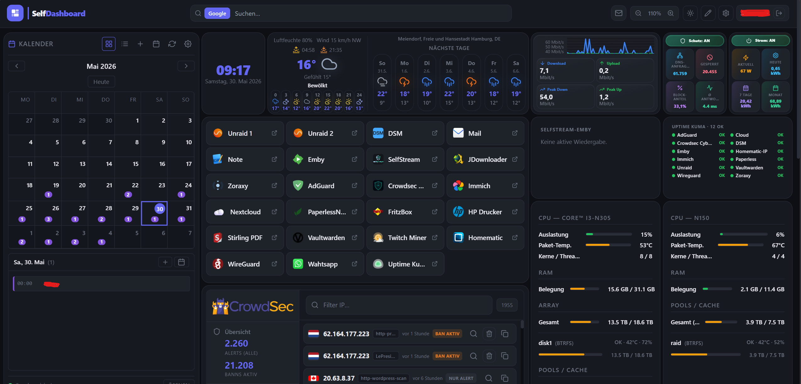
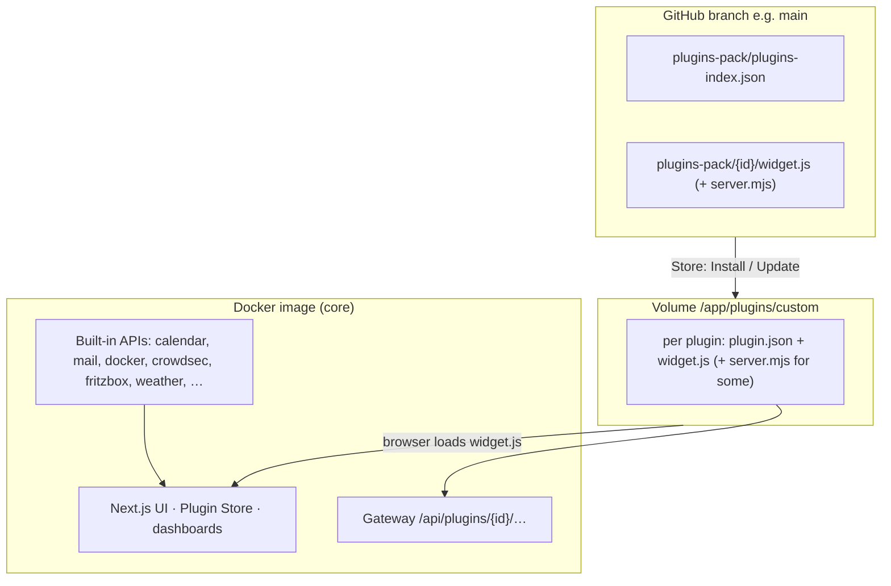
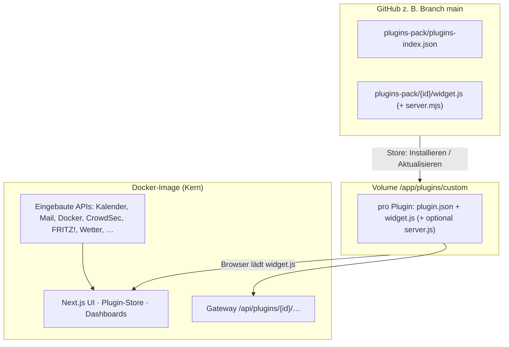

<p align="center">
  <picture>
    <source media="(prefers-color-scheme: dark)" srcset="https://raw.githubusercontent.com/s3lfcod3r/selfdashboard/main/public/logo-white.svg"/>
    
  </picture>
</p>

<p align="center">
  <a href="#english">🇬🇧 English</a> &nbsp;|&nbsp; <a href="#deutsch">🇩🇪 Deutsch</a>
</p>

<p align="center">
  
  
  
  
</p>

---

<a id="overview"></a>

## SelfDashboard at a glance

<p align="center">
  <a href="docs/screenshot-dashboard.png">
    
  </a>
</p>

<p align="center"><sub>A real homelab layout — every widget is a plugin, freely arrangeable and configurable.</sub></p>

**SelfDashboard** is your personal control center for homelab and self-hosting: **one Docker container**, **one browser tab** — instead of a dozen open admin UIs.

| Visible in the screenshot | What you get |
|---|---|
| 📅 **Calendar (SelfMailer)** | Month view with events, synced from SelfMailer |
| 🕐 **Clock** | Local date & time, front and center |
| 🌦️ **Weather** | **Day blocks** (0–6 … 18–24) + **7-day** forecast (from tomorrow) |
| 📈 **FRITZ! history** | Internet throughput (down/up Mbit/s) with peaks (TR-064) |
| 🌐 **AdGuard** | Protection status, DNS stats (tiles fill the widget) |
| ⚡ **FRITZ! power** | Smart-outlet power: now, today, 7 days, month (TR-064) |
| 🔖 **Bookmark grid** | Quick access to Unraid, Emby, Nextcloud, Immich, SelfMailer, … |
| 🔀 **Zoraxy** | Reverse-proxy requests — valid vs. blocked |
| 📺 **Media (Emby / SelfStream)** | Active streams — separate widgets or **Selfstream-Emby** combined list |
| 💚 **Uptime Kuma** | Status-page monitors (up / down / pending) in a compact list |
| 🔐 **WireGuard** | Peers online now / total, with live up/down traffic |
| 🛡️ **CrowdSec** | Alerts and active bans at a glance |
| 🖥️ **Unraid (2×)** | CPU, RAM, array/pool, and disks per server (**Unraid 7.2+** GraphQL) |
| 📝 **Notes** | Quick scratchpad pinned to the dashboard |
| ✉️ **Navbar mail** | Unread IMAP badge in the navbar — click opens webmail |

Everything supports **drag & drop**, **multiple dashboards** (e.g. `/dashboard/home`, `/dashboard/server`), **6 themes**, **EN/DE** — widgets come from the **volume-only plugin system** (install via **Plugin Store** or ZIP, update without rebuilding the image). See **[How SelfDashboard is built](#how-selfdashboard-is-built)**.

---

<a id="english"></a>

# 🇬🇧 English

**Contents:** [What is it](#what-is-selfdashboard) · [How it's built](#how-selfdashboard-is-built) · [What's new (v2.0.0)](#whats-new--v200) · [Plugins](#plugins) · [Quick Start](#quick-start) · [Docker & Unraid](#docker--unraid-template) · [Login & users](#login--multi-user) · [Kiosk](#kiosk-mode-wall-tablet) · [Env vars](#environment-variables) · [Troubleshooting](#troubleshooting)

## What is SelfDashboard?

> **See the [overview](#overview) above** for a full screenshot walkthrough.

SelfDashboard is a clean, modular, self-hosted home dashboard with a powerful plugin system — running as a single Docker container. Manage multiple dashboards, customize every detail, and add widgets for your self-hosted services.

**Plugins are not bundled in the image.** You install them from the **Plugin Store (GitHub)** or **ZIP** into a mounted folder (`/app/plugins/custom`). The Docker image only ships the **core app** (UI, store, shared APIs). Details: **[docs/PLUGINS.md](docs/PLUGINS.md)** · **[docs/PLUGIN_DEV.md](docs/PLUGIN_DEV.md)**.

## How it compares

Heimdall, Homarr, Dashy and Homepage are all great projects — SelfDashboard just focuses on something different: **live widgets with real backends, built-in auth, and a kiosk mode**, all configured in the UI.

| | SelfDashboard | Heimdall | Homarr | Homepage |
|---|---|---|---|---|
| Widgets with real backend | ✅ plugin system | ⚠️ limited | ⚠️ some | ⚠️ via API/YAML |
| Configuration | UI, no YAML | UI | UI | YAML files |
| Login + 2FA + multi-user | ✅ built in | ❌ | ⚠️ partial | ❌ |
| Kiosk mode | ✅ | ❌ | ❌ | ❌ |
| Encrypted credentials | ✅ AES-256-GCM | — | — | — |

**A good fit if you want**
- Live, interactive widgets (Docker control, FRITZ!Box, CrowdSec, calendar, mail) — not just links
- Multi-user with real auth / 2FA and a wall-tablet kiosk
- To configure everything in the UI instead of editing config files

**Maybe not for you if**
- You just want a simple bookmark/start page (Heimdall or Homepage are lighter for that)
- You can't run a Docker container, or prefer a purely static config-file workflow
- You need a large, established plugin ecosystem today — SelfDashboard's is younger and still growing

> Note: plugin server code runs with the app's privileges (no sandbox yet) — only install plugins you trust.

## How SelfDashboard is built



| Layer | Location | Purpose |
|--------|----------|---------|
| **Core app** | Docker image `ghcr.io/…/selfdashboard` (`:latest`) | Dashboard UI, settings, logging, plugin store, most `/api/*` routes |
| **Installed plugins** | Host → `/app/plugins/custom/<id>/` | Widgets the browser runs (`widget.js`); survives image updates |
| **Plugin catalog** | GitHub `plugins-pack/` on branch `main` (configurable) | `plugins-index.json` + files the store downloads on install/update |
| **Plugin source (dev)** | `plugins-pack/<id>/` (`index.tsx`, `widget.js`, optional `server.ts`) | Store ships UI + bundled `server.mjs`; image builtins remain fallback |
| **App data** | Host → `/app/data` | `dashboard.json`, calendar DB, central log |

### App update vs plugin update

| You change… | New Docker image? | What to do |
|-------------|-------------------|------------|
| A **plugin** (`widget.js` and/or `server.mjs` on GitHub) | **No** | Plugin Store → **Update** (or **Update all**) → **Ctrl+F5** |
| **SelfDashboard core** (UI, APIs, store, loader) | **Yes** | `docker pull` + restart container; keep `/app/data` and `/app/plugins/custom` mounts |

## What's new — v2.0.0

### Security & hardening (Docker image)

- **Non-root container (PUID/PGID)** — runs as a configurable unprivileged user (Unraid default **99/100**); the entrypoint fixes volume ownership on start. Match CrowdSec's PUID/PGID to read `crowdsec.db` directly.
- **Encrypted credentials everywhere** — calendar, mail and widget passwords/tokens (AdGuard, Pi-hole, FRITZ!, Speedtest, …) are sealed with **AES-256-GCM**; the browser only sees ciphertext. Set a fixed **`SELFDASHBOARD_SECRET_KEY`** so they survive updates.
- **SSRF protection** in every proxy plugin (DNS-resolved, blocks loopback / link-local / cloud-metadata); **TOTP replay protection**; reproducible `npm ci` build + container **HEALTHCHECK**.

### New plugins

- **Philips Hue (Beta)** — control lights & rooms in the Hue-app style: per-room toggle, brightness slider, real light colour, colour picker.
- **Homematic / RaspberryMatic (Beta)** — heating thermostats (target temp + Auto/Manual/Boost), switches, dimmers (on/off + colour), window contacts, sensors, system variables and programs; auto-grouped by CCU room (drag-and-drop sortable, multi-column), devices renamable. JSON-RPC login, no add-on required.
- **FRITZ! Smart Home (Beta)** — FRITZ!DECT thermostats (target temp), smart plugs (on/off + watt), window contacts and sensors via the AHA-HTTP interface; PBKDF2 SID login.
- **Bambu Lab Camera (Beta)** — live camera image from Bambu Lab printers: P1/A1 directly (local, port 6000) or any MJPEG/snapshot URL (e.g. X1 via go2rtc); auto-refreshing, access code stored encrypted, LAN-only addresses.
- **Jellyfin** — active sessions (own widget) · **Selfstream · Emby · Jellyfin** — combined stream list with a configurable title.
- **8 new integrations (Beta):** Plex, Proxmox VE, TrueNAS, Home Assistant, OPNsense, UniFi Controller, Nginx Proxy Manager, OpenMediaVault, plus **Speedtest Tracker**.
- **Auto-index store** — drop a plugin folder into `plugins-pack/<id>/` and push; `plugins-index.json` regenerates automatically (no manual index editing).

### CrowdSec 1.5.x

- Attack **world map** (real GeoIP dots, point/arc view) · separate **local bans** vs. **community (CAPI) bans** counts · optional alert list beside the map.

Full API/plugin notes: **[docs/CHANGELOG.md](docs/CHANGELOG.md)**.

## Documentation

| Topic | Document |
|--------|----------|
| Install & update plugins | [docs/PLUGINS.md](docs/PLUGINS.md) |
| Write & publish plugins | [docs/PLUGIN_DEV.md](docs/PLUGIN_DEV.md) |
| Plugin architecture | [docs/PLUGIN_ARCHITECTURE.md](docs/PLUGIN_ARCHITECTURE.md) |
| Plugin distribution model | [docs/PLUGIN_DISTRIBUTION.md](docs/PLUGIN_DISTRIBUTION.md) |
| Plugins as volume + ZIP | [docs/CUSTOM_PLUGINS_VOLUME.md](docs/CUSTOM_PLUGINS_VOLUME.md) |
| Plugin performance (dev) | [docs/PLUGIN_PERFORMANCE.md](docs/PLUGIN_PERFORMANCE.md) |
| Builtin servers in git / CI | [docs/PLUGINS_IN_REPO.md](docs/PLUGINS_IN_REPO.md) |
| Docker image build | [docs/DOCKER_BUILD.md](docs/DOCKER_BUILD.md) |
| Per-plugin setup (EN/DE) | [docs/plugins/README.md](docs/plugins/README.md) |
| Recent API/plugin changes | [docs/CHANGELOG.md](docs/CHANGELOG.md) |
| Error log | [docs/LOGGING.md](docs/LOGGING.md) |

## Features

Recent plugin and API changes are summarized in **[docs/CHANGELOG.md](docs/CHANGELOG.md)**.

| Feature | Description |
|---|---|
| 🧩 **Plugin System** | Volume-only widgets — install from GitHub store or ZIP; no widgets baked into the image |
| 🔄 **Plugin updates** | Store compares versions; badge + **Update all** — **no** image rebuild; **Ctrl+F5** after update |
| 📋 **Multiple Dashboards** | Create unlimited dashboards, each with its own URL (`/dashboard/home`, `/dashboard/server`) |
| 🎨 **6 Color Themes** | Dark, Light, Nord, Catppuccin, Dracula, Solarized |
| 🖌️ **Custom Colors** | Override any color individually per dashboard |
| 🖼️ **Custom Logo** | Upload your own logo per dashboard |
| 🖼️ **Background images** | **Design**: navbar wallpaper + dashboard (**1** or **2** JPG/PNG images) with readability overlay |
| 🌍 **Multilingual** | German & English interface |
| 🖱️ **Drag & Drop** | Move and resize widgets freely |
| 📐 **Widget Controls** | Per-widget zoom, padding and height adjustments |
| 🔍 **Dashboard Zoom** | Scale the entire dashboard (60%–150%) |
| 📏 **Grid Spacing** | Adjust widget gap and outer padding |
| 🔗 **Navbar Options** | Show icon only, text only, or both — toggle dashboard tabs |
| 📱 **Responsive layout** | **Phone / tablet / desktop** grid based on dashboard width; optional per-widget overrides in **⚙️ → Layout: phone & tablet**; compact **navbar search** (full-width row) on narrow viewports |
| 🐳 **Single Container** | Next.js 15, no external database (embedded SQLite for auth), no Redis needed |
| 📋 **Central error log** | **Settings → Logs**: app, API, and plugin errors (filter, export, 3–30 day retention) — automatic for every registered plugin |
| ✉️ **Navbar mail (IMAP)** | Unread badge in the navbar — multiple accounts, Synology/MailPlus-friendly, encrypted passwords, webmail link on click |
| 🔐 **Login & multi-user** | SQLite auth, admin/user roles, plugin whitelist, optional TOTP 2FA |
| 🔒 **Secure by default** | Non-root container, AES-256-GCM-encrypted credentials, SSRF guard on all proxy plugins |
| 📺 **Kiosk mode** | Public **`/kiosk`** URL — view-only full-screen dashboard for wall tablets; optional password (admin configures under **Settings → Users → Kiosk**) |
| 🖥️ **Unraid Ready** | Community Apps template included |

---

## Plugins

Widgets are **not** bundled in the image — install them from the **Plugin Store** or upload a ZIP. Each plugin has its own **README (EN/DE)** under `plugins-pack/<id>/`.

Install & folders: **[docs/PLUGINS.md](docs/PLUGINS.md)** · Develop plugins: **[docs/PLUGIN_DEV.md](docs/PLUGIN_DEV.md)**

Plugins marked **(Beta)** are new integrations that have not yet been tested against every server version — feedback (with the service version) is welcome.

| | Plugin | Category | Description |
|---|--------|----------|-------------|
|  | [AdGuard Home](plugins-pack/adguard/README.md) | Network | DNS stats, protection toggle |
|  | [Apple Music](plugins-pack/apple-music/README.md) | Media | In-browser player **(Beta)** |
| 🔖 | [Bookmarks](plugins-pack/bookmarks/README.md) | Utility | Quick links with groups |
| 📅 | [Calendar](plugins-pack/calendar/README.md) | Productivity | CalDAV + ICS |
| 🕐 | [Clock](plugins-pack/clock/README.md) | Utility | Time, date, timezone |
|  | [CrowdSec](plugins-pack/crowdsec/README.md) | Security | Alerts, bans, world map (optional) |
|  | [Docker](plugins-pack/docker/README.md) | System | Containers via socket |
|  | [Emby](plugins-pack/emby/README.md) | Media | Active sessions |
| 📈 | [FRITZ! WAN](plugins-pack/fritzbox/README.md) | Network | Throughput chart |
| ⚡ | [FRITZ! Energy](plugins-pack/fritz-energy/README.md) | Network | Smart plug kWh |
|  | [FRITZ! Smart Home](plugins-pack/fritz-smarthome/README.md) | Utility | Thermostats, plugs, contacts (AHA) **(Beta)** |
|  | [Google Home / Nest](plugins-pack/google-home/README.md) | Utility | Nest thermostats, sensors, device status (SDM API) **(Beta)** |
|  | [Home Assistant](plugins-pack/home-assistant/README.md) | Utility | Selected entities **(Beta)** |
|  | [Homematic](plugins-pack/homematic/README.md) | Utility | Heating, switches, sensors, rooms (RaspberryMatic) **(Beta)** |
|  | [Bambu Lab Camera](plugins-pack/bambu-cam/README.md) | Utility | Live printer camera (P1/A1 local or stream URL) **(Beta)** |
| 🖼️ | [Iframe](plugins-pack/iframe/README.md) | Utility | Embed URLs |
|  | [Jellyfin](plugins-pack/jellyfin/README.md) | Media | Active sessions |
| ✉️ | [Email](plugins-pack/mail/README.md) | Productivity | Navbar IMAP badge |
|  | [Nginx Proxy Manager](plugins-pack/npm/README.md) | Network | Proxy hosts overview **(Beta)** |
|  | [OpenMediaVault](plugins-pack/openmediavault/README.md) | Storage | System info via RPC **(Beta)** |
|  | [OPNsense](plugins-pack/opnsense/README.md) | Network | Version, gateways **(Beta)** |
| 📦 | [Parcel Tracking](plugins-pack/parcel/README.md) | Utility | DHL / Hermes / DPD tracking, no API key |
|  | [Philips Hue](plugins-pack/hue/README.md) | Utility | Lights & rooms control **(Beta)** |
|  | [Pi-hole](plugins-pack/pihole/README.md) | Network | Pi-hole v6 stats |
|  | [Plex](plugins-pack/plex/README.md) | Media | Active sessions **(Beta)** |
|  | [Proxmox VE](plugins-pack/proxmox/README.md) | System | Nodes, VMs/LXC **(Beta)** |
|  | [Reolink Camera](plugins-pack/reolink/README.md) | Utility | Live camera, AI/motion badges, PTZ **(Beta)** |
| 📝 | [Scratchpad](plugins-pack/scratchpad/README.md) | Utility | Short notes |
| 📺 | [Selfstream](plugins-pack/selfstream/README.md) | Media | Live IPTV |
| 📺 | [Selfstream · Emby · Jellyfin](plugins-pack/selfstream-emby/README.md) | Media | Combined stream list |
|  | [Spotify](plugins-pack/spotify/README.md) | Media | Now playing, controls, seek, volume, search & device picker |
|  | [Speedtest Tracker](plugins-pack/speedtest-tracker/README.md) | Network | Latest down/up/ping **(Beta)** |
|  | [TrueNAS](plugins-pack/truenas/README.md) | Storage | System + pool status **(Beta)** |
|  | [UniFi Controller](plugins-pack/unifi/README.md) | Network | WLAN/LAN/WAN status **(Beta)** |
|  | [Unraid](plugins-pack/unraid/README.md) | System | Unraid **7.2+** GraphQL overview |
|  | [Unraid Docker](plugins-pack/unraid-docker/README.md) | System | Containers via Unraid API |
|  | [Uptime Kuma](plugins-pack/uptime-kuma/README.md) | Network | Status-page monitors |
| 🌤️ | [Weather](plugins-pack/weather/README.md) | Utility | Open-Meteo (proxy), day blocks + 7-day |
|  | [WireGuard](plugins-pack/wireguard/README.md) | Network | wg-easy peers — who's online now + handshake history & transfer **(Beta)** |
| 🔀 | [Zoraxy](plugins-pack/zoraxy/README.md) | Network | Reverse-proxy host overview **(Beta)** |

<sub>All plugin READMEs are bilingual (EN/DE). Brand logos via [homarr-labs/dashboard-icons](https://github.com/homarr-labs/dashboard-icons).</sub>

## Quick Start

**Required:** map **`/app/data`** and **`/app/plugins/custom`**. Without the plugins folder, the store can install files but they will not persist.

**Image tags:** Unraid template uses **`ghcr.io/s3lfcod3r/selfdashboard:latest`**. The plugin catalog is loaded from GitHub branch **`main`** (`SELFDASHBOARD_PLUGINS_GITHUB_REF`, normally left as-is).

**Non-root container (PUID/PGID):** the app runs non-root, by default as **PUID/PGID 99/100** (Unraid `nobody:users`). On start, the entrypoint remaps to your PUID/PGID and chowns `/app/data` + `/app/plugins/custom` automatically (opt-out: `SELFDASHBOARD_SKIP_CHOWN=1`). **CrowdSec tip:** set PUID/PGID to the **same values as your CrowdSec container** — then SelfDashboard owns and reads `crowdsec.db` directly, surviving nightly backups that restart CrowdSec (no chmod needed).

### Option 1 — Unraid Community Apps (recommended)

1. Open Community Apps → search for **SelfDashboard**
2. Install — set **Config Storage**, **Plugins Storage**, port (default `3000`)
3. Open `http://YOUR-IP:3000`
4. **Plugin Store → From GitHub** — install widgets you need (Calendar, Bookmarks, …)
5. Click **+** to place widgets on the dashboard → **Ctrl+F5** if a widget stays blank
6. Done ✓

### Option 2 — Docker run

```bash
docker run -d \
  --name selfdashboard \
  --restart unless-stopped \
  -p 3000:3000 \
  -e TZ=Europe/Berlin \
  -v /mnt/user/appdata/selfdashboard:/app/data \
  -v /mnt/user/appdata/selfdashboard/plugins:/app/plugins/custom \
  -v /var/run/docker.sock:/var/run/docker.sock \
  ghcr.io/s3lfcod3r/selfdashboard:latest
```

*(**`/app/data`** → `dashboard.json`, calendar, logs. **`/app/plugins/custom`** → installed plugins. **Store → From GitHub** or ZIP, then **Ctrl+F5**. Docker socket optional — **Docker** plugin only. CrowdSec mount optional — **CrowdSec** plugin only.)*

### Option 3 — docker-compose

```bash
git clone https://github.com/s3lfcod3r/selfdashboard.git
cd selfdashboard
docker-compose up -d
```

## Docker & Unraid template

| Mount / setting | Content |
|-----------------|--------|
| **`/app/data`** | Per-user dashboards (`users/`), auth DB (`auth/`), calendar, central log — **back up** regularly |
| **`/app/plugins/custom`** | Installed plugins (`<id>/plugin.json`, `widget.js`, optional `server.mjs`) — **back up** with appdata |
| **GitHub env vars** | Pre-set in `:latest` image: repo `s3lfcod3r/selfdashboard`, ref `main`, path `plugins-pack` |
| **Docker Socket** (optional) | Local host only — **[Docker plugin](docs/plugins/docker/README.md)** |
| **CrowdSec Data** (optional) | `crowdsec.db` read-only — **[CrowdSec plugin](docs/plugins/crowdsec/README.md)** |

Unraid: **`unraid/selfdashboard.xml`** on branch **`main`** — **Config Storage**, **Plugins Storage** (both required for a normal setup).

After a **plugin** update: Store → **Update** → **Ctrl+F5**. After an **app** update: pull new image, restart — layouts and installed plugins stay on the volumes.

## Login & multi-user

SelfDashboard requires login. On first start (no users yet) you are redirected to **`/setup`** to create the admin account. Existing `dashboard.json` in appdata is migrated to that admin automatically (backup: `dashboard.json.pre-auth-migrated`).

| Topic | Details |
|-------|---------|
| **Roles** | **admin** — full access, plugin store, user management · **user** — only whitelisted plugins |
| **User data** | `/app/data/users/<id>/dashboard.json` per user |
| **Auth data** | `/app/data/auth/auth.db` (users, sessions, plugin whitelist) |
| **Admin UI** | **Settings → Users** — create/delete users, reset passwords, plugin checkmarks, **kiosk config** |
| **Self-service** | **Settings → Users** — change password, enable **2FA (TOTP)** |
| **2FA** | Optional authenticator at login — setup under **Settings → Users** |
| **Forgot password (no email)** | Env reset: `SELFDASHBOARD_AUTH_RESET_PASSWORD` → restart (see below) |
| **Backup** | Back up all of **`/app/data`** (at least `auth/` + `users/`) |
| **Dev only** | `SELFDASHBOARD_AUTH_DISABLED=1` disables auth (never in production) |

### Admin locked out (forgot password)

There is **no email reset** (would need SMTP — not typical for homelab). **Simplest: env reset on Unraid:**

1. **Env password reset (recommended on Unraid)** — edit container, add variable:
   - `SELFDASHBOARD_AUTH_RESET_PASSWORD` = your new password (min. 8 chars)
   - optional: `SELFDASHBOARD_AUTH_RESET_USER=admin` (default: first admin)
   - or one field: `SELFDASHBOARD_AUTH_RESET=admin:NewPassword`
   - **Restart container** → sign in → **clear the variable(s)** → restart again

2. **Direct CLI** (shell access):
   ```bash
   docker exec selfdashboard node /app/scripts/auth-reset-password.mjs --username admin --password 'NewSecurePass'
   ```

3. **Second admin** — reset password under **Settings → Users**.

---

## Dashboard Management

Each dashboard gets its own URL. Navigate between dashboards via the tab bar in the navbar or through **Settings → Dashboards**.

| Action | How |
|---|---|
| Create dashboard | Settings → Dashboards → New Dashboard |
| Switch dashboard | Click tab in navbar or Settings → Dashboards → Open |
| Hide tab from navbar | Settings → Dashboards → 👁️ toggle per dashboard |
| Delete dashboard | Settings → Dashboards → 🗑️ |
| Rename / change icon | Settings → Dashboards → ✏️ |

---

## Widget Controls

In **Edit Mode** (✏️ button), hover over any widget to see controls:

| Control | Function |
|---|---|
| ⠿ Drag handle | Move widget |
| 🔍 `− 100% +` | Zoom widget content |
| ↔ `− 8 +` | Inner padding |
| ↕ `− 4 +` | Widget height |
| ⚙️ | Plugin settings |
| ✕ | Remove widget |
| Resize grip (corner/edge) | Resize width and height freely |

---

## Responsive layout (phone, tablet & desktop)

The dashboard uses **three layout bands** based on the **dashboard grid width** (the track that holds the widgets — not only the outer browser window):

| Band | Approx. width | Behaviour |
|---|---|---|
| **Phone** | **&lt; 768 px** | Single **stacked column**; each widget uses **`layoutPhone`** height overrides when set, otherwise the desktop **`layout`** height. |
| **Tablet** | **768 – 1023 px** | **12-column** grid like desktop; optional **`layoutTablet`** overrides (`w`, `h`, `x`, `y`, `minH`) merge with **`layout`**. |
| **Desktop** | **≥ 1024 px** | Full **desktop** layout — what you usually edit when resizing widgets on a large screen. |

**How to tune it:** enter **Edit mode** (✏️), open a widget’s **⚙️** settings. Below the plugin-specific options, **“Layout: phone & tablet”** lets you set optional **phone** row height / min height and **tablet** position & size. **Leave fields empty** to keep using the desktop layout values for that band.

On **narrow viewports (about ≤ 1024 px)** the **navbar web search** moves to a **second row** at **full width** so it is not squeezed into the corner next to zoom and actions.

Plugins can optionally read the **`layoutMode`** prop (`'phone' \| 'tablet' \| 'desktop'`) for their own responsive UI — see **[docs/PLUGIN_DEV.md](docs/PLUGIN_DEV.md)**.

---

## Kiosk mode (wall tablet)

Public **view-only** display for a wall-mounted tablet or guest browser — separate from the normal logged-in dashboard.

| Topic | Details |
|---|---|
| **Display URL** | **`http://YOUR-IP:3000/kiosk`** — no admin login, full-screen widgets, no navbar |
| **Configure (admin)** | **Settings → Users → Kiosk / wall tablet** — enable, pick dashboard, optional password, session duration (2 h … unlimited) |
| **Edit widgets** | Log in as admin → **`/dashboard/<id>`** (e.g. `/dashboard/kiosk`) → edit mode — same as any dashboard |
| **Do not confuse** | **`/kiosk`** = display only · **`/dashboard/kiosk`** = edit with login |
| **Plugins** | Only widgets on the chosen kiosk dashboard are loaded (works in any browser, no SelfDashboard account needed when passwordless) |
| **HTTP / LAN** | Cookies work on HTTP by default; set `SELFDASHBOARD_SECURE_COOKIES=1` only behind HTTPS |

Ideal for a kitchen display, wall tablet, or shared screen on your LAN.

---

## Settings Overview

**General** — Language (DE/EN), dashboard title, navbar web search, navbar mail badge, navbar display style, dashboard tab visibility

**Users** — Change password, **2FA (TOTP)**, **kiosk / wall tablet** (admin). Admins also manage users and plugin whitelist here.

**Dashboards** — Create, edit, delete dashboards. Toggle tab visibility per dashboard. Set emoji or custom PNG icon.

**Design** — Navbar display style; grid spacing; **navbar background** (JPG/PNG + overlay); **dashboard background** (off / 1 image / 2 images side by side + overlay); logo upload; color theme; custom color overrides

**Email** — IMAP accounts, navbar badge, poll interval, connection test

**Logs (Protokoll)** — Central error log for support and debugging: filter by level, source, plugin; download `.txt` / JSONL; retention 3 / 7 / 30 days. Every plugin registered via `registerPlugin` logs render failures and failed `/api/*` calls automatically. Mail uses the same log with plugin id **`mail`**. Details: **[docs/LOGGING.md](docs/LOGGING.md)**.

## Environment Variables

| Variable | Default | Description |
|---|---|---|
| `TZ` | `Europe/Berlin` | Timezone |
| `NODE_ENV` | `production` | Node.js environment |
| `SELFDASHBOARD_DATA_DIR` | `/app/data` (in the official image) | Directory inside the container where **`dashboard.json`** is stored. Must match your **`/app/data`** bind-mount unless you intentionally use another path. |
| `SELFDASHBOARD_SECRET_KEY` | auto-generated file in data dir | **Central secret key** for encrypting **all** stored credentials: calendar, mail **and widget passwords/tokens** (AdGuard, Pi-hole, FRITZ!, Speedtest, …). **Strongly recommended:** set a fixed value in Docker so credentials survive image updates and volume moves. Once set, never change it — sealed secrets become unreadable. (Legacy alias `SELFDASHBOARD_CALENDAR_KEY` still works as a fallback.) |
| `MAIL_DATA_DIR` | `<plugins/custom>/mail` | Directory for **`mail.json`** (optional override) |
| `SELFDASHBOARD_PLUGINS_CUSTOM` | `<app>/plugins/custom` | Installed plugins (Unraid: map host folder here) |
| `SELFDASHBOARD_PLUGINS_GITHUB_REPO` | `s3lfcod3r/selfdashboard` in `:latest` image | GitHub repo for store (`owner/repo`) |
| `SELFDASHBOARD_PLUGINS_GITHUB_REF` | `main` | Branch/tag for `plugins-pack/` |
| `SELFDASHBOARD_PLUGINS_GITHUB_PATH` | `plugins-pack` | Path in repo to plugin files |
| `CROWDSEC_DATA_DIR` | `/crowdsec-data` | Allowed root for DB paths (CrowdSec widget only; optional) |
| `CROWDSEC_GEOIP_PATH` | — | Full path to `GeoLite2-*.mmdb` if not in the data folder (optional) |
| `CROWDSEC_DB_PATH` | — | Default DB file if widget path is empty (optional) |
| `CROWDSEC_CONTAINER` | `crowdsec` | Docker container name for optional unban via `cscli` (optional) |
| `SELFDASHBOARD_SECURE_COOKIES` | off | Set `1` to mark session/kiosk cookies **Secure** (HTTPS only). Default: **off** (HTTP on LAN works). **Set this to `1` when exposing the app over HTTPS.** |
| `SELFDASHBOARD_INSECURE_COOKIES` | — | Set `1` to force non-Secure cookies (same as default on HTTP). |
| `SELFDASHBOARD_TRUST_PROXY` | off | Set `1` **only** when a reverse proxy in front of the app sets `X-Forwarded-For`/`X-Real-IP`. When off, those (client-spoofable) headers are ignored for rate limiting. Account brute-force protection works regardless (persistent per-account lockout). |
| `SELFDASHBOARD_AUTH_RESET_PASSWORD` | — | One-shot admin password reset on container start (see **Login & multi-user**) |
| `SELFDASHBOARD_ENABLE_ENV_RESET` | off | In **production** (`NODE_ENV=production`, the default in the official image) the env password reset is **ignored** unless this is set to `1`. Outside production it is always allowed. Safety net so a forgotten `NODE_ENV` cannot leave the reset path silently active. |
| `SELFDASHBOARD_SECRET_SALT` | built-in | Optional KDF salt for credential encryption. Leave unset to use the default. If set, pin it from the very first start and **never change it** (like `SELFDASHBOARD_SECRET_KEY`) — changing it makes existing encrypted credentials unreadable. |

---

## Security notes

SelfDashboard is built for a trusted home LAN. A security review (2026-06) hardened the auth and plugin surfaces; the points below matter if you expose the app beyond your LAN.

**Hardened in code:**
- **Login brute-force:** failed attempts are now counted **persistently per account** in SQLite (10 / 15 min → temporary lockout). This survives restarts and is independent of the client IP, so spoofing `X-Forwarded-For` no longer bypasses it.
- **Spoofable proxy headers** are ignored unless `SELFDASHBOARD_TRUST_PROXY=1` (set this only behind a real reverse proxy).
- **Admin actions require completed MFA:** user/role/plugin-grant management is blocked for sessions that have not passed the second factor.
- **Rate limits** added to *change password* and *disable TOTP*.
- **TOTP secrets are encrypted at rest** (AES-256-GCM via `SELFDASHBOARD_SECRET_KEY`), so a leaked `auth.db` alone cannot mint valid 2FA codes. Existing enrollments are upgraded transparently.
- **Docker container actions** (start/stop/restart) now require an admin with completed MFA — read-only listing stays available to widget users.
- **Plugin pack extraction** validates every zip entry against path traversal (zip-slip) and enforces entry-count limits; uploads have a hard entry cap.
- **Plugin SVG assets** are served with `Content-Disposition: attachment`, `X-Content-Type-Options: nosniff` and a locked-down CSP, preventing stored XSS via uploaded SVGs.
- **Remote plugin integrity:** when the catalog (`plugins-index.json`) ships an optional `sha256` per file, every downloaded plugin file (incl. the executable `server.mjs`) is verified before it is written — a mismatch aborts the install. Protects against a compromised catalog.
- **Internal identity headers** (`x-sd-user-id` / `x-sd-role`) are set on the request for route handlers only, are **stripped from any client-supplied request**, and are **no longer echoed on responses**, so they cannot be spoofed or leaked.
- **Env password reset hardened:** in production the env reset is ignored unless `SELFDASHBOARD_ENABLE_ENV_RESET=1` is explicitly set.
- **CalDAV** now resolves and re-checks the target IP before connecting (DNS-rebinding protection), matching IMAP/FRITZ!.

**Operator responsibilities / when exposing publicly:**
- **Use HTTPS and set `SELFDASHBOARD_SECURE_COOKIES=1`.** The default is off so plain-HTTP LAN setups keep working — but over the internet, session cookies must be Secure.
- **Strip internal headers at the reverse proxy.** If you run SelfDashboard behind a proxy, configure it to drop incoming `x-sd-user-id`, `x-sd-role` and `x-sd-kiosk` request headers from clients. The app already strips them internally; this is defense in depth.
- **Plugin code runs with full server privileges.** Uploaded/remote plugin `server.mjs` files execute in the Node process — there is no sandbox. Only install plugins you trust, and treat the admin account as equivalent to shell access.
- **TLS verification** for IMAP/FRITZ! can be disabled per connection — leave it on unless you have a specific reason.
- Use a **strong admin password** and a fixed `SELFDASHBOARD_SECRET_KEY`.

> Known lower-priority follow-up (not yet changed): the credential-encryption KDF uses a fixed default salt (an optional `SELFDASHBOARD_SECRET_SALT` override is available for fresh installs). Low risk on a trusted LAN.

---

## Troubleshooting

| Problem | Solution |
|---|---|
| Dashboard not loading | Check logs: `docker logs selfdashboard` |
| **500 error after update** (`SQLITE_READONLY` in logs) | The container runs **non-root** (PUID/PGID, default 99/100). The entrypoint fixes volume ownership automatically on start; if you set `SELFDASHBOARD_SKIP_CHOWN=1`, run `chown -R <PUID>:<PGID>` on your appdata folder yourself. |
| **CrowdSec: `unable to open database file`** (often after nightly backups) | Set the container's **PUID/PGID to the same values as your CrowdSec container** (Unraid default 99/100). Then SelfDashboard reads `crowdsec.db` as the owner — permanently, no chmod. |
| **Plugin shows `401` / `stats_failed` / auth error** (AdGuard, Pi-hole, FRITZ!, …) although credentials are correct | The encryption key changed. **Fix once:** set a fixed **`SELFDASHBOARD_SECRET_KEY`** (long random string) in Docker, restart, then re-enter the plugin's password in its settings and **Save**. The key never changes again → stays working. (On an older core image, also set `SELFDASHBOARD_CALENDAR_KEY` to the **same** value until you pull the new `:latest`.) |
| Config lost after update | Image updates do not remove your appdata volume; your layout lives in **`/app/data/users/<userId>/dashboard.json`** (plus a `localStorage` cache). If a **new browser** shows an empty dashboard, check **`/app/data`** is mounted and writable (see **Docker & Unraid template**). |
| Plugin store empty / “GitHub not configured” | Set `SELFDASHBOARD_PLUGINS_GITHUB_*` or use the official `:latest` image defaults |
| Widget stuck on “Loading plugin…” | Wait a few seconds; **Plugin Store → Reload plugins**; check files under `/app/plugins/custom/<id>/widget.js` |
| Update installed, UI unchanged | **Ctrl+F5** (hard reload) — browser caches `widget.js` |
| Plugin not found after install | Confirm **Plugins Storage** mount; folder must contain `plugin.json` + `widget.js` (not `index.tsx`) |
| Port already in use | Change host port: `-p 3001:3000` |
| Widgets invisible in edit mode | Try refreshing the page |
| Theme not applying | Hard refresh: Ctrl+Shift+R |
| CrowdSec widget: `crowdsec.db not found` | Set **CrowdSec Data (optional)** in the Unraid template (host folder with `crowdsec.db` → `/crowdsec-data:ro`), or remove the widget if you do not use CrowdSec |
| CrowdSec: no country flags / all `??` | Ensure **GeoLite2-City.mmdb** (or Country) is in the mounted CrowdSec data folder, or set `CROWDSEC_GEOIP_PATH` |
| CrowdSec: unban fails | Mount **Docker Socket**, check container name in plugin settings, enable unban there |
| Mail badge red/yellow, count 0 | **Settings → Email** → re-enter password → **Save**. Set fixed `SELFDASHBOARD_SECRET_KEY` in Docker. Check **Logs** filter `mail` |
| Mail: `ENOTFOUND host:5000` | IMAP host must be IP/hostname only (e.g. `192.168.1.15`), port **993** separate; webmail URL goes in **Webmail URL** field |
| Mail test OK, navbar empty | Enable **Navbar email** (General or Email tab); save account; badge needs unread &gt; 0 |
| Mail badge shows mail that is gone in MailPlus | IMAP may still list deleted/read messages until the server cleans up. Use **Show unread** in email settings to see subjects. After update, SelfDashboard ignores `\Deleted` and `\Seen` ghosts. In MailPlus: empty trash / expunge if needed, then **Refresh all accounts**. |
| MailPlus shows 1 unread, preview listed 2 (old FRITZ mail) | Synology IMAP can keep ancient `UNSEEN` UIDs. Use **Settings → Email → Unread age filter** (default 30 days; `0` = off). Preview shows how many were ignored as too old or duplicate `Message-ID`. |
| Weather: **HTTP 404** on plugin API | **New app image** required — route is in the core app (`/api/plugins/weather/…`), not a volume-only plugin |
| Weather: no data / API error | Container must reach `api.open-meteo.com` and `geocoding-api.open-meteo.com` (HTTPS outbound). Test: `http://HOST:PORT/api/plugins/weather/resolve?name=Berlin&language=de` → JSON |
| Weather plugin old UI (hourly strip only) | Plugin Store → **Weather** → **Update** → **Ctrl+F5** (target **1.3.x**) |
| Unraid: **`Failed to fetch`** | Browser calls Unraid **directly** (`https://NAS/graphql`). Not a 7.3-only issue — check **API key**, URL, HTTPS cert, and **CORS / allowed origins** for your dashboard URL (e.g. `http://192.168.x.x:3010`) on **each** NAS |
| Unraid works on one NAS, not another | Compare API enabled, key permissions, and CORS on the failing box (**7.2.3** and **7.3** both supported if GraphQL API is active) |
| Background image not visible | **Design** → mode not **Off**; image uploaded; after change **Ctrl+F5**; very large images are capped (~4–5 MB in config) |
| Kiosk shows login instead of widgets | Use **`/kiosk`**, not **`/dashboard/…`**. Enable kiosk under **Settings → Users → Kiosk** |
| Kiosk: “Plugin not found” | Open **`/kiosk`** once as admin (updates plugin list), then retry guest browser; **Ctrl+F5** |
| Home dashboard broken after visiting `/kiosk` | Update to latest image (kiosk cookie no longer overrides admin session); **Ctrl+F5** |

---

## Technology

- **Frontend:** Next.js 15, React 18, Tailwind CSS
- **State:** Zustand — persisted to **`localStorage`** (cache) and to **`dashboard.json`** on the server when **`/app/data`** (or **`SELFDASHBOARD_DATA_DIR`**) is available
- **Grid:** react-grid-layout
- **Container:** Node.js 22 Alpine (multi-stage build, Next.js standalone)
- **Plugins:** Volume-only — dynamic `widget.js` load + `pluginRegistry`; catalog from GitHub `plugins-pack/`
- **Develop:** `npm run dev` in repo root; publish plugins with `npm run publish:plugin-pack`

---

## License

**MIT** — free to use, modify and share.

---

---

<a id="deutsch"></a>

# 🇩🇪 Deutsch

**Inhalt:** [Was ist das](#was-ist-selfdashboard) · [Aufbau](#aufbau-von-selfdashboard) · [Neu (v2.0.0)](#neu--v200) · [Plugins](#plugins-1) · [Schnellstart](#schnellstart) · [Docker & Unraid](#docker--unraid-template-1) · [Login](#login--mehrbenutzer) · [Kiosk](#kiosk-modus-wand-tablet) · [Umgebungsvariablen](#umgebungsvariablen) · [Troubleshooting](#troubleshooting-1)

<a id="overview-de"></a>

## SelfDashboard im Überblick

<p align="center">
  <a href="docs/screenshot-dashboard.png">
    
  </a>
</p>

<p align="center"><sub>Ein reales Homelab-Layout — alle Widgets sind Plugins, frei anordbar und konfigurierbar.</sub></p>

**SelfDashboard** ist dein persönliches Kontrollzentrum für Homelab und Self-Hosting: **ein Docker-Container**, **ein Browser-Tab** — statt zwölf geöffneter Admin-Oberflächen.

| Im Screenshot sichtbar | Was es dir bringt |
|---|---|
| 📅 **Kalender (SelfMailer)** | Monatsansicht mit Terminen, synchronisiert aus SelfMailer |
| 🕐 **Uhr** | Lokales Datum & Uhrzeit, prominent platziert |
| 🌦️ **Wetter** | **Tagesabschnitte** (0–6 … 18–24) + **7-Tage**-Vorschau (ab morgen) |
| 📈 **FRITZ! Verlauf** | Internet-Durchsatz (rauf/runter Mbit/s) mit Peaks (TR-064) |
| 🌐 **AdGuard** | Schutz-Status, DNS-Statistik (Kacheln füllen das Widget) |
| ⚡ **FRITZ! Strom** | Steckdose: aktuell, heute, 7 Tage, Monat (TR-064) |
| 🔖 **Lesezeichen-Grid** | Schnellzugriff auf Unraid, Emby, Nextcloud, Immich, SelfMailer, … |
| 🔀 **Zoraxy** | Reverse-Proxy-Anfragen — gültig vs. geblockt |
| 📺 **Media (Emby / SelfStream)** | Aktive Streams — einzeln oder kombiniert als **Selfstream-Emby** |
| 💚 **Uptime Kuma** | Status-Page-Monitore (OK / Down / Pending) in kompakter Liste |
| 🔐 **WireGuard** | Peers jetzt online / gesamt, mit Live-Traffic (rauf/runter) |
| 🛡️ **CrowdSec** | Alerts und aktive Bans auf einen Blick |
| 🖥️ **Unraid (2×)** | CPU, RAM, Array/Pool und Festplatten pro Server (**Unraid 7.2+** GraphQL) |
| 📝 **Notizzettel** | Schneller Notizblock direkt auf dem Dashboard |
| ✉️ **Navbar E-Mail** | IMAP-Badge in der Navbar — Klick öffnet Webmail |

Alles ist **Drag & Drop**, **mehrere Dashboards** (z. B. `/dashboard/home`, `/dashboard/server`), **6 Themes**, **DE/EN** — Widgets kommen aus dem **Volume-only Plugin-System** (Store oder ZIP, Updates ohne Image-Rebuild). Siehe **[Aufbau von SelfDashboard](#aufbau-von-selfdashboard)**.

## Was ist SelfDashboard?

SelfDashboard ist ein sauberes, modulares, selbst gehostetes Home-Dashboard mit einem leistungsstarken Plugin-System — als einzelner Docker-Container. Verwalte mehrere Dashboards, passe jedes Detail an und füge Widgets für deine selbst gehosteten Dienste hinzu.

**Plugins stecken nicht im Image.** Installation über **Plugin-Store (GitHub)** oder **ZIP** nach `/app/plugins/custom`. Das Image enthält nur die **Kern-App** (UI, Store, gemeinsame APIs). Details: **[docs/PLUGINS.md](docs/PLUGINS.md)** · **[docs/PLUGIN_DEV.md](docs/PLUGIN_DEV.md)**.

## Vergleich

Heimdall, Homarr, Dashy und Homepage sind alle super Projekte — SelfDashboard setzt einfach auf einen anderen Schwerpunkt: **Live-Widgets mit echtem Backend, eingebaute Auth und einen Kiosk-Modus**, alles in der UI konfiguriert.

| | SelfDashboard | Heimdall | Homarr | Homepage |
|---|---|---|---|---|
| Widgets mit echtem Backend | ✅ Plugin-System | ⚠️ begrenzt | ⚠️ einige | ⚠️ via API/YAML |
| Konfiguration | UI, kein YAML | UI | UI | YAML-Dateien |
| Login + 2FA + Multi-User | ✅ eingebaut | ❌ | ⚠️ teilweise | ❌ |
| Kiosk-Modus | ✅ | ❌ | ❌ | ❌ |
| Verschlüsselte Zugangsdaten | ✅ AES-256-GCM | — | — | — |

**Passt gut, wenn du willst**
- Live-Widgets, die wirklich was tun (Docker-Steuerung, FritzBox, CrowdSec, Kalender, Mail) — nicht nur Links
- Mehrbenutzer mit echter Auth / 2FA und einen Kiosk fürs Wand-Tablet
- Alles in der UI konfigurieren statt Config-Dateien zu editieren

**Vielleicht nichts für dich, wenn**
- Du nur eine einfache Lesezeichen-/Startseite willst (dafür sind Heimdall oder Homepage schlanker)
- Du keinen Docker-Container betreiben kannst oder einen rein statischen Config-Datei-Workflow bevorzugst
- Du heute ein großes, etabliertes Plugin-Ökosystem brauchst — das von SelfDashboard ist jünger und wächst noch

> Hinweis: Plugin-Server-Code läuft mit den Rechten der App (noch keine Sandbox) — installier nur Plugins, denen du vertraust.

## Aufbau von SelfDashboard



| Schicht | Ort | Zweck |
|--------|-----|--------|
| **Kern-App** | Image `ghcr.io/…/selfdashboard` (`:latest`) | UI, Einstellungen, Protokoll, Plugin-Store, die meisten `/api/*`-Routen |
| **Installierte Plugins** | Host → `/app/plugins/custom/<id>/` | Widgets im Browser (`widget.js`); überlebt Image-Updates |
| **Plugin-Katalog** | GitHub `plugins-pack/` auf Branch `main` (konfigurierbar) | `plugins-index.json` + Dateien für Install/Update |
| **Plugin-Quellcode (Dev)** | `plugins-pack/<id>/` (`index.tsx`, `widget.js`, optional `server.ts`) | Store liefert UI + gebündeltes `server.mjs`; Image-Builtins als Fallback |
| **App-Daten** | Host → `/app/data` | `dashboard.json`, Kalender-DB, zentrales Protokoll |

### App-Update vs Plugin-Update

| Du änderst… | Neues Docker-Image? | Vorgehen |
|-------------|---------------------|----------|
| Ein **Plugin** (`widget.js` und/oder `server.mjs` auf GitHub) | **Nein** | Plugin-Store → **Aktualisieren** (oder **Alle aktualisieren**) → **Strg+F5** |
| **SelfDashboard-Kern** (UI, APIs, Store, Loader) | **Ja** | `docker pull` + Container neu starten; Mounts `/app/data` und `/app/plugins/custom` behalten |

## Neu — v2.0.0

### Sicherheit & Härtung (Docker-Image)

- **Non-root-Container (PUID/PGID)** — läuft als einstellbarer unprivilegierter User (Unraid-Standard **99/100**); der Entrypoint korrigiert die Volume-Rechte beim Start. PUID/PGID wie bei CrowdSec setzen, um `crowdsec.db` direkt zu lesen.
- **Verschlüsselte Zugangsdaten überall** — Kalender-, Mail- und Widget-Passwörter/-Tokens (AdGuard, Pi-hole, FRITZ!, Speedtest, …) werden mit **AES-256-GCM** versiegelt; der Browser sieht nur Ciphertext. Festen **`SELFDASHBOARD_SECRET_KEY`** setzen, damit sie Updates überleben.
- **SSRF-Schutz** in jedem Proxy-Plugin (DNS-aufgelöst, blockt Loopback / Link-Local / Cloud-Metadata); **TOTP-Replay-Schutz**; reproduzierbarer `npm ci`-Build + Container-**HEALTHCHECK**.

### Neue Plugins

- **Philips Hue (Beta)** — Lampen & Räume im Hue-App-Stil steuern: Toggle pro Raum, Helligkeits-Slider, echte Lichtfarbe, Farbwähler.
- **Homematic / RaspberryMatic (Beta)** — Heizungsthermostate (Soll-Temp + Auto/Manuell/Boost), Schalter, Dimmer (an/aus + Farbe), Fensterkontakte, Sensoren, Systemvariablen und Programme; automatisch nach CCU-Raum gruppiert (per Drag-and-Drop sortierbar, mehrspaltig), Geräte umbenennbar. JSON-RPC-Login, kein Addon nötig.
- **FRITZ! Smart Home (Beta)** — FRITZ!DECT-Thermostate (Soll-Temp), Steckdosen (an/aus + Watt), Fensterkontakte und Sensoren über das AHA-HTTP-Interface; PBKDF2-SID-Login.
- **Bambu Lab Kamera (Beta)** — Live-Kamerabild von Bambu-Lab-Druckern: P1/A1 direkt (lokal, Port 6000) oder beliebige MJPEG-/Snapshot-URL (z. B. X1 via go2rtc); aktualisiert sich automatisch, Zugangscode verschlüsselt, nur LAN-Adressen.
- **Jellyfin** — aktive Sessions (eigenes Widget) · **Selfstream · Emby · Jellyfin** — kombinierte Stream-Liste mit einstellbarem Titel.
- **8 neue Integrationen (Beta):** Plex, Proxmox VE, TrueNAS, Home Assistant, OPNsense, UniFi Controller, Nginx Proxy Manager, OpenMediaVault, dazu **Speedtest Tracker**.
- **Auto-Index-Store** — Plugin-Ordner nach `plugins-pack/<id>/` legen und pushen; `plugins-index.json` wird automatisch neu generiert (kein Hand-Editieren des Index).

### CrowdSec 1.5.x

- Angriffs-**Weltkarte** (echte GeoIP-Punkte, Punkt-/Bogen-Ansicht) · getrennte Zähler für **lokale Banns** und **Community-Banns (CAPI)** · optionale Alert-Liste neben der Karte.

API-/Plugin-Details: **[docs/CHANGELOG.md](docs/CHANGELOG.md)**.

## Dokumentation

| Thema | Datei |
|--------|--------|
| Installation & Plugin-Updates | [docs/PLUGINS.md](docs/PLUGINS.md) |
| Plugins entwickeln & veröffentlichen | [docs/PLUGIN_DEV.md](docs/PLUGIN_DEV.md) |
| Plugin-Architektur | [docs/PLUGIN_ARCHITECTURE.md](docs/PLUGIN_ARCHITECTURE.md) |
| Plugin-Verteilungsmodell | [docs/PLUGIN_DISTRIBUTION.md](docs/PLUGIN_DISTRIBUTION.md) |
| Plugins als Volume + ZIP | [docs/CUSTOM_PLUGINS_VOLUME.md](docs/CUSTOM_PLUGINS_VOLUME.md) |
| Plugin-Performance (Dev) | [docs/PLUGIN_PERFORMANCE.md](docs/PLUGIN_PERFORMANCE.md) |
| Builtin-Server im Git / CI | [docs/PLUGINS_IN_REPO.md](docs/PLUGINS_IN_REPO.md) |
| Docker-Image bauen | [docs/DOCKER_BUILD.md](docs/DOCKER_BUILD.md) |
| Pro-Plugin-Anleitung (DE/EN) | [docs/plugins/README.md](docs/plugins/README.md) |
| Aktuelle API-/Plugin-Änderungen | [docs/CHANGELOG.md](docs/CHANGELOG.md) |
| Fehlerprotokoll | [docs/LOGGING.md](docs/LOGGING.md) |

## Features

Aktuelle Plugin- und API-Änderungen: **[docs/CHANGELOG.md](docs/CHANGELOG.md)**.

| Feature | Beschreibung |
|---|---|
| 🧩 **Plugin-System** | Nur Volume-Plugins — Store (GitHub) oder ZIP; keine Widgets im Image |
| 🔄 **Plugin-Updates** | Versionsvergleich im Store; Badge + **Alle aktualisieren** — **kein** Image-Rebuild; danach **Strg+F5** |
| 📋 **Mehrere Dashboards** | Unbegrenzt viele Dashboards, jedes mit eigener URL (`/dashboard/home`, `/dashboard/server`) |
| 🎨 **6 Farbthemen** | Dark, Light, Nord, Catppuccin, Dracula, Solarized |
| 🖌️ **Eigene Farben** | Jede Farbe einzeln pro Dashboard anpassbar |
| 🖼️ **Eigenes Logo** | Logo pro Dashboard hochladen |
| 🖼️ **Hintergrundbilder** | **Design**: Navbar-Wallpaper + Dashboard (**1** oder **2** JPG/PNG) mit Lesbarkeits-Overlay |
| 🌍 **Mehrsprachig** | Deutsch & Englisch |
| 🖱️ **Drag & Drop** | Widgets frei verschieben und skalieren |
| 📐 **Widget-Controls** | Zoom, Innenabstand und Höhe pro Widget einstellbar |
| 🔍 **Dashboard-Zoom** | Gesamtes Dashboard skalieren (60%–150%) |
| 📏 **Grid-Abstände** | Widget-Abstand und Außenrand einstellbar |
| 🔗 **Navbar-Optionen** | Nur Icon, nur Text oder beides — Dashboard-Tabs ein/ausblendbar |
| 📱 **Responsives Layout** | **Handy / Tablet / Desktop**-Raster je nach Dashboard-Breite; optionale Widget-Overrides unter **⚙️ → Layout: Handy & Tablet**; **Navbar-Suche** auf schmalen Viewports in **eigener voller Zeile** |
| 🐳 **Single Container** | Next.js 15, keine externe Datenbank (eingebettetes SQLite für Auth), kein Redis nötig |
| 📋 **Zentrales Protokoll** | **Einstellungen → Protokoll**: App-, API- und Plugin-Fehler (Filter, Export, 3–30 Tage) — automatisch für jedes registrierte Plugin |
| ✉️ **Navbar E-Mail (IMAP)** | Ungelesen-Badge in der Navbar — mehrere Konten, Synology/MailPlus, verschlüsselte Passwörter, Webmail per Klick |
| 🔐 **Login & Mehrbenutzer** | SQLite-Auth, Admin/User-Rollen, Plugin-Whitelist, optional TOTP-2FA |
| 🔒 **Sicher per Default** | Non-root-Container, AES-256-GCM-verschlüsselte Zugangsdaten, SSRF-Schutz in allen Proxy-Plugins |
| 📺 **Kiosk-Modus** | Öffentliche URL **`/kiosk`** — Nur-Ansicht/Vollbild fürs Wand-Tablet; optional Passwort (**Einstellungen → Benutzer → Kiosk**) |
| 🖥️ **Unraid-ready** | Community Apps Template inklusive |

---

## Plugins

Widgets kommen **nicht** im Image mit — Installation über **Plugin-Store** oder ZIP. Pro Plugin eine eigene **README (DE/EN)** unter `plugins-pack/<id>/`.

Installation & Ordner: **[docs/PLUGINS.md](docs/PLUGINS.md)** · Entwicklung: **[docs/PLUGIN_DEV.md](docs/PLUGIN_DEV.md)**

Mit **(Beta)** markierte Plugins sind neue Integrationen, die noch nicht gegen jede Server-Version getestet sind — Feedback (mit Versionsangabe) ist willkommen.

| | Plugin | Kategorie | Kurzbeschreibung |
|---|--------|-----------|------------------|
|  | [AdGuard Home](plugins-pack/adguard/README.md) | Netzwerk | DNS-Statistik, Schutz umschalten |
|  | [Apple Music](plugins-pack/apple-music/README.md) | Media | Player im Browser **(Beta)** |
| 🔖 | [Bookmarks](plugins-pack/bookmarks/README.md) | Utility | Schnelllinks mit Gruppen |
| 📅 | [Kalender](plugins-pack/calendar/README.md) | Productivity | CalDAV + ICS |
| 🕐 | [Uhr](plugins-pack/clock/README.md) | Utility | Zeit, Datum, Zeitzone |
|  | [CrowdSec](plugins-pack/crowdsec/README.md) | Sicherheit | Alerts, Banns, Weltkarte (optional) |
|  | [Docker](plugins-pack/docker/README.md) | System | Container per Socket |
|  | [Emby](plugins-pack/emby/README.md) | Media | Aktive Sessions |
| 📈 | [FRITZ! Internet](plugins-pack/fritzbox/README.md) | Netzwerk | WAN-Durchsatz-Kurve |
| ⚡ | [FRITZ! Energie](plugins-pack/fritz-energy/README.md) | Netzwerk | Steckdose kWh/W |
|  | [FRITZ! Smart Home](plugins-pack/fritz-smarthome/README.md) | Utility | Thermostate, Steckdosen, Kontakte (AHA) **(Beta)** |
|  | [Google Home / Nest](plugins-pack/google-home/README.md) | Utility | Nest-Thermostate, Sensoren, Gerätestatus (SDM-API) **(Beta)** |
|  | [Home Assistant](plugins-pack/home-assistant/README.md) | Utility | Ausgewählte Entitäten **(Beta)** |
|  | [Homematic](plugins-pack/homematic/README.md) | Utility | Heizung, Schalter, Sensoren, Räume (RaspberryMatic) **(Beta)** |
|  | [Bambu Lab Kamera](plugins-pack/bambu-cam/README.md) | Utility | Live-Druckerkamera (P1/A1 lokal oder Stream-URL) **(Beta)** |
| 🖼️ | [Iframe](plugins-pack/iframe/README.md) | Utility | Webseite einbetten |
|  | [Jellyfin](plugins-pack/jellyfin/README.md) | Media | Aktive Sessions |
| ✉️ | [E-Mail](plugins-pack/mail/README.md) | Productivity | Navbar IMAP-Badge |
|  | [Nginx Proxy Manager](plugins-pack/npm/README.md) | Netzwerk | Proxy-Hosts-Übersicht **(Beta)** |
|  | [OpenMediaVault](plugins-pack/openmediavault/README.md) | Storage | Systeminfo per RPC **(Beta)** |
|  | [OPNsense](plugins-pack/opnsense/README.md) | Netzwerk | Version, Gateways **(Beta)** |
| 📦 | [Paketverfolgung](plugins-pack/parcel/README.md) | Utility | Sendungsverfolgung DHL / Hermes / DPD, ohne API-Key |
|  | [Philips Hue](plugins-pack/hue/README.md) | Utility | Lampen & Räume steuern **(Beta)** |
|  | [Pi-hole](plugins-pack/pihole/README.md) | Netzwerk | DNS-Statistik v6 |
|  | [Plex](plugins-pack/plex/README.md) | Media | Aktive Sessions **(Beta)** |
|  | [Proxmox VE](plugins-pack/proxmox/README.md) | System | Nodes, VMs/LXC **(Beta)** |
|  | [Reolink Kamera](plugins-pack/reolink/README.md) | Utility | Live-Kamera, KI-/Bewegungs-Badges, PTZ **(Beta)** |
| 📝 | [Notizzettel](plugins-pack/scratchpad/README.md) | Utility | Kurznotizen |
| 📺 | [Selfstream](plugins-pack/selfstream/README.md) | Media | IPTV-Streams live |
| 📺 | [Selfstream · Emby · Jellyfin](plugins-pack/selfstream-emby/README.md) | Media | Kombinierte Stream-Liste |
|  | [Spotify](plugins-pack/spotify/README.md) | Media | Aktueller Titel, Steuerung, Seek, Lautstärke, Suche & Gerätewahl |
|  | [Speedtest Tracker](plugins-pack/speedtest-tracker/README.md) | Netzwerk | Letzter Down/Up/Ping **(Beta)** |
|  | [TrueNAS](plugins-pack/truenas/README.md) | Storage | System + Pool-Status **(Beta)** |
|  | [UniFi Controller](plugins-pack/unifi/README.md) | Netzwerk | WLAN/LAN/WAN-Status **(Beta)** |
|  | [Unraid](plugins-pack/unraid/README.md) | System | Unraid **7.2+** GraphQL-Übersicht |
|  | [Unraid Docker](plugins-pack/unraid-docker/README.md) | System | Container per Unraid-API |
|  | [Uptime Kuma](plugins-pack/uptime-kuma/README.md) | Netzwerk | Status-Page-Monitore |
| 🌤️ | [Wetter](plugins-pack/weather/README.md) | Utility | Open-Meteo (Proxy), Tagesabschnitte + 7 Tage |
|  | [WireGuard](plugins-pack/wireguard/README.md) | Netzwerk | wg-easy-Peers — wer jetzt online ist + Handshake-Verlauf & Transfer **(Beta)** |
| 🔀 | [Zoraxy](plugins-pack/zoraxy/README.md) | Netzwerk | Reverse-Proxy-Host-Übersicht **(Beta)** |

<sub>Alle Plugin-READMEs sind zweisprachig (DE/EN). Marken-Logos via [homarr-labs/dashboard-icons](https://github.com/homarr-labs/dashboard-icons).</sub>

---

## Schnellstart

**Pflicht:** **`/app/data`** und **`/app/plugins/custom`** mounten. Ohne Plugin-Ordner gehen Store-Installationen beim Neustart verloren.

**Image-Tags:** Unraid-Template nutzt **`ghcr.io/s3lfcod3r/selfdashboard:latest`**. Der Plugin-Katalog kommt vom GitHub-Branch **`main`** (`SELFDASHBOARD_PLUGINS_GITHUB_REF`, normalerweise unverändert lassen).

**Non-root-Container (PUID/PGID):** Die App läuft non-root, standardmäßig als **PUID/PGID 99/100** (Unraid `nobody:users`). Der Entrypoint mappt beim Start auf deine PUID/PGID und chownt `/app/data` + `/app/plugins/custom` automatisch (Opt-out: `SELFDASHBOARD_SKIP_CHOWN=1`). **CrowdSec-Tipp:** PUID/PGID auf **dieselben Werte wie dein CrowdSec-Container** setzen — dann besitzt und liest SelfDashboard die `crowdsec.db` direkt, auch nach nächtlichen Backups, die CrowdSec neu starten (kein chmod nötig).

### Option 1 — Unraid Community Apps (empfohlen)

1. Community Apps → **SelfDashboard** suchen
2. Installieren — **Config Storage**, **Plugins Storage**, Port (Standard `3000`)
3. `http://DEINE-IP:3000` öffnen
4. **Plugin-Store → Von GitHub** — benötigte Widgets installieren (Kalender, Lesezeichen, …)
5. **+** — Widgets aufs Dashboard legen → **Strg+F5**, falls ein Widget leer bleibt
6. Fertig ✓

### Option 2 — Docker run

```bash
docker run -d \
  --name selfdashboard \
  --restart unless-stopped \
  -p 3000:3000 \
  -e TZ=Europe/Berlin \
  -v /mnt/user/appdata/selfdashboard:/app/data \
  -v /mnt/user/appdata/selfdashboard/plugins:/app/plugins/custom \
  -v /var/run/docker.sock:/var/run/docker.sock \
  ghcr.io/s3lfcod3r/selfdashboard:latest
```

*(**`/app/data`** → `dashboard.json`, Kalender, Protokoll. **`/app/plugins/custom`** → installierte Plugins. **Store → Von GitHub** oder ZIP, dann **Strg+F5**. Docker-Socket optional — **Docker**-Plugin. CrowdSec-Mount optional — **CrowdSec**-Plugin.)*

### Option 3 — docker-compose

```bash
git clone https://github.com/s3lfcod3r/selfdashboard.git
cd selfdashboard
docker-compose up -d
```

## Docker & Unraid-Template

| Mount / Einstellung | Inhalt |
|---------------------|--------|
| **`/app/data`** | Pro-User-Dashboards (`users/`), Auth-DB (`auth/`), Kalender, Protokoll — **Backup** |
| **`/app/plugins/custom`** | Installierte Plugins (`<id>/plugin.json`, `widget.js`, optional `server.mjs`) — **mit Appdata sichern** |
| **GitHub-Env** | Im `:latest`-Image voreingestellt: Repo `s3lfcod3r/selfdashboard`, Ref `main`, Pfad `plugins-pack` |
| **Docker Socket** (optional) | Nur lokaler Host — **[Docker-Plugin](docs/plugins/docker/README.md)** |
| **CrowdSec Data** (optional) | `crowdsec.db` read-only — **[CrowdSec-Plugin](docs/plugins/crowdsec/README.md)** |

Unraid: **`unraid/selfdashboard.xml`** auf Branch **`main`** — **Config Storage** und **Plugins Storage** (für den Normalbetrieb beide nötig).

Nach **Plugin**-Update: Store → **Aktualisieren** → **Strg+F5**. Nach **App**-Update: neues Image pullen, neu starten — Layout und installierte Plugins bleiben auf den Volumes.

## Login & Mehrbenutzer

Ein Login ist nötig. Beim ersten Start (noch kein Benutzer) → **`/setup`** (Admin anlegen). Bestehendes `dashboard.json` im Appdata wird diesem Admin zugeordnet (Backup: `dashboard.json.pre-auth-migrated`).

| Thema | Details |
|-------|---------|
| **Rollen** | **admin** — alles, Plugin-Store, Benutzerverwaltung · **user** — nur freigegebene Plugins |
| **User-Daten** | `/app/data/users/<id>/dashboard.json` pro Benutzer |
| **Auth-Daten** | `/app/data/auth/auth.db` (Benutzer, Sessions, Plugin-Whitelist) |
| **Admin-UI** | **Einstellungen → Benutzer** — anlegen/löschen, Passwort zurücksetzen, Plugin-Häkchen, **Kiosk-Konfiguration** |
| **Selbst** | **Einstellungen → Benutzer** — Passwort ändern, **2FA (TOTP)** |
| **2FA** | Optional Authenticator beim Login — einrichten unter **Einstellungen → Benutzer** |
| **Passwort vergessen (ohne E-Mail)** | Env-Reset: `SELFDASHBOARD_AUTH_RESET_PASSWORD` → Restart (siehe unten) |
| **Backup** | Gesamtes **`/app/data`** sichern (mindestens `auth/` + `users/`) |
| **Nur Dev** | `SELFDASHBOARD_AUTH_DISABLED=1` schaltet Auth aus (nicht in Production) |

### Admin ausgesperrt (Passwort vergessen)

**Kein E-Mail-Reset** (bräuchte SMTP — im Homelab unüblich). **Am einfachsten auf Unraid: Env-Reset**

1. **Passwort per Env (empfohlen)** — Container bearbeiten, Variable setzen:
   - `SELFDASHBOARD_AUTH_RESET_PASSWORD` = neues Passwort (min. 8 Zeichen)
   - optional: `SELFDASHBOARD_AUTH_RESET_USER=admin` (Standard: erster Admin)
   - oder kombiniert: `SELFDASHBOARD_AUTH_RESET=admin:NeuesPasswort`
   - **Container neu starten** → einloggen → Variable **leeren** → erneut starten

2. **CLI** (Shell):
   ```bash
   docker exec selfdashboard node /app/scripts/auth-reset-password.mjs --username admin --password 'NeuesPasswort'
   ```

3. **Zweiter Admin** — **Einstellungen → Benutzer** → Passwort zurücksetzen.

---

## Dashboard-Verwaltung

Jedes Dashboard hat eine eigene URL. Zwischen Dashboards wechseln per Tab in der Navbar oder über **Einstellungen → Dashboards**.

| Aktion | So geht's |
|---|---|
| Dashboard erstellen | Einstellungen → Dashboards → Neues Dashboard |
| Dashboard wechseln | Tab in Navbar klicken oder Einstellungen → Öffnen |
| Tab ausblenden | Einstellungen → Dashboards → 👁️ Toggle pro Dashboard |
| Dashboard löschen | Einstellungen → Dashboards → 🗑️ |
| Umbenennen / Icon ändern | Einstellungen → Dashboards → ✏️ |

---

## Widget-Controls

Im **Bearbeitungsmodus** (✏️ Button), über ein Widget hovern um Controls zu sehen:

| Control | Funktion |
|---|---|
| ⠿ Griff | Widget verschieben |
| 🔍 `− 100% +` | Widget-Inhalt zoomen |
| ↔ `− 8 +` | Innenabstand |
| ↕ `− 4 +` | Widget-Höhe |
| ⚙️ | Plugin-Einstellungen |
| ✕ | Widget entfernen |
| Resize-Griff (Ecke/Rand) | Breite und Höhe frei skalieren |

---

## Responsives Layout (Handy, Tablet & Desktop)

Das Dashboard schaltet anhand der **Raster-Breite** des Dashboards (der Bereich mit den Widgets — nicht nur die Browserfensterbreite) zwischen **drei Modi**:

| Modus | Ca. Breite | Verhalten |
|---|---|---|
| **Handy** | **&lt; 768 px** | **Eine Spalte**, Widgets untereinander; optional **`layoutPhone`** (`h`, `minH`) — sonst gilt das **Desktop-`layout`**. |
| **Tablet** | **768 – 1023 px** | **12-Spalten-Raster** wie Desktop; optional **`layoutTablet`** (`w`, `h`, `x`, `y`, `minH`) wird mit **`layout`** gemischt. |
| **Desktop** | **≥ 1024 px** | Normales **Desktop-Layout** — typischerweise das, was du am großen Bildschirm per Ziehen skalierst. |

**Anpassen:** **Bearbeiten** (✏️) aktivieren, beim Widget **⚙️** öffnen. Unten **„Layout: Handy & Tablet“**: optional **Höhe / Mindesthöhe** für die **gestapelte Handy-Ansicht** sowie **Tablet**-Position und -Größe. **Felder leer lassen** = für diesen Modus die Werte vom **Desktop-Layout** übernehmen.

Bei **schmalen Viewports (ca. ≤ 1024 px)** liegt die **Navbar-Websuche** in einer **zweiten Zeile in voller Breite**, damit sie nicht mit Zoom und Buttons um Platz kämpft.

Plugins können optional die Prop **`layoutMode`** (`'phone' \| 'tablet' \| 'desktop'`) nutzen — siehe **[docs/PLUGIN_DEV.md](docs/PLUGIN_DEV.md)**.

---

## Kiosk-Modus (Wand-Tablet)

Öffentliche **Nur-Ansicht** für Wand-Tablet oder Gast-Browser — getrennt vom normalen Dashboard mit Login.

| Thema | Details |
|---|---|
| **Anzeige-URL** | **`http://DEINE-IP:3000/kiosk`** — kein Admin-Login, Vollbild, keine Navbar |
| **Konfiguration (Admin)** | **Einstellungen → Benutzer → Kiosk / Wand-Tablet** — aktivieren, Dashboard wählen, optional Passwort, Sitzungsdauer (2 Std. … unbegrenzt) |
| **Widgets bearbeiten** | Als Admin einloggen → **`/dashboard/<id>`** (z. B. `/dashboard/kiosk`) → Bearbeitungsmodus |
| **Nicht verwechseln** | **`/kiosk`** = nur Anzeigen · **`/dashboard/kiosk`** = Bearbeiten mit Login |
| **Plugins** | Nur Widgets vom gewählten Kiosk-Dashboard (funktioniert in jedem Browser) |
| **HTTP / LAN** | Cookies standardmäßig auch per HTTP; `SELFDASHBOARD_SECURE_COOKIES=1` nur hinter HTTPS |

Für Küchendisplay, Wand-Tablet oder gemeinsamen Bildschirm im LAN.

---

## Einstellungen-Übersicht

**Allgemein** — Sprache (DE/EN), Dashboard-Titel, Navbar-Websuche, Navbar E-Mail, Navbar-Darstellung, Dashboard-Tab-Sichtbarkeit

**Benutzer** — Passwort ändern, **2FA (TOTP)**, **Kiosk / Wand-Tablet** (Admin). Admins verwalten hier zusätzlich Benutzer und Plugin-Freigaben.

**Dashboards** — Dashboards erstellen, bearbeiten, löschen. Tab-Sichtbarkeit pro Dashboard. Emoji oder PNG-Icon setzen.

**Design** — Navbar-Darstellung; Grid-Abstände; **Navbar-Hintergrund** (JPG/PNG + Overlay); **Dashboard-Hintergrund** (Aus / 1 Bild / 2 Bilder nebeneinander + Overlay); Logo; Farbthema; Farben einzeln anpassen

**E-Mail** — IMAP-Konten, Navbar-Badge, Abfrage-Intervall, Verbindung testen

**Protokoll** — Zentrales Fehlerprotokoll für Support und Fehlersuche: Filter nach Stufe, Quelle, Plugin; Download `.txt` / JSONL; Aufbewahrung 3 / 7 / 30 Tage. Jedes per `registerPlugin` eingebundene Plugin loggt Render-Fehler und fehlgeschlagene `/api/*`-Aufrufe automatisch. E-Mail nutzt dasselbe Protokoll mit Plugin-ID **`mail`**. Details: **[docs/LOGGING.md](docs/LOGGING.md)**.

## Umgebungsvariablen

| Variable | Standard | Beschreibung |
|---|---|---|
| `TZ` | `Europe/Berlin` | Zeitzone |
| `NODE_ENV` | `production` | Node.js Umgebung |
| `SELFDASHBOARD_DATA_DIR` | `/app/data` (im offiziellen Image) | Verzeichnis **im** Container für **`dashboard.json`**. Muss zum **`/app/data`-Bind-Mount** passen, außer du nutzt bewusst einen anderen Pfad. |
| `SELFDASHBOARD_SECRET_KEY` | Datei im Data-Ordner | **Zentraler Schlüssel** für **alle** gespeicherten Zugangsdaten: Kalender, E-Mail **und Widget-Passwörter/-Tokens** (AdGuard, Pi-hole, FRITZ!, Speedtest, …). **Dringend empfohlen:** festen Wert in Docker setzen, damit Zugangsdaten Image-Updates und Volume-Umzüge überleben. Einmal gesetzt, nie mehr ändern — sonst sind verschlüsselte Werte unlesbar. (Alter Name `SELFDASHBOARD_CALENDAR_KEY` funktioniert weiter als Fallback.) |
| `MAIL_DATA_DIR` | `<plugins/custom>/mail` | Verzeichnis für **`mail.json`** (optional) |
| `SELFDASHBOARD_PLUGINS_CUSTOM` | `<app>/plugins/custom` | Installierte Plugins (Unraid: Host-Ordner hierher mappen) |
| `SELFDASHBOARD_PLUGINS_GITHUB_REPO` | `s3lfcod3r/selfdashboard` im `:latest`-Image | GitHub-Repo für Store (`owner/repo`) |
| `SELFDASHBOARD_PLUGINS_GITHUB_REF` | `main` | Branch/Tag für `plugins-pack/` |
| `SELFDASHBOARD_PLUGINS_GITHUB_PATH` | `plugins-pack` | Pfad im Repo zu den Plugin-Dateien |
| `CROWDSEC_DATA_DIR` | `/crowdsec-data` | Erlaubtes Wurzelverzeichnis für DB-Pfade (nur CrowdSec-Widget; optional) |
| `CROWDSEC_GEOIP_PATH` | — | Voller Pfad zu `GeoLite2-*.mmdb`, falls nicht im Data-Ordner (optional) |
| `CROWDSEC_DB_PATH` | — | Standard-DB-Datei, wenn im Widget kein Pfad gesetzt ist (optional) |
| `CROWDSEC_CONTAINER` | `crowdsec` | Docker-Container-Name für optionales Entsperren per `cscli` (optional) |
| `SELFDASHBOARD_SECURE_COOKIES` | aus | `1` = Session/Kiosk-Cookies nur per **HTTPS**. Standard: **aus** (HTTP im LAN). **Bei HTTPS-Betrieb auf `1` setzen.** |
| `SELFDASHBOARD_INSECURE_COOKIES` | — | `1` = explizit unsichere Cookies (wie Standard bei HTTP). |
| `SELFDASHBOARD_TRUST_PROXY` | aus | Nur auf `1` setzen, wenn ein Reverse-Proxy davor `X-Forwarded-For`/`X-Real-IP` setzt. Sonst werden diese (vom Client fälschbaren) Header beim Rate-Limiting ignoriert. Der Brute-Force-Schutz pro Konto wirkt unabhängig davon (persistente Konto-Sperre). |
| `SELFDASHBOARD_AUTH_RESET_PASSWORD` | — | Einmal-Passwort-Reset beim Container-Start (siehe **Login & Mehrbenutzer**) |
| `SELFDASHBOARD_ENABLE_ENV_RESET` | aus | In **Produktion** (`NODE_ENV=production`, Standard im offiziellen Image) wird der Env-Passwort-Reset **ignoriert**, außer dies steht auf `1`. Außerhalb von Produktion immer erlaubt. Schutznetz, falls `NODE_ENV` vergessen wurde. |
| `SELFDASHBOARD_SECRET_SALT` | eingebaut | Optionaler KDF-Salt für die Credential-Verschlüsselung. Leer lassen = Standard. Wenn gesetzt, von Anfang an festlegen und **nie ändern** (wie `SELFDASHBOARD_SECRET_KEY`) — eine Änderung macht bestehende verschlüsselte Zugangsdaten unlesbar. |

---

## Sicherheitshinweise

SelfDashboard ist für ein vertrauenswürdiges Heimnetz gebaut. Ein Security-Review (06/2026) hat die Auth- und Plugin-Flächen gehärtet; die folgenden Punkte sind relevant, sobald du die App über das LAN hinaus erreichbar machst.

**Im Code gehärtet:**
- **Login-Brute-Force:** Fehlversuche werden jetzt **persistent pro Konto** in SQLite gezählt (10 / 15 Min → temporäre Sperre). Das übersteht Neustarts und ist IP-unabhängig — ein gefälschter `X-Forwarded-For`-Header umgeht es nicht mehr.
- **Fälschbare Proxy-Header** werden ignoriert, außer `SELFDASHBOARD_TRUST_PROXY=1` ist gesetzt (nur hinter echtem Reverse-Proxy).
- **Admin-Aktionen erfordern abgeschlossene MFA:** Benutzer-/Rollen-/Plugin-Verwaltung ist für Sessions ohne zweiten Faktor gesperrt.
- **Rate-Limits** für *Passwort ändern* und *TOTP deaktivieren* ergänzt.
- **TOTP-Secrets werden verschlüsselt gespeichert** (AES-256-GCM via `SELFDASHBOARD_SECRET_KEY`) — eine geleakte `auth.db` allein erlaubt keine gültigen 2FA-Codes mehr. Bestehende Enrollments werden transparent migriert.
- **Docker-Container-Aktionen** (Start/Stopp/Neustart) erfordern jetzt einen Admin mit abgeschlossener MFA — die reine Liste bleibt für Widget-Nutzer sichtbar.
- **Plugin-Pack-Extraktion** prüft jeden Zip-Eintrag gegen Path-Traversal (Zip-Slip) und begrenzt die Eintragszahl; Uploads haben ein hartes Limit.
- **Plugin-SVG-Assets** werden mit `Content-Disposition: attachment`, `X-Content-Type-Options: nosniff` und restriktiver CSP ausgeliefert → kein gespeichertes XSS über hochgeladene SVGs.
- **Integrität von Remote-Plugins:** Liefert der Katalog (`plugins-index.json`) optionale `sha256`-Hashes pro Datei, wird jede heruntergeladene Plugin-Datei (inkl. ausführbarer `server.mjs`) vor dem Schreiben geprüft — bei Abweichung bricht die Installation ab. Schützt vor einem kompromittierten Katalog.
- **Interne Identitäts-Header** (`x-sd-user-id` / `x-sd-role`) werden nur am Request für die Route-Handler gesetzt, aus **eingehenden Client-Requests entfernt** und **nicht mehr in Responses** zurückgegeben — kein Spoofing, kein Leak.
- **Env-Passwort-Reset gehärtet:** in Produktion wird der Env-Reset ignoriert, außer `SELFDASHBOARD_ENABLE_ENV_RESET=1` ist explizit gesetzt.
- **CalDAV** löst jetzt die Ziel-IP auf und prüft sie vor dem Verbinden (DNS-Rebinding-Schutz), analog zu IMAP/FRITZ!.

**Betreiber-Verantwortung / bei öffentlicher Erreichbarkeit:**
- **HTTPS nutzen und `SELFDASHBOARD_SECURE_COOKIES=1` setzen.** Standard ist aus, damit reine HTTP-LAN-Setups funktionieren — über das Internet müssen Session-Cookies aber Secure sein.
- **Interne Header am Reverse-Proxy entfernen.** Hinter einem Proxy den Proxy so konfigurieren, dass eingehende `x-sd-user-id`-, `x-sd-role`- und `x-sd-kiosk`-Request-Header von Clients verworfen werden. Die App entfernt sie bereits intern; dies ist zusätzliche Absicherung.
- **Plugin-Code läuft mit vollen Server-Rechten.** Hochgeladene/Remote-Plugin-`server.mjs`-Dateien werden im Node-Prozess ausgeführt — ohne Sandbox. Installiere nur vertrauenswürdige Plugins und behandle den Admin-Account wie Shell-Zugriff.
- **TLS-Prüfung** für IMAP/FRITZ! kann pro Verbindung deaktiviert werden — lass sie an, außer es gibt einen konkreten Grund.
- Nutze ein **starkes Admin-Passwort** und einen festen `SELFDASHBOARD_SECRET_KEY`.

> Bekannter nachrangiger Punkt (noch nicht geändert): Die KDF der Credential-Verschlüsselung nutzt einen festen Standard-Salt (ein optionaler `SELFDASHBOARD_SECRET_SALT`-Override steht für Neu-Installationen bereit). Im vertrauenswürdigen LAN geringes Risiko.

---

## Troubleshooting

| Problem | Lösung |
|---|---|
| Dashboard lädt nicht | Logs prüfen: `docker logs selfdashboard` |
| **500-Fehler nach Update** (`SQLITE_READONLY` im Log) | Der Container läuft **non-root** (PUID/PGID, Standard 99/100). Der Entrypoint korrigiert die Volume-Rechte beim Start automatisch; bei `SELFDASHBOARD_SKIP_CHOWN=1` selbst `chown -R <PUID>:<PGID>` auf den Appdata-Ordner ausführen. |
| **CrowdSec: `unable to open database file`** (oft nach nächtlichem Backup) | **PUID/PGID des Containers auf dieselben Werte wie dein CrowdSec-Container** setzen (Unraid-Standard 99/100). Dann liest SelfDashboard die `crowdsec.db` als Eigentümer — dauerhaft, ohne chmod. |
| CrowdSec-Widget: `crowdsec.db nicht gefunden` | **CrowdSec Data (optional)** im Template setzen (Host-Ordner mit `crowdsec.db` → `/crowdsec-data:ro`) oder Mount weglassen und Widget entfernen, wenn du CrowdSec nicht nutzt |
| CrowdSec: keine Länder / nur `??` | **GeoLite2-City.mmdb** (oder Country) im gemounteten CrowdSec-Ordner ablegen oder `CROWDSEC_GEOIP_PATH` setzen |
| CrowdSec: Entsperren schlägt fehl | **Docker Socket** mounten, Container-Name in den Plugin-Einstellungen prüfen, Entsperren dort aktivieren |
| **Plugin zeigt `401` / `stats_failed` / Auth-Fehler** (AdGuard, Pi-hole, FRITZ!, …) obwohl Zugangsdaten stimmen | Der Verschlüsselungs-Schlüssel hat sich geändert. **Einmal fix:** festen **`SELFDASHBOARD_SECRET_KEY`** (langer Zufallsstring) in Docker setzen, Container neu starten, dann das Plugin-Passwort in den Einstellungen neu eintippen und **Speichern**. Der Schlüssel bleibt → läuft dauerhaft. (Bei älterem Core-Image zusätzlich `SELFDASHBOARD_CALENDAR_KEY` auf **denselben** Wert setzen, bis du das neue `:latest` ziehst.) |
| Konfiguration nach Update weg | Image-Updates löschen das Appdata-Volume nicht; dein Layout liegt in **`/app/data/users/<userId>/dashboard.json`** (plus `localStorage`-Cache). Leeres Dashboard im neuen Browser → **`/app/data`** gemappt und beschreibbar? (siehe **Docker & Unraid-Template**) |
| Store leer / „GitHub nicht konfiguriert“ | `SELFDASHBOARD_PLUGINS_GITHUB_*` setzen oder offizielles `:latest`-Image mit Defaults nutzen |
| Widget hängt bei „Plugin wird geladen…“ | Kurz warten; **Plugin-Store → Plugins neu laden**; prüfen: `/app/plugins/custom/<id>/widget.js` |
| Update installiert, UI unverändert | **Strg+F5** — Browser cached `widget.js` |
| Plugin nicht gefunden nach Install | **Plugins Storage** gemountet? Ordner braucht `plugin.json` + `widget.js` (nicht `index.tsx`) |
| Port bereits belegt | Host-Port ändern: `-p 3001:3000` |
| Widgets im Bearbeitungsmodus unsichtbar | Seite neu laden |
| Theme wird nicht übernommen | Browser-Cache leeren: Strg+Shift+R |
| E-Mail: roter/gelber Punkt, 0 Mails | **Einstellungen → E-Mail** → Passwort neu → **Speichern**. Feste `SELFDASHBOARD_SECRET_KEY` im Container. **Protokoll** Filter `mail` |
| E-Mail: `ENOTFOUND host:5000` | IMAP-Host nur IP/Name (z. B. `192.168.1.15`), Port **993** extra; Webmail-URL ins Feld **Webmail-URL** |
| Test OK, Navbar leer | **Navbar E-Mail** einschalten; Konto speichern; Badge nur bei Ungelesen &gt; 0 |
| Badge zeigt Mail, die in MailPlus weg ist | IMAP kann gelöschte/gelesene Mails noch listen. **Ungelesen anzeigen** in den E-Mail-Einstellungen prüfen. Neuere Version ignoriert `\Deleted`/`\Seen`-Geister. In MailPlus Papierkorb leeren/leeren, dann **Alle Konten aktualisieren**. |
| MailPlus 1 ungelesen, Vorschau zeigte 2 (alte FRITZ-Mail) | Synology-IMAP behält oft alte `UNSEEN`-UIDs. **Einstellungen → E-Mail → Altersfilter ungelesen** (Standard 30 Tage, **0** = aus). Vorschau zeigt ignorierte Alt-/Duplikat-Mails. |
| Wetter: **HTTP 404** auf Plugin-API | **Neues App-Image** nötig — Route in der Kern-App (`/api/plugins/weather/…`), nicht nur Volume-Plugin |
| Wetter: keine Daten / API-Fehler | Container muss `api.open-meteo.com` und `geocoding-api.open-meteo.com` erreichen (HTTPS raus). Test: `http://HOST:PORT/api/plugins/weather/resolve?name=Berlin&language=de` → JSON |
| Wetter-Plugin alte UI (nur Stunden-Leiste) | Plugin-Store → **Wetter** → **Aktualisieren** → **Strg+F5** (Ziel **1.3.x**) |
| Unraid: **`Failed to fetch`** | Browser ruft Unraid **direkt** auf (`https://NAS/graphql`). Kein „nur 7.3“-Problem — **API-Key**, URL, HTTPS-Zertifikat und **CORS / erlaubte Origins** für die Dashboard-URL (z. B. `http://192.168.x.x:3010`) **pro NAS** prüfen |
| Unraid auf einem NAS ok, auf anderem nicht | API aktiv?, Key-Rechte?, CORS auf dem betroffenen Server vergleichen (**7.2.3** und **7.3** möglich, wenn GraphQL-API läuft) |
| Hintergrundbild fehlt | **Design** → Modus nicht **Aus**; Bild hochgeladen; **Strg+F5**; sehr große Bilder sind begrenzt (~4–5 MB in der Config) |
| Kiosk zeigt Login statt Widgets | **`/kiosk`** nutzen, nicht **`/dashboard/…`**. Kiosk unter **Einstellungen → Benutzer → Kiosk** aktivieren |
| Kiosk: „Plugin nicht gefunden“ | Einmal **`/kiosk`** als Admin öffnen (Plugin-Liste aktualisieren), dann Gast-Browser; **Strg+F5** |
| Home-Dashboard kaputt nach `/kiosk` | Neuestes Image ziehen (Kiosk-Cookie überschreibt Admin nicht mehr); **Strg+F5** |

---

## Technologie

- **Frontend:** Next.js 15, React 18, Tailwind CSS
- **State:** Zustand — im **`localStorage`** (Cache) und in **`dashboard.json`** auf dem Server, sobald **`/app/data`** bzw. **`SELFDASHBOARD_DATA_DIR`** verfügbar ist
- **Grid:** react-grid-layout
- **Container:** Node.js 22 Alpine (Multi-Stage, Next.js standalone)
- **Plugins:** Nur Volume — dynamisches `widget.js` + `pluginRegistry`; Katalog von GitHub `plugins-pack/`
- **Entwicklung:** `npm run dev` im Repo; Plugins veröffentlichen mit `npm run publish:plugin-pack`

---

## Lizenz

**MIT** — kostenlos nutzbar, veränderbar und weiterzugeben.


